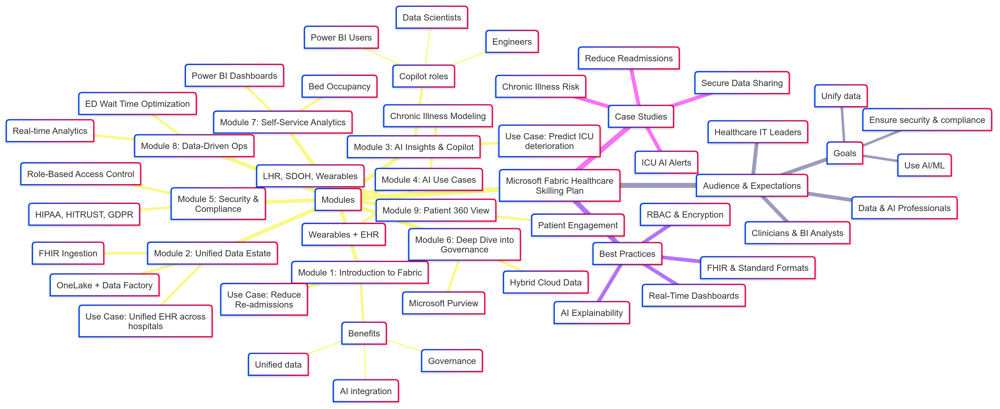

# 📘 Microsoft Fabric for Healthcare: Participant Guide

## Course Mindmap
<figure>
  
  <figcaption><em>Figure: Mindmap overview of the Microsoft Fabric Healthcare Skilling Plan.</em></figcaption>
</figure>

---

## 📑 Training Manual Outline

1.  **Introduction to Microsoft Fabric in Healthcare**
2.  **Setting Up the Environment**
3.  **Data Ingestion and Integration**
4.  **Data Modeling and Transformation**
5.  **Security, Compliance, and Governance**
6.  **Analytics and Reporting**
7.  **Machine Learning and AI Integration**
8.  **Performance Optimization**
9.  **Collaboration and Sharing**
10. **Advanced Features and Customization**
11. **Case Studies and Real-World Applications**
12. **Labs and Exercises**
13. **Assessment and Certification**
14. **Job Aids and Cheat Sheets**
15. **Final Notes and Resources**

---

## 📘 Section 1: Introduction to Microsoft Fabric in Healthcare

---

### 1.0 Overview

Welcome to the first section of your technical training on Microsoft Fabric for Healthcare! In the age of digital transformation, healthcare organizations face unprecedented challenges and opportunities. Data is both a burden and a blessing. While the volume of data continues to grow exponentially—coming from electronic health records (EHRs), laboratory systems, wearable devices, imaging repositories, and more—the ability to derive real-time, actionable insights remains constrained by legacy architectures, siloed systems, and interoperability gaps.

Enter **Microsoft Fabric**, an integrated Software-as-a-Service (SaaS) data platform built on top of Azure that consolidates analytics, governance, AI, and data engineering in one seamless environment. For data engineers and developers in healthcare, Fabric isn't just a tool—it's a comprehensive platform that redefines how healthcare data is ingested, secured, modeled, analyzed, and operationalized.

This section will provide you with a robust understanding of why Fabric matters to healthcare and what foundational competencies you need to build to effectively implement it in clinical settings.

---

### 1.1 The Healthcare Data Dilemma

Before diving into the technology, it's critical to grasp the environment in which it operates.

#### Fragmentation Across Systems

Healthcare systems are notoriously siloed. Data lives in:

*   **EHRs** (Epic, Cerner, Meditech, etc.)
*   **Laboratory Information Systems (LIS)**
*   **Radiology PACS**
*   **Pharmacy dispensing systems**
*   **Billing and revenue cycle software**
*   **IoT-enabled medical devices**
*   **Department-level Excel sheets or Access DBs**

Each repository holds vital data, but their lack of interconnectivity impairs holistic insights. Interoperability standards like HL7v2, FHIR, and DICOM attempt to bridge the divide—but real-time, semantic-level interoperability remains elusive.

#### The Challenge of Data Velocity & Variety

Healthcare data comes in many forms and at high speeds:

*   **Structured data** (e.g., vitals, lab results)
*   **Unstructured data** (e.g., physician notes, PDF scans)
*   **Image data** (e.g., MRI, CT)
*   **Streaming data** (e.g., continuous glucose monitors, heart monitors)

Handling these streams in a secure, compliant, and analyzable fashion demands more than traditional data warehouses.

#### Compliance Pressures

Healthcare organizations are bound by rigorous regulations:

*   **HIPAA (U.S.):** Ensures privacy and security of protected health information (PHI).
*   **HITRUST:** A certifiable framework combining ISO, NIST, and HIPAA.
*   **State regulations:** Varying rules on data storage, breach notification, and access auditing.

Microsoft Fabric addresses these with built-in governance, access controls, encryption, and integration with Microsoft Purview.

---

### 1.2 What is Microsoft Fabric?

Microsoft Fabric is a **SaaS-based unified data platform** designed to consolidate multiple Azure services into one streamlined experience:

*   **Azure Data Factory** (for data integration)
*   **Azure Synapse Analytics** (for data engineering)
*   **Power BI** (for business intelligence)
*   **Real-Time Analytics** (for event streaming and telemetry)
*   **Data Science tools** (with MLflow, notebooks)
*   **Microsoft Purview integration** (for data governance)

At its core is **OneLake**: a single, logical data lake for the entire organization where data resides in an open format (Delta Parquet).

#### Core Features

| Feature              | Description                                                            |
| -------------------- | ---------------------------------------------------------------------- |
| OneLake              | Centralized data lake using open Delta format                          |
| Data Factory         | Connect, ingest, and orchestrate data pipelines                        |
| Notebooks            | Jupyter-style environments for PySpark, Python, R                      |
| Power BI Integration | Real-time visual analytics on unified data                             |
| AI/ML Integration    | Train models directly within Fabric, leverage Azure Cognitive Services |
| Data Governance      | RBAC, data classification, audit trails via Microsoft Purview          |
| Copilot Integration  | Natural language interface to generate code, queries, and dashboards   |

---

### 1.3 Why Microsoft Fabric Matters to Healthcare

#### A. Unified Data Estate

Microsoft Fabric allows healthcare organizations to unify patient, clinical, financial, and operational data from multiple systems into **OneLake**. This enables:

*   Patient 360 views
*   Population health dashboards
*   Real-time alerts
*   Interdepartmental collaboration

#### B. AI-Powered Analytics

With integrated ML capabilities, data engineers and developers can deploy models for:

*   Predicting readmission risk
*   ICU deterioration monitoring
*   Medication adherence
*   No-show prediction
*   Operational throughput

#### C. Compliance and Security

Fabric supports:

*   End-to-end encryption (at rest, in transit)
*   Role-based access control (RBAC)
*   Activity auditing
*   Support for customer-managed keys
*   De-identification workflows
*   Integration with Purview for lineage tracking

#### D. Developer Productivity

Via Copilot, you can:

*   Auto-generate transformation code
*   Get SQL/DAX suggestions
*   Receive inline documentation
*   Troubleshoot errors

---

### 1.4 Visualizing Data Architectures

#### 1.4.1 Traditional vs. Unified Data Flow in Microsoft Fabric
<figure>
  
  <figcaption><em>Figure: Conceptual diagram illustrating traditional fragmented data approaches versus Microsoft Fabric's unified data approach.</em></figcaption>
</figure>

**Consider:** How does the unified architecture address the challenges of the traditional model?

---

### Lab 1.5: Understanding Healthcare Data Fragmentation

**Module Alignment:** Section 1: Introduction to Microsoft Fabric in Healthcare

**Objective:**
*   Analyze a fictional hospital’s data systems to identify fragmentation.
*   Understand the challenges posed by data fragmentation for analytics.
*   Conceptualize how Microsoft Fabric can address these challenges.

**Scenario:**
Valley General Hospital, a mid-sized healthcare provider, uses several distinct IT systems to manage its operations and patient care:
1.  **Electronic Health Record (EHR) System:** Contains patient demographics, clinical encounter details, prescribed medications, allergies, and problem lists.
2.  **Pharmacy System:** Manages medication dispensing, prescription fill history, and inventory. Linked to the EHR for prescriptions but operates as a separate database for dispensing records.
3.  **Laboratory Information System (LIS):** Stores results from all lab tests conducted, including blood work, pathology reports, and microbiology. Results are sent to the EHR but detailed metadata and raw outputs might remain in the LIS.
4.  **Outpatient Portal System:** Allows patients to schedule appointments, view summaries of their visits, and communicate with providers. Appointment data and patient-entered information are stored here.

**Prerequisites:**
*   Understanding of basic healthcare data types (demographics, encounters, medications, lab results).
*   Familiarity with the concept of data silos.

**Tools to be Used:**
*   This is a conceptual lab, primarily requiring analytical thinking and discussion. No specific Fabric tools are used for execution, but knowledge of Fabric's purpose is beneficial.

**Estimated Time:** 30 minutes

**Tasks:**

This lab is discussion-based. Consider the following questions based on the scenario:

**Questions & Detailed Answers:**

**1. List which key data elements are likely stored in each system at Valley General Hospital.**

*   **EHR System:**
    *   `Patient_ID`, `Patient_Name`, `Date_of_Birth`, `Gender`, `Address`, `Contact_Info`
    *   `Encounter_ID`, `Encounter_Date`, `Encounter_Type` (e.g., Inpatient, Outpatient, Emergency)
    *   `Provider_ID`, `Attending_Physician`
    *   `Diagnosis_Codes` (e.g., ICD-10), `Problem_List`
    *   `Medication_Orders` (prescribed medications, dosage, frequency)
    *   `Allergies_List`, `Adverse_Reactions`
    *   `Vital_Signs` (Height, Weight, Blood Pressure, Temperature)
    *   `Clinical_Notes` (Progress notes, consultation notes - often unstructured)
    *   `Immunization_Records`
    *   Pointers to lab results and radiology reports.

*   **Pharmacy System:**
    *   `Prescription_ID` (linked to EHR order)
    *   `Patient_ID`
    *   `Medication_NDC_Code` (National Drug Code)
    *   `Dispense_Date`, `Dispense_Quantity`, `Days_Supply`
    *   `Fill_Number`, `Refills_Remaining`
    *   `Pharmacist_ID`
    *   `Cost_Information`, `Insurance_Formulary_Status` (potentially)
    *   Inventory levels of medications.

*   **Laboratory Information System (LIS):**
    *   `Lab_Order_ID` (linked to EHR order)
    *   `Patient_ID`
    *   `Specimen_ID`, `Specimen_Type`, `Collection_Date_Time`
    *   `Test_Code` (e.g., LOINC), `Test_Name`
    *   `Result_Value` (quantitative or qualitative)
    *   `Reference_Range`, `Abnormal_Flags`
    *   `Performing_Lab_ID`, `Technician_ID`
    *   Pathology reports, microbiology culture details (can be extensive and semi-structured).

*   **Outpatient Portal System:**
    *   `Patient_ID`
    *   `Appointment_ID`, `Scheduled_Date_Time`, `Appointment_Status` (Scheduled, Confirmed, Cancelled, Completed)
    *   `Provider_ID`, `Clinic_Location`
    *   `Reason_for_Visit` (patient-stated)
    *   Secure messages exchanged between patient and provider.
    *   Patient-entered data (e.g., pre-visit questionnaires, symptom checkers).
    *   View logs (which patient viewed what information).

**2. What are the challenges if Valley General Hospital wants to develop a predictive model for patient readmission within 30 days of discharge?**

*   **Data Silos & Integration Complexity:**
    *   Crucial data for readmission prediction (e.g., discharge medications from EHR, actual dispensing from Pharmacy, post-discharge lab results from LIS, follow-up appointment adherence from Outpatient Portal) reside in separate systems.
    *   Combining this data requires complex, often manual, and potentially error-prone integration efforts. Each system might use different patient identifiers or data formats, requiring sophisticated mapping.

*   **Data Timeliness & Accessibility:**
    *   Real-time or near real-time data access is difficult. If the Pharmacy system updates dispensing records daily via batch, the model might not have the latest medication adherence information.
    *   Accessing data from multiple systems often involves different APIs, query languages, or export formats, increasing development time.

*   **Inconsistent Data Definitions & Standards:**
    *   The definition of "medication adherence" or "completed follow-up" might differ or not be explicitly captured across systems.
    *   While standards like HL7 or FHIR might be used for some interfaces, the internal storage and granularity can vary.

*   **Lack of a Unified Patient View (Patient 360):**
    *   Without a consolidated view, it's hard to see the complete patient journey leading up to a potential readmission. For example, did the patient pick up their discharge medications? Did they attend their follow-up appointment? Were there critical lab value changes post-discharge?

*   **Feature Engineering Difficulty:**
    *   Creating meaningful features for the model (e.g., number of prior admissions, specific medication classes, social determinants of health if captured) becomes challenging when data is fragmented. For instance, calculating the "number of hospitalizations in the last 6 months" requires querying and joining data that might span EHR and potentially older archived systems.

*   **Data Quality Issues:**
    *   Discrepancies between systems (e.g., a medication prescribed in EHR but never dispensed according to Pharmacy records) can lead to inaccurate model inputs.
    *   Missing data in one system that is critical for a feature can reduce the model's predictive power.

*   **Scalability & Performance:**
    *   Querying multiple disparate systems for large patient cohorts to train a model can be slow and resource-intensive.

**3. How can Microsoft Fabric’s OneLake and Data Factory help address these challenges?**

*   **OneLake as a Unified Data Store:**
    *   **Centralization:** OneLake acts as a single, logical data lake for the entire organization. Data from the EHR, Pharmacy, LIS, and Outpatient Portal can be ingested and stored in OneLake, eliminating physical silos.
    *   **Single Source of Truth:** By processing and conforming data into Bronze, Silver, and Gold layers within OneLake, Valley General can create a unified, reliable source for analytics and model training. This enables a true Patient 360 view.
    *   **Open Data Formats:** Storing data in open formats like Delta Parquet within OneLake means it's accessible by various compute engines in Fabric (Spark, SQL, Power BI via DirectLake) without data movement or duplication.

*   **Data Factory for Ingestion and Orchestration:**
    *   **Connectors:** Data Factory provides a wide range of connectors to pull data from various sources, including SQL databases (for EHR, LIS, Pharmacy backends), APIs (potentially for the Outpatient Portal or modern EHRs using FHIR), and file systems.
    *   **Data Integration Pipelines:** Data Factory can be used to build robust pipelines to extract, transform (if needed at a basic level for ingestion), and load (ETL/ELT) data from these disparate systems into the Bronze layer of OneLake.
    *   **Scheduling & Automation:** These pipelines can be scheduled to run at regular intervals (e.g., hourly, daily), ensuring that OneLake is consistently updated with the latest information, improving data timeliness for the readmission model.
    *   **Data Transformation (with Dataflows Gen2 or Notebooks):** While Data Factory orchestrates, it integrates seamlessly with Dataflows Gen2 (for low-code transformations) or Notebooks (for complex transformations using Spark/Python) to cleanse, standardize, and conform the ingested data into the Silver and Gold layers. This is where data from different sources can be joined and harmonized.

*   **Addressing Specific Challenges with Fabric:**
    *   **Integration Complexity:** Fabric provides the tools (Data Factory, Notebooks) to build these integrations once and then automate them.
    *   **Data Timeliness:** Scheduled pipelines ensure fresher data. Real-Time Analytics in Fabric could even handle streaming data if some sources support it.
    *   **Unified Patient View:** The Gold layer in OneLake, built using Fabric tools, would house the comprehensive data needed for the readmission model, effectively creating that Patient 360.
    *   **Feature Engineering:** With all relevant data in OneLake, data scientists can use Fabric Notebooks (with Spark or Python) to easily access and process this data to engineer complex features for the model.
    *   **Scalability & Performance:** Fabric's compute engines (Spark for Notebooks, SQL engine for the Warehouse) are designed for performance and can scale to handle large datasets for model training and scoring.

**Expected Outcome / Deliverables:**
*   A clear understanding of how data fragmentation in healthcare impacts analytical capabilities.
*   An appreciation for the role of a unified data platform like Microsoft Fabric in overcoming these challenges.

**interactive quiz:** [Module 1 - The Data Unification Journey](./visualizations-html/Module%201-The%20Data%20Unification%20Journey.html)

---

### 1.6 Exercise: Map Your Organization’s Data Fragmentation (Optional)

This exercise is designed to help you apply the concepts of data fragmentation to your own context. If you are not currently working within a healthcare organization, you can reflect on a past experience or a hypothetical scenario.

**Instructions:**

1.  **Sketch Your Data Flow:** On a piece of paper or using a simple drawing tool, create a visual representation of the key data systems currently used in your organization (or a chosen scenario). Show how data might (or might not) flow between them.
2.  **Analyze Your Map:** Reflect on your diagram and answer the following:
    *   Which of these systems are currently integrated or connected? How do they share data?
    *   Where do the most significant data silos or gaps exist?
    *   Which departments or roles within the organization most struggle with accessing comprehensive data?
    *   Identify one or two specific datasets or types of analysis that would provide significant value if data could be unified and analyzed with AI/ML tools.

*(This exercise is for your own reflection and learning. There's no need to submit your map, but consider discussing your insights with peers if applicable.)*

---

### 1.7 Knowledge Review: Test Your Understanding

Use these "flashcards" to review the key concepts from this section. Try to answer the question on the "front" before revealing the "back."

| Front                                      | Back                                                                                                |
| ------------------------------------------ | --------------------------------------------------------------------------------------------------- |
| What is Microsoft Fabric?                  | A SaaS-based unified analytics platform that consolidates data engineering, AI, and BI on OneLake.    |
| What is OneLake?                           | A single, unified, logical data lake for the entire organization, built into Fabric, using Delta Parquet format. |
| Name three key benefits of Microsoft Fabric for healthcare. | 1. Unified patient/operational views. 2. Enhanced AI/ML capabilities. 3. Robust security and compliance. (Others: Developer productivity, real-time analytics) |
| How does Microsoft Fabric support HIPAA compliance? | Through features like Role-Based Access Control (RBAC), end-to-end encryption, comprehensive audit logs, and integration with Microsoft Purview for governance. |

---

### 1.8 Summary

This introductory section has laid the groundwork for your journey into Microsoft Fabric for Healthcare. You should now have a clearer understanding of:

*   The significant challenges and pain points in managing healthcare data today, particularly data fragmentation.
*   How Microsoft Fabric aims to address these challenges by unifying data, enabling advanced AI, ensuring compliance, and boosting productivity.
*   The essential components and core features of the Microsoft Fabric platform, especially OneLake.

In the next section, we will move on to the practical steps of setting up and preparing your Microsoft Fabric environment. Get ready to dive in!

---

### ❓ Section 1 Quiz: Check Your Knowledge

Test your understanding of the concepts covered in this section. Choose the best answer for each question.

**1. What is the primary storage format used by OneLake in Microsoft Fabric?**
   a) CSV (Comma Separated Values)
   b) JSON (JavaScript Object Notation)
   c) Delta Parquet
   d) XML (Extensible Markup Language)

**2. Which U.S. regulation is primarily concerned with the privacy and security of patient health information?**
   a) GDPR (General Data Protection Regulation)
   b) HIPAA (Health Insurance Portability and Accountability Act)
   c) PCI-DSS (Payment Card Industry Data Security Standard)
   d) SOX (Sarbanes-Oxley Act)

**3. What is the primary role of Microsoft Purview when integrated with Microsoft Fabric?**
   a) Advanced data visualization and dashboarding
   b) Data governance, including data discovery, classification, and lineage
   c) Real-time data streaming and processing
   d) User interface customization for Fabric workloads

*(Scroll down for answers)*
.
.
.
.
.
**Quiz Answers:**
1.  **c) Delta Parquet** - OneLake stores data in the open Delta Lake format, which is built on Parquet.
2.  **b) HIPAA** - HIPAA is the key U.S. federal law that protects sensitive patient health information.
3.  **b) Data governance, including data discovery, classification, and lineage** - Microsoft Purview provides comprehensive data governance capabilities.

---

### 🔖 Section 1 Cheat Sheet

Here's a quick reference for the key terms and concepts from this section:

*   **Microsoft Fabric:** A unified SaaS analytics platform.
*   **OneLake:** Fabric’s single, logical data lake (Delta Parquet format).
*   **Data Fragmentation:** Data siloed across disparate healthcare systems.
*   **Key Fabric Benefits in Healthcare:** Unified data, AI/ML enablement, security & compliance, developer productivity.
*   **HIPAA:** U.S. regulation for protecting patient health information.
*   **Data Factory (in Fabric):** Tool for data integration, ingestion, and pipeline orchestration.
*   **Power BI (in Fabric):** Tool for data visualization and business intelligence.
*   **Copilot (in Fabric):** AI-powered assistant for code generation, queries, and insights.
*   **Microsoft Purview:** Service for unified data governance.

---
[Interactive Info Card: Industry Impact](./visualizations-html/Section%201%20-%20Introduction%20to%20Microsoft%20Fabric%20in%20Healthcare.html)

---

## 📘 Section 2: Setting Up the Environment

---

### 2.0 Overview

Welcome to Section 2! Before you can start building powerful data solutions for healthcare, it's crucial to correctly set up your **Microsoft Fabric environment**. This section will guide you through the essential steps: understanding prerequisites, configuring access, creating workspaces, connecting to data, and establishing basic governance. We'll focus on ensuring your setup is robust, compliant (with standards like HIPAA), and scalable for healthcare data engineering tasks.

---

### 2.1 Prerequisites: What You Need to Get Started

#### ✔️ Organizational Requirements

To effectively use Microsoft Fabric, your organization (or your training environment provider) needs to have the following in place:

*   An active **Microsoft 365 tenant**: This is the foundational platform.
*   A valid **Microsoft Fabric license**: Fabric capabilities are often tied to Power BI Premium, specific Microsoft 365 E5 licenses, or dedicated Fabric capacity SKUs.
*   **Microsoft Fabric enabled**: An administrator must enable Fabric within the Microsoft 365 Admin Center.
*   **Appropriate Admin Roles**: Roles like Power BI Admin or Fabric Admin are needed for initial setup and workspace provisioning.
*   **Azure Active Directory (Azure AD / Entra ID)**: This is used for managing user identities and controlling access to Fabric resources.

#### ✔️ Understanding Roles and Access

From the beginning, it’s important to think about who will be using Fabric and what they need to do. This helps in setting up the right permissions using **Role-Based Access Control (RBAC)**:

| Common Role        | Typical Tasks in Fabric                               | Suggested Fabric Role(s) |
| ------------------ | ----------------------------------------------------- | ------------------------ |
| Data Engineer      | Design data pipelines, transform data, manage Lakehouse | Admin, Contributor       |
| Data Scientist     | Train machine learning models, use Notebooks          | Contributor              |
| Data Analyst       | Create Power BI reports, explore data                 | Member, Viewer           |
| Compliance Officer | Review audit logs, check governance settings          | Viewer (with Purview access) |

**Key Principle:** Always grant the *minimum necessary permissions* to protect sensitive healthcare data.

---

### 2.2 Licensing and Region Selection: Important Choices

#### Fabric Licensing Explained

Microsoft Fabric's features and capacity (how much data you can process and store) are determined by its licensing. This can be part of:

*   **Power BI Premium (P SKUs)**
*   **Microsoft 365 E5** (often includes some Fabric capabilities)
*   **Fabric capacity SKUs (F SKUs)**: These are dedicated capacities for Fabric workloads.

**Recommendation for Healthcare:** For handling large healthcare datasets and running complex AI models, an **F64 capacity or higher** is generally recommended. Your training environment will have a specific capacity assigned.

#### Region Selection for HIPAA Compliance

When setting up or using a Microsoft Fabric tenant, especially with U.S. healthcare data:

*   **Choose U.S.-based Azure regions**: This is critical for **HIPAA data residency requirements**, meaning the data should physically reside within the U.S.
*   **Avoid unnecessary cross-region data transfers**: If data must move between regions, ensure it's properly governed and encrypted.
*   **Business Associate Agreement (BAA)**: Microsoft provides a BAA for customers using eligible Azure services (including Fabric) that handle Protected Health Information (PHI), affirming their commitment to HIPAA compliance.

---

### 2.3 Accessing Microsoft Fabric: Your Gateway

Once enabled by an administrator, you can access Microsoft Fabric through your web browser:

1.  Go to: [https://app.fabric.microsoft.com](https://app.fabric.microsoft.com)
2.  Sign in with your organizational Microsoft 365 credentials.

Inside Fabric, you'll find a unified interface where you can switch between different "experiences" or tools, such as:

*   **Data Factory**: For building data pipelines.
*   **Synapse Data Engineering**: For Spark-based data processing and Lakehouse management.
*   **Synapse Data Science**: For building and training ML models.
*   **Synapse Data Warehousing**: For traditional SQL-based data warehousing.
*   **Synapse Real-Time Analytics**: For streaming data.
*   **Power BI**: For data visualization and reporting.
*   **Data Activator**: For setting up alerts and actions based on data patterns.

*(Your trainer may provide a visual walkthrough of the Fabric UI.)*

---

### 2.4 Creating Your First Workspace: Organizing Your Projects

Workspaces are fundamental organizational units in Fabric. Think of them as containers for your projects, allowing you to group related items (like Lakehouses, Notebooks, Power BI reports) and manage access for collaboration.

#### Steps to Create a Workspace (if permitted by your role):

1.  In the Fabric portal (usually on the left navigation pane), find and click on **“Workspaces”**.
2.  Click **“+ New Workspace”**.
3.  **Name your workspace**: Use a clear, descriptive name (e.g., `HealthcareAnalytics_Dev` or `PatientReadmissionProject`).
4.  **Assign to a capacity**: Choose the capacity that will power this workspace.
5.  **Manage access**: Assign roles (Admin, Member, Contributor, Viewer) to your team members.

#### Workspace Best Practices for Healthcare:

*   **Separate Environments**: If possible, use different workspaces for `Development (DEV)`, `Testing (TEST)`, and `Production (PROD)`. This prevents accidental changes to live systems.
*   **Clear Naming Conventions**: Use prefixes like `DEV_`, `TEST_`, `PROD_` in workspace names.
*   **Documentation**: Keep a record of each workspace's purpose, data sources, and access rules.
*   **Sensitivity Labels**: Integrate with Microsoft Purview to apply sensitivity labels (e.g., "PHI Data") to workspaces and their content (more on this in Section 5).

---

### 2.5 Connecting Data Sources: Bringing in Healthcare Data

Microsoft Fabric offers a wide array of connectors to bring in data from various sources. For healthcare, common sources include:

| Source Type         | Example Systems                                     | Typical Fabric Connector(s)        |
| ------------------- | --------------------------------------------------- | ---------------------------------- |
| Databases           | SQL Server, Azure SQL DB, Oracle, PostgreSQL        | Native database connectors         |
| Cloud Storage       | Azure Blob Storage, Azure Data Lake Storage Gen2 (ADLS Gen2) | Native connectors                  |
| Healthcare APIs     | FHIR Servers, HL7 Gateways, custom healthcare APIs  | REST API, OData, custom connectors |
| Files               | HL7 v2 batch files, CSVs from medical devices, DICOM metadata extracts | File connectors (e.g., for ADLS Gen2) |
| Streaming Data      | Medical IoT devices (via Azure Event Hubs or Kafka) | Eventstream, Kafka connector       |

You'll typically use **Dataflows Gen2** (for no-code/low-code data ingestion and transformation) or **Notebooks** (with Spark for code-based ingestion) to load data into your Lakehouse.

---

### 2.6 Setting Up OneLake: Your Unified Data Foundation

**OneLake** is a cornerstone of Microsoft Fabric. It's a single, unified, logical data lake for your entire organization (tenant). You don't need to provision OneLake separately; it's automatically available when Fabric is enabled.

#### How OneLake Works with Workspaces:

*   Each Fabric workspace can contain one or more **Lakehouses**. A Lakehouse is your primary interface for interacting with data stored in OneLake within that workspace.
*   Data in a Lakehouse is typically organized into layers (often called Bronze, Silver, Gold, or Raw, Staged, Curated) to represent different stages of data processing and refinement.
*   **Open Format**: Data in OneLake is stored in the open **Delta Parquet** format. This means the data is not locked into a proprietary format and can be accessed by various engines.
*   **Shortcuts**: OneLake allows you to create "shortcuts" to data that already exists in other storage locations like Azure Data Lake Storage Gen2, Amazon S3, or Google Cloud Storage, without physically moving or duplicating the data.

#### OneLake and HIPAA Compliance:

*   **Encryption**: All data stored in OneLake is encrypted at rest by default.
*   **Access Control**: RBAC applied at the workspace and item level restricts who can access specific data within the Lakehouse.
*   **Auditing**: Fabric provides audit logs that track access and modifications to data, which is crucial for HIPAA's audit control requirements.

#### 2.6.1 Conceptual Data Flow for Unified Healthcare Data Estate (Medallion Architecture)

<figure>
  
  <figcaption><em>Figure: This diagram illustrates the Medallion Architecture (Bronze, Silver, Gold layers) within OneLake, a common best practice for building robust and scalable data estates.</em></figcaption>
</figure>

---

### 2.7 Your Toolchain: Key Fabric Components for Setup

During the setup phase, you'll primarily interact with:

#### ✅ Data Factory (within Fabric)

*   To create your first data pipelines:
    *   Open your workspace.
    *   Click **“+ New” → “Data pipeline”**.
    *   Use the drag-and-drop interface to add activities like:
        *   **Copy data** (to bring data from a source).
        *   **Dataflow Gen2** (to transform data).
        *   **Notebook** (to run custom Spark code).
        *   And then load the data into a **Lakehouse table**.

#### ✅ Power BI

*   Power BI reports in Fabric can use a feature called **DirectLake mode**. This allows Power BI to query data directly from OneLake (Delta Parquet files) with very high performance, without needing to import or duplicate the data into a separate Power BI dataset.
*   You'll implement **Row-Level Security (RLS)** in Power BI (or at the source) to ensure users only see the data they are authorized to access, especially important for PHI.

#### ✅ Notebooks

*   Fabric provides Jupyter-style Notebooks for interactive data engineering and data science.
*   Supported languages include **Python (PySpark), Scala (Spark), SQL, and R**.
*   You can easily read data from and write data to your Lakehouse tables. For example, in PySpark:
    ```python
    # Read data from a Lakehouse table named 'Patients_Silver'
    df_patients = spark.read.table("your_lakehouse_name.Patients_Silver")
    df_patients.show()

    # Alternatively, if your notebook is in the same Lakehouse
    # df_patients = spark.read.table("Patients_Silver")


    # Example: Write a DataFrame to a new table in the Lakehouse
    # new_data_df.write.format("delta").mode("overwrite").saveAsTable("your_lakehouse_name.NewProcessedData_Gold")
    ```

---

### 2.8 Setting Up Governance Basics with Microsoft Purview

Microsoft Fabric integrates deeply with **Microsoft Purview** to provide comprehensive data governance, which is essential for compliance in healthcare.

#### Initial Governance Actions to Consider:

*   **Data Discovery and Classification**: Use Purview to scan your data sources (including OneLake) to identify and automatically classify sensitive data, such as PHI (e.g., "Patient Name," "Date of Birth," "Medical Record Number").
*   **Sensitivity Labels**: Apply sensitivity labels (e.g., `Confidential - PHI`) to workspaces, Lakehouses, and specific data items. These labels can drive policies like restricting sharing or requiring encryption.
*   **Data Lineage**: Purview can automatically track data lineage, showing how data flows from its source, through transformations, to reports. This is vital for understanding data provenance and for audit purposes.
*   **Access Policies**: Define data access policies in Purview that can control who can access what data across Fabric.

**HIPAA Note:** Microsoft Purview capabilities are critical for meeting HIPAA's "audit control," "integrity," and "access control" safeguards.

---

### Lab 2.9: Setting Up Your First Fabric Environment and Ingesting Sample Data

**Module Alignment:** Section 2: Setting Up the Environment

**Objective:**
*   Familiarize with the Microsoft Fabric portal and workspace creation.
*   Create a Lakehouse and ingest sample CSV data.
*   Explore the ingested data using a Fabric Notebook.
*   Understand basic role assignments within a workspace.

**Scenario:**
You are a data engineer at Valley General Hospital, newly onboarded to Microsoft Fabric. Your first task is to set up a development workspace for an upcoming cardiology analytics project and perform a test ingestion of sample patient data.

**Prerequisites:**
*   Access to a Microsoft Fabric enabled Microsoft 365 tenant.
*   Permissions to create workspaces in Fabric (typically Fabric Administrator or Power BI Administrator to enable Fabric for the tenant, then users with appropriate capacity permissions can create workspaces).
*   A sample CSV file with patient data. We will create one in the lab.

**Tools to be Used:**
*   Microsoft Fabric Portal
*   Fabric Workspace
*   Fabric Lakehouse
*   Fabric Notebook (PySpark)

**Estimated Time:** 45 minutes

**Tasks / Step-by-Step Instructions:**

**Part 1: Create a Workspace**

1.  **Navigate to Microsoft Fabric:** Open your browser and go to `app.fabric.microsoft.com`.
2.  **Create a New Workspace:**
    *   In the left navigation pane, click on **Workspaces**.
    *   Click the **+ New workspace** button in the top right.
    *   **Name:** Enter `DEV_CardiologyAnalytics`.
    *   **Description:** (Optional) Enter "Development workspace for cardiology analytics projects".
    *   **Domain:** (Optional) Assign to a relevant domain if your organization uses them.
    *   **Capacity:** Assign the workspace to a Fabric capacity (e.g., a trial capacity or a provisioned F-SKU). This is crucial for using Fabric features.
    *   Click **Apply**.

**Part 2: Create a Lakehouse**

1.  **Open Your Workspace:** From the Workspaces list, click on `DEV_CardiologyAnalytics` to open it.
2.  **Create a New Lakehouse:**
    *   Within the workspace, click the **+ New** button.
    *   Select **Lakehouse** from the options.
    *   **Name:** Enter `CardiologyLakehouse`.
    *   Click **Create**.
    *   The Lakehouse explorer view will open. You'll see sections for `Tables` and `Files`.

**Part 3: Prepare and Upload Sample CSV Data**

1.  **Create Sample CSV Data:**
    *   Open a plain text editor (like Notepad or VS Code) on your local machine.
    *   Copy and paste the following data into the editor:
        ```csv
        PatientID,FirstName,LastName,DateOfBirth,Gender,LastVisitDate,Diagnosis
        P001,John,Doe,1985-06-15,Male,2023-01-10,Hypertension
        P002,Jane,Smith,1992-03-22,Female,2023-02-20,Diabetes Type 2
        P003,Robert,Jones,1978-11-05,Male,2022-12-05,Asthma
        P004,Emily,Brown,2001-07-30,Female,2023-03-15,Migraine
        P005,Michael,Davis,1965-09-12,Male,2023-01-25,Coronary Artery Disease
        ```
    *   Save the file as `sample_patients.csv` on your local machine.

2.  **Upload Data to Lakehouse (Files section):**
    *   In the `CardiologyLakehouse` explorer view, under the `Files` section, click the three dots (**...**) next to `Files` (or an existing folder if you prefer).
    *   Select **Upload** -> **Upload files**.
    *   Browse to your locally saved `sample_patients.csv` and select it.
    *   Confirm the upload. You should see `sample_patients.csv` appear under the `Files` section.

3.  **Load CSV to a Delta Table (using UI):**
    *   In the Lakehouse explorer, find the `sample_patients.csv` file under `Files`.
    *   Click the three dots (**...**) next to `sample_patients.csv`.
    *   Select **Load to table** -> **New table**.
    *   **Table name:** Enter `bronze_patients`.
    *   Fabric will infer the schema. Review it and click **Load**.
    *   A notification will appear once the table is created. You should see `bronze_patients` under the `Tables` section.

**Part 4: Explore Data with a Notebook**

1.  **Create a New Notebook:**
    *   Go back to your `DEV_CardiologyAnalytics` workspace view.
    *   Click **+ New** -> **Notebook**.
    *   A new notebook will open.

2.  **Attach Lakehouse to Notebook:**
    *   In the notebook interface, on the left side, you should see an "Explorer" pane.
    *   Click on **Add Lakehouse**.
    *   Select your `CardiologyLakehouse` and click **Add**. This makes the tables and files in your Lakehouse accessible to the notebook.

3.  **Write and Run PySpark Code:**
    *   In the first cell of the notebook, ensure the language is set to **PySpark (Python)**.
    *   Enter the following code to load and display the `bronze_patients` table:

        ```python
        # Read the Delta table from the Lakehouse
        df_patients = spark.read.table("CardiologyLakehouse.bronze_patients") # Or just "bronze_patients" if default lakehouse is set

        # Display the DataFrame schema and some data
        df_patients.printSchema()
        display(df_patients.limit(5)) # display() is a Fabric-specific function for rich table rendering

        # Perform a simple count
        patient_count = df_patients.count()
        print(f"Total number of patients: {patient_count}")
        ```
    *   Click the **Run cell** button (or Shift+Enter) to execute the code.

**Part 5: Assign Roles in Workspace (Conceptual - Requires Admin to actually assign)**

1.  **Navigate to Workspace Access Management:**
    *   Go to your `DEV_CardiologyAnalytics` workspace.
    *   In the top right corner of the workspace view, click on **Manage access** (or an icon representing access).
2.  **Add Users and Assign Roles:**
    *   You would typically see a list of current members. Click **+ Add people or groups**.
    *   Enter the email address of a team member.
    *   Assign a role:
        *   **Admin:** Full control (e.g., Data Engineering Lead).
        *   **Member:** Can view, edit, and publish content (e.g., another Data Engineer or Power BI Developer).
        *   **Contributor:** Can create items and publish reports but can't manage access or workspace settings (e.g., Data Analyst).
        *   **Viewer:** Can only view content (e.g., Clinical stakeholder).
    *   Click **Add**.
    *   *(Note: For this lab, you might not have other users to add, but understand the process.)*

**Expected Outcome / Deliverables:**
*   A Fabric workspace named `DEV_CardiologyAnalytics` is created.
*   A Lakehouse named `CardiologyLakehouse` exists within the workspace.
*   The `sample_patients.csv` data is uploaded to the Lakehouse `Files` section and loaded into a Delta table named `bronze_patients`.
*   A Fabric Notebook successfully reads and displays data from the `bronze_patients` table.
*   Understanding of how to conceptually assign different roles within a Fabric workspace.

**Questions & Answers:**

*   **Q1: What level of access should a data analyst be granted if they primarily need to build reports and perform data exploration but not manage the workspace or core data engineering pipelines?**
    *   **A1:** A **Contributor** role is often suitable. They can create notebooks, dataflows, and Power BI reports using existing data in the Lakehouse. If they only need to consume existing reports, **Viewer** would be more appropriate. If they need to publish reports and manage datasets they create, **Member** might be considered, but Contributor is a good starting point for report building without full workspace admin rights.

*   **Q2: Which Fabric tool is best for building visual, low-code/no-code ETL pipelines for ingesting data from various sources into the Lakehouse?**
    *   **A2:** **Dataflows Gen2** is the primary tool in Fabric for visual, low-code/no-code ETL/ELT pipeline creation. Data Factory pipelines orchestrate activities, which can include running Dataflows Gen2.

*   **Q3: How does OneLake enhance collaboration between different roles (e.g., Data Engineers, Data Scientists, BI Analysts) working on the same data?**
    *   **A3:** OneLake provides a **single, unified, and logical copy of the data** (stored in Delta Parquet format).
        *   **No Data Duplication:** Different roles and their preferred tools (Spark for Data Scientists/Engineers, SQL endpoint for Analysts, DirectLake for Power BI) can access the same underlying data in OneLake without creating multiple copies. This ensures everyone is working from the same version of truth.
        *   **Interoperability:** Data written by a Spark notebook is immediately queryable via the SQL endpoint and accessible in Power BI via DirectLake.
        *   **Shortcuts:** Data can be virtualized from other storage accounts or even other Fabric domains/workspaces, further enhancing collaboration without physically moving data.
        *   **Simplified Governance:** Managing security and governance is easier on a single data store.

**interactive quiz:** [Module 2 - Building Your Data Pipeline](./visualizations-html/Module%202:%20Building%20Your%20Data%20Pipeline.html)

---

### 2.10 Section 2 Quiz: Check Your Knowledge

Test your understanding of setting up the Fabric environment. Choose the best answer.

**1. When setting up Microsoft Fabric for U.S. healthcare data, which of the following is a key consideration for HIPAA compliance regarding data location?**
   a) Using the Azure region closest to the company headquarters, regardless of country.
   b) Ensuring the Fabric capacity is at least F128.
   c) Selecting U.S.-based Azure regions for data residency.
   d) Storing all data exclusively in Power BI datasets.

**2. What is the primary function of a "Workspace" in Microsoft Fabric?**
   a) To store user authentication credentials.
   b) As a container for organizing related Fabric items (Lakehouses, Notebooks, reports) and managing collaboration.
   c) Exclusively for running Spark jobs.
   d) To manage Fabric licensing and capacity SKUs.

**3. Which Microsoft service integrates with Fabric to provide data governance capabilities like data classification, lineage tracking, and sensitivity labels?**
   a) Azure DevOps
   b) Microsoft Teams
   c) Microsoft Purview
   d) Azure Logic Apps

*(Scroll down for answers)*
.
.
.
.
.
**Quiz Answers:**
1.  **c) Selecting U.S.-based Azure regions for data residency.** - This is crucial for HIPAA compliance.
2.  **b) As a container for organizing related Fabric items (Lakehouses, Notebooks, reports) and managing collaboration.** - Workspaces are central to organizing projects.
3.  **c) Microsoft Purview** - Purview is the key governance tool integrated with Fabric.

---

### 2.11 Section 2 Cheat Sheet

Key takeaways for setting up your Fabric environment:

*   **Prerequisites:** M365 Tenant, Fabric License, Azure AD, Admin Roles.
*   **OneLake:** Unified, tenant-wide Delta Lake; auto-provisioned. Accessed via Lakehouses in workspaces.
*   **Workspaces:** Collaboration containers for Fabric items (Lakehouses, pipelines, notebooks, reports). Use RBAC (Admin, Member, Contributor, Viewer).
*   **Licensing & Region:** Choose appropriate Fabric/Power BI capacity (e.g., F64+ for healthcare). Select U.S. regions for HIPAA data residency.
*   **Data Ingestion:** Use Data Factory (pipelines, dataflows) or Notebooks (Spark) to load data into Lakehouse tables.
*   **Toolchain:**
    *   **Data Factory:** ETL/ELT pipelines.
    *   **Notebooks (Spark):** Code-based data engineering & science (Python, SQL, R, Scala).
    *   **Power BI (DirectLake):** Fast reporting on OneLake data.
*   **Governance (Purview):** Essential for compliance. Use for data classification, sensitivity labels, lineage, access policies.
*   **HIPAA:** Requires BAA, U.S. data residency, robust access controls, auditing, encryption (default in Fabric at rest/transit).

---
[Hands-on Setup Checklist](./visualizations-html/Section%202%20-%20Setting%20Up%20the%20Environment.html)

---
## 📘 Section 3: Data Ingestion and Integration

---

### 3.0 Overview

Welcome to Section 3! A critical part of any healthcare data platform is its ability to bring in (ingest) and combine (integrate) data from many different sources. Healthcare organizations deal with a vast array of data from clinical systems, patient records, lab results, medical devices, and more. Often, this data is fragmented and stored in different formats.

In this section, you'll learn how **Microsoft Fabric** empowers data engineers to tackle these challenges. We'll explore how to ingest data from common healthcare sources like Electronic Health Records (EHRs), HL7 messages, FHIR APIs, and even streaming data from medical devices. You'll understand how to build **data ingestion pipelines** that are not only efficient but also secure, compliant, and maintain data quality, setting the stage for powerful analytics and AI.

---

### 3.1 Key Principles of Healthcare Data Ingestion

#### 1. Understanding the Diversity of Data Sources

Healthcare data is incredibly varied. Here are some common systems and the types of data they produce:

| System Type                 | Example Systems                      | Common Data Format/Source Type        |
| --------------------------- | ------------------------------------ | ------------------------------------- |
| Electronic Health Record (EHR) | Epic, Cerner, Allscripts             | SQL Databases, FHIR APIs, HL7 messages |
| Laboratory Information System (LIS) | Orchard Harvest, Sunquest            | CSV files, HL7 messages               |
| Radiology Information System (RIS) / Picture Archiving and Communication System (PACS) | Philips IntelliSpace, GE Centricity | DICOM metadata (often as CSV/XML), HL7 |
| Pharmacy Systems            | Cerner RxStation, Omnicell           | XML, CSV files, proprietary formats   |
| Billing & Financial Systems | RCM (Revenue Cycle Management)       | CSV files, SQL Databases              |
| Wearables/IoT Devices       | Continuous Glucose Monitors (CGMs), Blood Pressure Monitors | Streaming JSON (often via Azure Event Hubs or Kafka) |
| Research Data Platforms     | REDCap, Clinical Trial Databases     | Excel files, CSV, SAS datasets        |

Microsoft Fabric needs to connect to and understand these diverse sources.

#### 2. Different Ways to Ingest Data (Ingestion Modalities)

Fabric supports several methods to bring data in:

*   **Batch Ingestion:** This involves collecting data over a period (e.g., hourly, daily) and then processing it in a large batch. This is common for data from databases or file shares.
*   **Streaming (Real-time) Ingestion:** This is for data that arrives continuously, like readings from patient monitoring devices or event logs from applications.
*   **API-Based Ingestion:** Many modern healthcare systems expose data through APIs (Application Programming Interfaces), such as FHIR APIs. Fabric can connect to these APIs to pull data.

#### 3. Compliance and Security are Paramount

When ingesting healthcare data, especially Protected Health Information (PHI):

*   **Audit Everything:** Every time data is moved or accessed, it must be logged.
*   **Encrypt Data:** Data should be encrypted both when it's being transferred (in transit) and when it's stored (at rest). Fabric handles much of this automatically.
*   **Minimum Necessary Use:** Only ingest and process the data elements that are absolutely necessary for the task, adhering to HIPAA's Privacy Rule.
*   **De-identification:** For research or analytics where direct patient identifiers are not needed, plan for de-identification pipelines to remove or mask PHI.

---

### 3.2 Using Microsoft Fabric Data Factory for Ingestion

**Data Factory** is the primary service within Microsoft Fabric for orchestrating data movement and transformation. It's your main tool for building ingestion pipelines.

#### Key Components You'll Use:

| Component         | Function                                                                 |
| ----------------- | ------------------------------------------------------------------------ |
| **Pipelines**       | These define a sequence of activities or steps to perform your data tasks. |
| **Dataflows Gen2**  | A low-code/no-code visual tool (based on Power Query) for data ingestion and transformation. Great for many common scenarios. |
| **Notebooks**       | For more complex transformations or when you need custom code (e.g., using PySpark, Scala, SQL, or R) to process data. |
| **Linked Services** | These are like connection strings that tell Fabric how to connect to your external data sources (e.g., a SQL database, an S3 bucket, a REST API). |

#### Typical Ingestion Flow:

A common pattern for ingesting data looks like this:
`Source System → Linked Service (Connection) → Dataflow Gen2 or Notebook (Ingestion & Basic Transformation) → Lakehouse (Bronze Layer)`

#### Example: Connecting to a FHIR Server (Conceptual)

1.  **Launch Data Factory** from your Fabric workspace.
2.  Click **“+ New” → “Data pipeline”**.
3.  Add a **Dataflow Gen2** activity to your pipeline.
4.  Inside the Dataflow Gen2, configure a connection to your FHIR server (this would typically use a REST API or OData connector, defined as a Linked Service).
5.  Specify the FHIR resource you want to ingest (e.g., `Patient` resource).
6.  Map the fields from the FHIR `Patient` resource to columns in a destination table.
7.  Set the "data destination" (sink) to be a new table in your Lakehouse, for example, `Bronze_FHIR_Patients`.

---

### 3.3 Ingesting HL7 Messages

HL7 version 2 (HL7v2) is a widely used standard for exchanging clinical and administrative data. It's a text-based format with segments delimited by pipe characters (`|`). HL7 messages are often transmitted as batches of files.

#### Common HL7 Message Types:

*   **ADT** (Admit, Discharge, Transfer): Messages about patient registration, admission, discharge, and transfer events (e.g., ADT-A01 for admission).
*   **ORU** (Observation Result): Messages carrying lab results, radiology reports, or other observations.
*   **MDM** (Medical Document Management): Messages for transmitting transcribed documents like discharge summaries.

#### Steps to Ingest HL7 Files:

1.  **File Ingestion:** Use a Data Factory pipeline with a file connector (e.g., to read from Azure Data Lake Storage where HL7 files are dropped).
2.  **Parsing HL7:** HL7 parsing often requires custom logic. A **Spark Notebook** (using Python with libraries like `hl7apy` or custom parsing functions) is a common way to:
    *   Read the HL7 file content.
    *   Split the file into individual messages.
    *   Parse each message into its segments (e.g., MSH - Message Header, PID - Patient Identification, PV1 - Patient Visit, OBX - Observation/Result).
    *   Extract relevant fields from each segment.
3.  **Store Raw/Parsed Data:** Store the parsed HL7 data into tables in your Lakehouse's Bronze layer (e.g., `Bronze_HL7_ADT_Messages`, `Bronze_HL7_PID_Segments`).
4.  **(Optional) Transform to FHIR:** For better interoperability, you might transform the parsed HL7 data into FHIR-equivalent resources (e.g., an ADT message could be transformed into FHIR `Patient` and `Encounter` resources).

#### HIPAA Compliance Tip for HL7 Ingestion:

Always log critical information for auditing:
*   Source file path and name.
*   A checksum (e.g., MD5 or SHA256 hash) of the file to ensure data integrity.
*   Timestamp of when the file was ingested.
*   The user or service principal ID that performed the ingestion.

---

### 3.4 Integrating with FHIR APIs

FHIR (Fast Healthcare Interoperability Resources) is a modern standard for exchanging healthcare information electronically, using RESTful APIs and JSON/XML formats.

#### Steps to Ingest Data from a FHIR API:

1.  **Create a Linked Service:** In Data Factory, set up a Linked Service for a REST API or OData (if the FHIR server supports it) to connect to your FHIR server. Securely store any authentication tokens or API keys (e.g., using Azure Key Vault, integrated with Fabric).
2.  **Use API Calls in a Pipeline/Dataflow:**
    *   Use a "Copy Data" activity, Dataflow Gen2, or a Notebook to make GET requests to specific FHIR endpoints.
    *   Example FHIR API calls:
        *   To get all patients updated after a certain date: `/Patient?_lastUpdated=gt2024-01-01`
        *   To get observations for a specific lab code: `/Observation?code=http://loinc.org|12345-6`
3.  **Store Raw Response:** Land the raw JSON/XML response from the FHIR API into your Lakehouse's Bronze layer (e.g., `Bronze_FHIR_Patient_Responses`).
4.  **Flatten and Structure:** Use Dataflow Gen2 or a Spark Notebook to:
    *   Parse the JSON/XML response.
    *   Flatten nested structures.
    *   Select relevant fields.
5.  **Transform to Silver Layer:** Load the structured data into a well-defined table in your Silver layer (e.g., `Silver_Patients`, `Silver_Observations`).

#### Tips for FHIR API Ingestion:

*   **Pagination:** FHIR APIs often return results in pages. Ensure your ingestion process handles pagination to retrieve all data.
*   **Throttling:** Be mindful of API rate limits. Implement appropriate delays or strategies if you're pulling large volumes of data.
*   **Delta Loads:** Use parameters like `_lastUpdated` to fetch only new or updated records since the last ingestion run (incremental/delta loading).
*   **Security:** Always use HTTPS. Store API keys, tokens, and other secrets securely, never hardcode them in pipelines or notebooks.

---

### 3.5 Handling DICOM Metadata

DICOM (Digital Imaging and Communications in Medicine) is the standard for medical imaging information. While Microsoft Fabric is not primarily an image processing platform, it can ingest and analyze **metadata** extracted from DICOM files. This metadata often includes valuable information for cohort building and analytics.

#### Steps to Ingest DICOM Metadata:

1.  **Metadata Extraction (External Process):** Typically, DICOM metadata (e.g., PatientID, StudyInstanceUID, Modality, AcquisitionDate, BodyPartExamined) is extracted from DICOM files by a PACS system or a specialized tool and saved as CSV, XML, or JSON files.
2.  **Ingest Metadata Files:** Use a Data Factory pipeline to read these metadata files (e.g., from a storage location).
3.  **Load to Lakehouse:** Load the DICOM metadata into a table in your Lakehouse's Bronze layer (e.g., `Bronze_DICOM_Metadata`).
4.  **Link to Other Data:** In the Silver or Gold layers, you can join this DICOM metadata with other clinical data (like encounters or patient demographics) using `PatientID` or `StudyInstanceUID` to provide a richer analytical view.

---

### 3.6 Streaming IoT Data (e.g., Bedside Monitors, Wearables)

Modern healthcare involves an increasing amount of real-time data from Internet of Things (IoT) devices like continuous glucose monitors, EKG monitors, and smart beds. Fabric can ingest and process this streaming data.

#### Setup for Streaming Ingestion:

1.  **Event Ingestion Hub (e.g., Azure Event Hubs):** IoT devices typically send data to a central event ingestion service like Azure Event Hubs or Kafka.
2.  **Fabric Eventstream:** In Microsoft Fabric, you can create an **Eventstream**. This Eventstream can connect to sources like Azure Event Hubs.
3.  **Process with KQL or Notebooks:**
    *   **KQL (Kusto Query Language):** You can use KQL queries directly within the Eventstream or a KQL Database to perform real-time transformations, filtering, and aggregation on the incoming stream.
    *   **Notebooks:** The Eventstream can also output data to a Lakehouse table, which can then be processed by Spark Notebooks for more complex stream processing or feature engineering.
4.  **Store Processed Data:** Land the raw streaming data in a Bronze layer table (e.g., `Bronze_Streaming_PatientVitals_Raw`) and the processed, structured data in a Silver layer table (e.g., `Silver_PatientVitals_HourlyAvg`).

#### HIPAA Compliance for Streaming Data:

*   **Secure Endpoints:** Use private endpoints and secure connections for your Event Hubs and Eventstreams.
*   **Payload Encryption:** Ensure the data payload sent by IoT devices is encrypted if it contains PHI.
*   **Logging:** Log event IDs, timestamps, sender device identity, and any transformations applied.

---

### 3.7 Building a Medallion Architecture for Ingestion

The **Medallion Architecture** (Bronze, Silver, Gold layers) is a highly recommended data organization pattern that works very well with Fabric's Lakehouse.

| Layer      | Purpose                                     | Data State                                     | Example Healthcare Data                     |
| ---------- | ------------------------------------------- | ---------------------------------------------- | ------------------------------------------- |
| **Bronze** | Raw Ingestion / Landing Zone                | As-is from source, immutable, historical archive | Raw HL7 message files, raw FHIR JSON responses, unprocessed CSVs from LIS. |
| **Silver** | Cleansed, Conformed, Filtered, Integrated   | Validated, standardized schema, de-duplicated, joined from multiple sources. Ready for BI/Ad-hoc query. | `Patient_Profile` table (combined from EHR & ADT), `Standardized_LabResults` table (HL7 ORU parsed & codes mapped). |
| **Gold**   | Aggregated, Business-Specific, Optimized for Analytics/Reporting | Summarized, denormalized, project-specific views, data marts. Optimized for specific use cases like dashboards or ML model input. | `Monthly_Readmission_Fact` table, `Patient_RiskScore_Features` table for an ML model. |

This layered approach improves data quality, reusability, and governance. Ingestion pipelines typically land data in the Bronze layer first.

---

### 🧪 Lab 3.8: Ingesting and Integrating Patient Encounter Data

**Objective:** Design and conceptually build a data ingestion pipeline in Microsoft Fabric to ingest patient encounter data from two different sources (a batch HL7 file and a FHIR API) and integrate them into a unified Silver layer table.

**Scenario:** You need to create a consolidated view of patient encounters. Some encounter data arrives as daily HL7 ADT batch files, while newer systems provide encounter information via a FHIR API.

**Assumed Prerequisites:**
* A Fabric workspace (e.g., `DEV_DataIntegration_YourName`) and a Lakehouse (e.g., `HealthDataLH_YourName`) are set up.
* For HL7: An Azure Data Lake Storage (ADLS) Gen2 container where HL7 batch files are dropped (e.g., `hl7-landing-zone/adt_batch_YYYYMMDD.hl7`).
* For FHIR: Access to a FHIR server endpoint (e.g., `https://your-fhir-server.com/fhir/`) and necessary authentication (e.g., API key or OAuth token).
* Python library for HL7 parsing (e.g., `hl7apy`) would be used in a real Spark Notebook scenario. For this lab, the parsing logic will be simplified.

**Creating sample `adt_batch_YYYYMMDD.hl7` file content:**
For demonstration, a simplified HL7-like structure. A real HL7 file is much more complex.

```hl7
MSH|^~\&|SENDING_APP|SENDING_FACILITY|RECEIVING_APP|RECEIVING_FACILITY|20240515103000||ADT^A01^ADT_A01|MSG00001|P|2.3
EVN|A01|20240515103000
PID|1||PATID12345^^^MRN|ALTID98765^^^SSN|DOE^JOHN^^^^^L||19800101|M||WH|123 MAIN ST^^ANYTOWN^CA^90210||(555)555-1212||ENG|S||PATID12345|123-45-6789
PV1|1|I|ICU^101^A||||ADMDR007^SMITH^JOHN^P|||SUR||||||ADMDR007||A0|20240515102500
DG1|1||I21.3^ACUTE MYOCARDIAL INFARCTION^ICD10
MSH|^~\&|SENDING_APP|SENDING_FACILITY|RECEIVING_APP|RECEIVING_FACILITY|20240515110000||ADT^A01^ADT_A01|MSG00002|P|2.3
EVN|A01|20240515110000
PID|1||PATID67890^^^MRN||ROE^JANE^^^^^L||19750315|F||AS|456 OAK AVE^^ANYCITY^CA^90211||(555)555-2323||ENG|M||PATID67890|234-56-7890
PV1|1|I|MEDSURG^205^B||||ADMDR008^BROWN^EMILY^P|||MED||||||ADMDR008||A0|20240515105500
DG1|1||J44.9^COPD UNSPECIFIED^ICD10
```

**Creating sample FHIR Encounter JSON response (conceptual for `Bronze_FHIR_Encounters_Raw`):**
A single encounter resource example:
```json
{
  "resourceType": "Encounter",
  "id": "ENC789",
  "status": "finished",
  "class": {
    "system": "http://terminology.hl7.org/CodeSystem/v3-ActCode",
    "code": "IMP",
    "display": "inpatient encounter"
  },
  "subject": {
    "reference": "Patient/PATFHIR001",
    "display": "Walter White"
  },
  "period": {
    "start": "2024-05-16T10:00:00Z",
    "end": "2024-05-20T14:30:00Z"
  },
  "hospitalization": {
    "admitSource": {
      "coding": [
        {
          "system": "http://terminology.hl7.org/CodeSystem/admit-source",
          "code": "gp",
          "display": "General Practitioner"
        }
      ]
    },
    "dischargeDisposition": {
      "coding": [
        {
          "system": "http://terminology.hl7.org/CodeSystem/discharge-disposition",
          "code": "home",
          "display": "Home"
        }
      ]
    }
  },
  "serviceProvider": {
    "reference": "Organization/ORG123",
    "display": "General Hospital"
  },
  "_lastUpdated": "2024-05-20T15:00:00Z"
}
```

---
**Lab Tasks (Conceptual Steps & Code):**

**1. Ingest HL7 ADT Batch File:**
    * **Pipeline Design (Conceptual UI Steps):**
        * **Step 1.1:** In your Fabric workspace, create a new **Data pipeline**. Name it `Ingest_HL7_Encounters_Pipeline_YourName`.
        * **Step 1.2:** Add a **Copy data** activity to the pipeline.
            * **Source Configuration:**
                * Connection: Create a new connection to Azure Data Lake Storage Gen2.
                * File path: Point to the container and directory where `adt_batch_YYYYMMDD.hl7` files are dropped (e.g., `hl7-landing-zone/`). Use wildcards or parameters for the filename to pick up daily files (e.g., `adt_batch_*.hl7`).
                * File format: Text format.
            * **Sink Configuration:**
                * Data store type: Workspace.
                * Workspace data store type: Lakehouse.
                * Lakehouse: Select `HealthDataLH_YourName`.
                * Table: Create a new table named `Bronze_HL7_ADT_RawFiles`. This table will store the raw file content, filename, and ingestion timestamp.
                    * *Alternative for parsing:* Instead of directly sinking to a structured table, you might sink the raw file to the `Files` section of the Lakehouse, then use a Notebook activity for parsing. For this lab, we'll assume a Notebook activity follows if direct parsing in Copy Data is not feasible for complex HL7.

        * **Step 1.3 (Preferred Method for HL7 Parsing): Add a Notebook activity** to the pipeline *after* the raw file is landed (e.g., in the `Files` section of the Lakehouse, path: `Files/bronze/hl7_adt_raw/adt_batch_YYYYMMDD.hl7`).
            * Notebook: Create a new Notebook named `Parse_HL7_ADT_YourName`.
            * This Notebook will contain PySpark code to read the raw HL7 file, parse it, and write structured data to `Bronze_HL7_Encounters_Raw`.

    * **Notebook Code (`Parse_HL7_ADT_YourName` - PySpark):**
        *Assume the raw HL7 file `adt_batch_20240515.hl7` (from our sample) has been copied to the `Files/bronze/hl7_adt_raw/` directory in your Lakehouse `HealthDataLH_YourName`.*

        ```python
        from pyspark.sql import Row
        from pyspark.sql.functions import udf, col, explode, lit
        from pyspark.sql.types import StringType, StructType, StructField, ArrayType
        import datetime

        # Define Lakehouse and table names
        lakehouse_name = "HealthDataLH_YourName" # Replace YourName
        bronze_hl7_encounters_table = f"{lakehouse_name}.Bronze_HL7_Encounters_Raw"
        
        # Path to the raw HL7 file in the Lakehouse Files section
        # This path might come from a pipeline parameter in a real scenario
        raw_hl7_file_path = f"/lakehouses/{lakehouse_name}/Files/bronze/hl7_adt_raw/adt_batch_20240515.hl7"
        source_filename = "adt_batch_20240515.hl7" # This would also typically be dynamic
        ingestion_timestamp = datetime.datetime.now()

        # Read the raw HL7 file
        # Each line in the RDD will be a segment from the HL7 file
        # For simplicity, we'll read the whole file content first.
        # In a real scenario, you'd handle multiple files or split messages properly.
        try:
            hl7_content_rdd = spark.sparkContext.textFile(raw_hl7_file_path)
            full_hl7_content = "\n".join(hl7_content_rdd.collect())
        except Exception as e:
            print(f"Error reading file {raw_hl7_file_path}: {e}")
            dbutils.notebook.exit(f"Failed to read {raw_hl7_file_path}")


        # Simplified parsing logic for demonstration.
        # A real HL7 parser (like hl7apy) would be much more robust.
        def parse_simplified_hl7_messages(hl7_text):
            messages_data = []
            messages = hl7_text.strip().split('MSH|^~\\&|') # Basic split by MSH, not perfectly robust
            
            for msg_content in messages:
                if not msg_content.strip():
                    continue
                
                # Reconstruct the message with MSH prefix for parsing
                full_msg_str = "MSH|^~\\&|" + msg_content
                segments = full_msg_str.strip().split('\n')
                
                parsed_encounter = {
                    "PatientID_MRN": None, "PatientName": None, "PatientDOB": None, "PatientGender": None,
                    "VisitID": None, "AdmissionDateTime": None, "DischargeDateTime": None, # Discharge typically from A03
                    "PatientClass": None, "AttendingProviderID": None, "AttendingProviderName": None,
                    "DiagnosisCode": None, "DiagnosisDescription": None,
                    "RawMessageSegment": full_msg_str # Store the segment for audit
                }

                for segment in segments:
                    fields = segment.split('|')
                    segment_type = fields[0]

                    if segment_type == "PID":
                        try:
                            # PID-3 (Patient Identifier List - first rep, first component for MRN)
                            if len(fields) > 3 and fields[3]:
                                parsed_encounter["PatientID_MRN"] = fields[3].split('^')[0]
                            # PID-5 (Patient Name - first rep)
                            if len(fields) > 5 and fields[5]:
                                name_parts = fields[5].split('^')
                                parsed_encounter["PatientName"] = f"{name_parts[0]}, {name_parts[1]}" if len(name_parts) >= 2 else name_parts[0]
                            # PID-7 (Date/Time of Birth)
                            if len(fields) > 7 and fields[7]:
                                parsed_encounter["PatientDOB"] = fields[7]
                            # PID-8 (Administrative Sex)
                            if len(fields) > 8 and fields[8]:
                                parsed_encounter["PatientGender"] = fields[8]
                        except IndexError:
                            print(f"Warning: PID segment parsing error for message: {full_msg_str[:50]}...")
                            pass


                    elif segment_type == "PV1":
                        try:
                            # PV1-19 (Visit Number - if available, else use other logic for VisitID)
                            if len(fields) > 19 and fields[19]:
                                parsed_encounter["VisitID"] = fields[19].split('^')[0] 
                            # PV1-2 (Patient Class)
                            if len(fields) > 2 and fields[2]:
                                parsed_encounter["PatientClass"] = fields[2]
                            # PV1-7 (Attending Doctor - first rep)
                            if len(fields) > 7 and fields[7]:
                                prov_parts = fields[7].split('^')
                                parsed_encounter["AttendingProviderID"] = prov_parts[0]
                                parsed_encounter["AttendingProviderName"] = f"{prov_parts[1]}, {prov_parts[2]}" if len(prov_parts) >=3 else prov_parts[1] if len(prov_parts) >=2 else prov_parts[0]
                            # PV1-44 (Admission Date/Time)
                            if len(fields) > 44 and fields[44]:
                                parsed_encounter["AdmissionDateTime"] = fields[44]
                            # PV1-45 (Discharge Date/Time) - Usually in ADT-A03, A01 is admission
                            if len(fields) > 45 and fields[45]:
                                parsed_encounter["DischargeDateTime"] = fields[45] 
                        except IndexError:
                            print(f"Warning: PV1 segment parsing error for message: {full_msg_str[:50]}...")
                            pass
                    
                    elif segment_type == "DG1": # Assuming first DG1 is primary
                        try:
                            # DG1-3 (Diagnosis Code - ICD)
                            if len(fields) > 3 and fields[3]:
                                diag_parts = fields[3].split('^')
                                parsed_encounter["DiagnosisCode"] = diag_parts[0]
                                if len(diag_parts) > 1:
                                    parsed_encounter["DiagnosisDescription"] = diag_parts[1]
                        except IndexError:
                            print(f"Warning: DG1 segment parsing error for message: {full_msg_str[:50]}...")
                            pass
                
                if parsed_encounter["PatientID_MRN"] and parsed_encounter["AdmissionDateTime"]: # Basic check
                    messages_data.append(parsed_encounter)
            return messages_data

        # Parse the content
        parsed_hl7_data_list = parse_simplified_hl7_messages(full_hl7_content)

        if not parsed_hl7_data_list:
            print("No HL7 messages could be parsed. Exiting.")
            dbutils.notebook.exit("No HL7 data parsed.")

        # Create DataFrame
        hl7_df = spark.createDataFrame([Row(**x) for x in parsed_hl7_data_list])
        
        # Add audit columns
        final_hl7_df = hl7_df.withColumn("SourceFile", lit(source_filename)) \
                             .withColumn("IngestionTimestamp", lit(ingestion_timestamp).cast("timestamp"))

        # Write to Bronze Lakehouse table
        final_hl7_df.write.format("delta").mode("append").saveAsTable(bronze_hl7_encounters_table)
        print(f"Successfully ingested and parsed HL7 data into {bronze_hl7_encounters_table}")
        final_hl7_df.show(truncate=False)
        ```

---
**2. Ingest FHIR Encounter Resources:**
    * **Pipeline Design (Conceptual UI Steps):**
        * **Step 2.1:** In your Fabric workspace, create or use an existing Data pipeline (e.g., `Ingest_FHIR_Encounters_Pipeline_YourName`).
        * **Step 2.2:** Add a **Copy data** activity (or a **Dataflow Gen2** for more complex handling of API calls and pagination).
            * **Source Configuration (using Copy data with REST source):**
                * Connection: Create a new **REST** linked service.
                    * Base URL: `https://your-fhir-server.com/fhir/` (Replace with actual server)
                    * Authentication: Select appropriate type (e.g., Basic, OAuth2, API Key). Configure securely (e.g., use Azure Key Vault for secrets).
                * Relative URL: `Encounter` (or `Encounter?_lastUpdated=gt{LastProcessedTimestamp}` for delta loads – LastProcessedTimestamp would be a pipeline variable or lookup).
                * Request method: GET.
                * Pagination rules: Configure if the API supports pagination (e.g., using Link headers or offset/limit parameters). This is critical for fetching all data.
            * **Sink Configuration:**
                * Data store type: Workspace.
                * Workspace data store type: Lakehouse.
                * Lakehouse: Select `HealthDataLH_YourName`.
                * Table: Create a new table named `Bronze_FHIR_Encounters_RawJSON`. This table will store the raw JSON responses from the API. It's good practice to include a column for the API call timestamp.
                    * Each row could represent one fetched JSON object (encounter) or a batch of responses.
                    * For simplicity here, we'll assume each row stores one encounter's JSON string.
        * *(Alternative: Use a Notebook activity with Python `requests` library for more custom control over API calls, error handling, and token management if Copy data activity is insufficient).*

    * **Notebook Code (Conceptual for processing raw JSON if landed by Copy Data):**
        *Suppose the `Bronze_FHIR_Encounters_RawJSON` table has a column `RawEncounterJSON` (string) and `APICallTimestamp`.*

        ```python
        from pyspark.sql.functions import from_json, col, lit, current_timestamp
        from pyspark.sql.types import StructType, StringType # Define schema based on expected JSON

        # Define Lakehouse and table names
        lakehouse_name = "HealthDataLH_YourName" # Replace YourName
        source_raw_json_table = f"{lakehouse_name}.Bronze_FHIR_Encounters_RawJSON"
        bronze_fhir_encounters_table = f"{lakehouse_name}.Bronze_FHIR_Encounters_Parsed" # Storing parsed data

        # Define a simplified schema for the FHIR Encounter resource
        # A more complete schema would be needed for production from FHIR specifications
        fhir_encounter_schema = StructType.fromJson({
            "fields": [
                {"metadata": {}, "name": "resourceType", "nullable": True, "type": "string"},
                {"metadata": {}, "name": "id", "nullable": True, "type": "string"},
                {"metadata": {}, "name": "status", "nullable": True, "type": "string"},
                {"metadata": {}, "name": "class", "nullable": True, "type": {"fields": [
                    {"metadata": {}, "name": "system", "nullable": True, "type": "string"},
                    {"metadata": {}, "name": "code", "nullable": True, "type": "string"},
                    {"metadata": {}, "name": "display", "nullable": True, "type": "string"}
                ], "type": "struct"}},
                {"metadata": {}, "name": "subject", "nullable": True, "type": {"fields": [
                    {"metadata": {}, "name": "reference", "nullable": True, "type": "string"},
                    {"metadata": {}, "name": "display", "nullable": True, "type": "string"}
                ], "type": "struct"}},
                {"metadata": {}, "name": "period", "nullable": True, "type": {"fields": [
                    {"metadata": {}, "name": "start", "nullable": True, "type": "string"}, # Timestamp
                    {"metadata": {}, "name": "end", "nullable": True, "type": "string"}   # Timestamp
                ], "type": "struct"}},
                {"metadata": {}, "name": "_lastUpdated", "nullable": True, "type": "string"} # Timestamp
            ], "type": "struct"
        })

        # Read the raw JSON data
        try:
            raw_json_df = spark.read.table(source_raw_json_table)
        except Exception as e:
            print(f"Error reading table {source_raw_json_table}: {e}")
            dbutils.notebook.exit(f"Failed to read {source_raw_json_table}")

        # Parse the JSON string column
        parsed_df = raw_json_df.withColumn("ParsedData", from_json(col("RawEncounterJSON"), fhir_encounter_schema))

        # Select the parsed fields and audit columns
        # Flatten the structure as needed
        fhir_encounters_df = parsed_df.select(
            col("ParsedData.id").alias("EncounterFHIR_ID"),
            col("ParsedData.status").alias("EncounterStatus"),
            col("ParsedData.class.code").alias("EncounterClassCode"),
            col("ParsedData.class.display").alias("EncounterClassDisplay"),
            col("ParsedData.subject.reference").alias("PatientFHIR_Reference"),
            col("ParsedData.period.start").alias("AdmissionDateTime"),
            col("ParsedData.period.end").alias("DischargeDateTime"),
            col("ParsedData._lastUpdated").alias("SourceLastUpdated"),
            col("APICallTimestamp"), # Assuming this column exists from the Copy activity
            col("RawEncounterJSON") # Keep raw JSON for audit/reprocessing
        ).withColumn("IngestionTimestamp", current_timestamp())

        # Write to a parsed Bronze table
        fhir_encounters_df.write.format("delta").mode("append").saveAsTable(bronze_fhir_encounters_table)
        print(f"Successfully ingested and parsed FHIR Encounter data into {bronze_fhir_encounters_table}")
        fhir_encounters_df.show(truncate=False)
        ```

---
**3. Conform and Integrate into a Silver Layer Table:**
    * **Tool:** Spark Notebook or Dataflow Gen2. (Using Spark Notebook for more complex logic demonstration).
    * **Notebook Name:** `Conform_Encounters_To_Silver_YourName`
    * **Logic (PySpark Code):**

        ```python
        from pyspark.sql.functions import col, lit, when, to_timestamp, expr, coalesce
        import datetime

        # Define Lakehouse and table names
        lakehouse_name = "HealthDataLH_YourName" # Replace YourName
        bronze_hl7_table = f"{lakehouse_name}.Bronze_HL7_Encounters_Raw"
        bronze_fhir_table = f"{lakehouse_name}.Bronze_FHIR_Encounters_Parsed" # Using the parsed FHIR table
        silver_unified_encounters_table = f"{lakehouse_name}.Silver_Unified_Encounters"

        # Read from Bronze tables
        try:
            hl7_enc_df = spark.read.table(bronze_hl7_table)
            fhir_enc_df = spark.read.table(bronze_fhir_table)
        except Exception as e:
            print(f"Error reading bronze tables: {e}")
            dbutils.notebook.exit("Failed to read bronze tables.")

        # --- Transform HL7 Data to Common Schema ---
        # Convert HL7 admission date (YYYYMMDDHHMMSS) to timestamp
        # Note: HL7 date parsing can be tricky; this is a simplified approach.
        transformed_hl7_df = hl7_enc_df.withColumn(
            "AdmissionDateTime_ts",
            when(col("AdmissionDateTime").isNotNull(), 
                 to_timestamp(col("AdmissionDateTime"), "yyyyMMddHHmmss"))
            .otherwise(None)
        ).withColumn(
            "DischargeDateTime_ts", # Assuming DischargeDateTime might also be in YYYYMMDDHHMMSS
             when(col("DischargeDateTime").isNotNull(), 
                 to_timestamp(col("DischargeDateTime"), "yyyyMMddHHmmss"))
            .otherwise(None)
        ).select(
            col("VisitID").alias("SourceSystemEncounterID"), # May need better EncounterID logic
            col("PatientID_MRN").alias("PatientIdentifier"),
            col("AdmissionDateTime_ts").alias("AdmissionDateTime"),
            col("DischargeDateTime_ts").alias("DischargeDateTime"),
            col("PatientClass").alias("EncounterType"), # Needs mapping to standard codes
            col("AttendingProviderID").alias("AttendingProviderIdentifier"),
            col("DiagnosisCode").alias("PrimaryDiagnosisCode"), # Assuming first DG1 is primary
            lit("HL7v2").alias("SourceSystem"),
            col("IngestionTimestamp").alias("SourceIngestionTimestamp")
        )

        # --- Transform FHIR Data to Common Schema ---
        transformed_fhir_df = fhir_enc_df.withColumn(
            "AdmissionDateTime_ts",
            to_timestamp(col("AdmissionDateTime")) 
        ).withColumn(
            "DischargeDateTime_ts",
            to_timestamp(col("DischargeDateTime"))
        ).withColumn(
            "PatientIdentifier", # Extract patient ID from 'PatientFHIR_Reference' (e.g., "Patient/PATFHIR001" -> "PATFHIR001")
            expr("substring(PatientFHIR_Reference, instr(PatientFHIR_Reference, '/') + 1)")
        ).select(
            col("EncounterFHIR_ID").alias("SourceSystemEncounterID"),
            col("PatientIdentifier"),
            col("AdmissionDateTime_ts").alias("AdmissionDateTime"),
            col("DischargeDateTime_ts").alias("DischargeDateTime"),
            col("EncounterClassCode").alias("EncounterType"), # Needs mapping to standard codes
            lit(None).cast("string").alias("AttendingProviderIdentifier"), # Assuming not directly available or needs lookup
            lit(None).cast("string").alias("PrimaryDiagnosisCode"), # Assuming not directly available or needs lookup from Condition resource
            lit("FHIR_API").alias("SourceSystem"),
            col("IngestionTimestamp").alias("SourceIngestionTimestamp")
        )
        
        # --- Union the transformed data ---
        # Ensure columns are aligned for the union
        common_columns = [
            "SourceSystemEncounterID", "PatientIdentifier", "AdmissionDateTime", "DischargeDateTime",
            "EncounterType", "AttendingProviderIdentifier", "PrimaryDiagnosisCode",
            "SourceSystem", "SourceIngestionTimestamp"
        ]
        
        # Select common columns in the same order
        aligned_hl7_df = transformed_hl7_df.select(common_columns)
        aligned_fhir_df = transformed_fhir_df.select(common_columns)
        
        unified_encounters_df = aligned_hl7_df.unionByName(aligned_fhir_df, allowMissingColumns=True)

        # --- Perform De-duplication (Example: based on PatientIdentifier and AdmissionDateTime) ---
        # This is a simplified de-duplication. Real-world scenarios might need more sophisticated logic.
        # Using SourceSystemEncounterID if it's globally unique across systems, or a combination.
        # For this example, let's assume (PatientIdentifier, AdmissionDateTime, SourceSystem) as a composite key for an encounter for deduplication.
        # We can also add a preference for source if duplicates exist (e.g., prefer FHIR if both exist for the same event).
        
        # Add a row number partitioned by a potential unique key combination
        window_spec = spark.catalog.Window.partitionBy("PatientIdentifier", "AdmissionDateTime").orderBy(col("SourceIngestionTimestamp").desc()) # Keep the latest ingested record
        
        deduplicated_df = unified_encounters_df.withColumn("row_num", expr("row_number() OVER (PARTITION BY PatientIdentifier, AdmissionDateTime ORDER BY SourceIngestionTimestamp DESC)")) \
                                            .filter(col("row_num") == 1) \
                                            .drop("row_num")

        # --- Add Silver layer audit columns ---
        final_silver_df = deduplicated_df.withColumn("SilverLoadTimestamp", lit(datetime.datetime.now()).cast("timestamp")) \
                                         .withColumn("EncounterSK", expr("md5(concat_ws('|', coalesce(SourceSystemEncounterID, ''), coalesce(PatientIdentifier,''), coalesce(cast(AdmissionDateTime as string),''), SourceSystem))")) # Example surrogate key

        # Write to Silver Lakehouse table
        final_silver_df.write.format("delta").mode("overwrite").saveAsTable(silver_unified_encounters_table) # Use overwrite for idempotency in DEV
        print(f"Successfully conformed and integrated encounter data into {silver_unified_encounters_table}")
        final_silver_df.show(truncate=False)
        ```

---
**Discussion Questions:**
1.  **When parsing the HL7 PID segment and the FHIR `Encounter.subject.reference`, what common patient identifier would you aim to extract or map to ensure you can link encounters to the correct patient?**
    * You would aim to extract or map to a **Master Patient Identifier (MPI)** or a common enterprise-wide patient identifier.
        * From HL7 PID-3 (Patient Identifier List), you'd typically look for the MRN (Medical Record Number) or a specific identifier assigned by an MPI system.
        * From FHIR `Encounter.subject.reference` (e.g., "Patient/PATFHIR001"), the `PATFHIR001` part is the logical ID of the Patient resource. This logical ID within the FHIR server should correspond to a unique patient, ideally linked to or being the MPI.
        * The goal is to resolve these potentially different source identifiers to a single, canonical patient identifier used across the integrated data.

2.  **Why is it beneficial to keep the `Bronze_HL7_Encounters_Raw` (or raw HL7 files/parsed data) and `Bronze_FHIR_Encounters_RawJSON` tables even after creating the `Silver_Unified_Encounters` table?**
    * **Auditability and Traceability:** Bronze tables store data in its original or near-original state. This allows for auditing back to the source and understanding exactly what data was received. This is crucial for compliance and data lineage.
    * **Reprocessing:** If errors are found in the transformation logic for the Silver layer, or if new requirements emerge, the raw Bronze data can be reprocessed without needing to re-ingest from the source systems. This saves time and reduces load on operational systems.
    * **Data Lineage & Debugging:** When troubleshooting issues in the Silver or Gold layers, having the raw Bronze data helps in tracing data transformations and identifying where potential errors or discrepancies were introduced.
    * **Historical Archive:** Bronze serves as an immutable historical archive of all data ingested, which can be important for long-term data retention policies or for future analytical needs not yet defined.
    * **Schema Evolution:** Source systems might change their schema. The Bronze layer captures this raw data, allowing for adaptation of transformation logic over time.

3.  **What are two key pieces of metadata or logging information you would ensure are captured during the ingestion of the HL7 batch file for audit and traceability purposes?**
    * **Source File Name and Path:** Knowing the exact file from which a record originated (e.g., `adt_batch_20240515_01.hl7`) is crucial for tracing data back to its entry point.
    * **Ingestion Timestamp:** Recording the date and time when the file (or each message/record within it) was ingested into the system. This helps in understanding data latency and in reconstructing the state of the data at a particular point in time.
    * *(Other important metadata: Checksum of the file (e.g., MD5 or SHA256) to ensure data integrity during transfer, number of messages/records in the file, status of ingestion (success/failure), user or service principal ID that performed the ingestion).*

4.  **If the FHIR API requires an OAuth2.0 token for authentication, how would you securely manage this token within your Fabric pipeline?**
    * **Azure Key Vault Integration:** The recommended approach is to store the client ID, client secret (or certificate), and token endpoint URL required for OAuth2.0 flow in Azure Key Vault.
    * **Fabric Linked Service Configuration:** When creating the REST Linked Service in Fabric Data Factory for the FHIR API, you would configure it to retrieve these secrets from Azure Key Vault. Fabric can use a Managed Identity (MSI) for the Fabric workspace/Data Factory to authenticate to Key Vault, avoiding the need to store secrets directly in the pipeline definition.
    * **Token Acquisition and Caching:**
        * **Copy Activity:** Some connectors in Fabric's Copy activity might have built-in OAuth2.0 handling where you configure the necessary parameters, and it manages token acquisition and refresh.
        * **Notebook/Custom Activity:** If more control is needed, you would use a Web activity or a Notebook (e.g., Python with `msal` or `requests_oauthlib` libraries) at the beginning of your pipeline to call the token endpoint, acquire the OAuth2.0 token, and then pass this token (e.g., as a pipeline variable or output) to subsequent activities that call the FHIR API. The token itself should be handled as a secret.
        * It's important to handle token expiration and refresh logic. The acquired token should be passed in the Authorization header (e.g., `Authorization: Bearer <token>`) of the API requests.
    * **Never hardcode tokens or secrets** directly in pipeline definitions, notebooks, or source code.

---

### 3.9 Section 3 Quiz: Check Your Knowledge

Test your understanding of data ingestion and integration in Fabric.

**1. In the Medallion Architecture, which layer is typically used for storing raw, unaltered data as it's ingested from source systems?**
   a) Gold Layer
   b) Silver Layer
   c) Bronze Layer
   d) Platinum Layer

**2. Which Microsoft Fabric component is best suited for visually designing low-code/no-code data ingestion and transformation tasks using a Power Query-based interface?**
   a) Spark Notebooks
   b) KQL Queries
   c) Dataflows Gen2
   d) Power BI Dashboards

**3. When ingesting real-time data from medical IoT devices into Fabric, which combination of Fabric components is commonly used?**
   a) Dataflows Gen2 and SQL endpoint
   b) Eventstream and KQL Database/Lakehouse
   c) Power BI Dataflows and Data Activator
   d) File connector and Spark Notebooks

*(Scroll down for answers)*
.
.
.
.
.
**Quiz Answers:**
1.  **c) Bronze Layer** - The Bronze layer holds raw, source-aligned data.
2.  **c) Dataflows Gen2** - Dataflows Gen2 provide the Power Query experience for visual data transformation.
3.  **b) Eventstream and KQL Database/Lakehouse** - Eventstream is designed for ingesting streaming data, which can then be queried with KQL or landed in a Lakehouse.

---

### 3.10 Section 3 Cheat Sheet

Key concepts for data ingestion and integration:

*   **Medallion Architecture:**
    *   **Bronze:** Raw, source-aligned data (e.g., raw HL7 files, FHIR JSON).
    *   **Silver:** Cleaned, conformed, integrated data (e.g., a unified `Encounter` table).
    *   **Gold:** Aggregated, business-centric data, optimized for analytics (e.g., data marts for reporting).
*   **Data Factory (Fabric):** Orchestration hub.
    *   **Pipelines:** Sequence of activities.
    *   **Dataflows Gen2:** Visual, Power Query-based ingestion and transformation.
    *   **Notebooks (Spark):** Code-based (PySpark, Scala, SQL, R) for complex parsing (e.g., HL7, custom JSON) and transformations.
*   **Healthcare Data Sources:** EHRs (HL7, FHIR, DBs), LIS (CSV, HL7), PACS (DICOM metadata), Pharmacy, Billing, IoT (streaming).
*   **Ingestion Modalities:** Batch, Streaming, API-based.
*   **FHIR Integration:** Use REST API connectors; handle pagination, delta loads (`_lastUpdated`), secure tokens.
*   **HL7 Ingestion:** Parse segments (MSH, PID, PV1, OBX) typically using Notebooks.
*   **Streaming (IoT):** Use **Eventstream** (connects to Event Hubs, Kafka) and process with **KQL** or land in Lakehouse for Notebook processing.
*   **Compliance:** Audit all data movements, encrypt data, use minimum necessary data, log source details (filename, checksum, timestamp, user ID).

---
[Embedded Quiz: Data Pipeline Best Practices](./visualizations-html/Section%203%20-%20Data%20Ingestion%20and%20Integration.html)

---
## 📘 Section 4: Data Modeling and Transformation

---

### 4.0 Overview

Welcome to Section 4! Once healthcare data is ingested into Microsoft Fabric (as covered in Section 3), the next crucial steps are **data modeling** and **transformation**. Raw data, whether from FHIR APIs, HL7 messages, or DICOM metadata, is often not in a format that's ready for analysis or AI. It needs to be **cleansed** (fixing errors or inconsistencies), **standardized** (making sure data is in a consistent format), **linked** (connecting related pieces of information, like a patient to their encounters), and **modeled** (structured logically) to create meaningful, business-ready datasets.

In Microsoft Fabric, these processes are typically performed within the **Lakehouse environment**, following the **Medallion Architecture (Bronze, Silver, Gold layers)**. You'll use tools like **Dataflows Gen2**, **Spark Notebooks** (with PySpark/SQL), and **SQL endpoints/Warehouses** to transform your data. This section will equip you with the knowledge to design resilient data models, ensure high data quality, and convert fragmented healthcare datasets into conformed, analytics-ready structures.

---

### 4.1 Introduction to Healthcare Data Modeling: Making Sense of Complex Data

#### 4.1.1 Data Modeling & Transformation Diagram
<figure>
  
  <figcaption><em>Figure: Data Modeling & Transformation Diagram.</em></figcaption>
</figure>

Healthcare data is inherently complex. A single patient's journey can generate data across multiple systems, departments, and over long periods. Data modeling helps to organize this complexity.

#### Key Data Modeling Concepts:

| Concept                 | Description                                                                                                | Relevance in Healthcare                                                                 |
| ----------------------- | ---------------------------------------------------------------------------------------------------------- | --------------------------------------------------------------------------------------- |
| **Entity Modeling**       | Identifying and defining the key "things" or entities you care about (e.g., Patients, Encounters, Medications, Lab Results, Providers). | Forms the basis of your data structure.                                                 |
| **Relationship Modeling** | Defining how these entities are connected (e.g., a Patient *has many* Encounters; an Encounter *is attended by* one or more Providers). | Captures the real-world connections essential for analysis.                             |
| **Normalization**         | Structuring data to reduce redundancy and improve data integrity, often by breaking it into multiple related tables (common in 3rd Normal Form - 3NF for transactional systems like EHR databases). | Good for data storage and consistency in source systems.                                |
| **Denormalization**       | Combining data from multiple tables into fewer, wider tables to improve query performance for analytics (common in dimensional models for data warehouses/marts). | Makes data easier and faster to query for reporting and BI.                             |

---

### 4.2 The Medallion Architecture: Guiding Your Transformations

We've touched on the Medallion Architecture (Bronze → Silver → Gold layers) before. It's not just an ingestion pattern but also a powerful data modeling and transformation framework within the Lakehouse.

| Layer      | Description                                       | Transformation Focus                                                                 | Example Healthcare Data State                                     |
| ---------- | ------------------------------------------------- | ------------------------------------------------------------------------------------ | ----------------------------------------------------------------- |
| **Bronze** | Raw data, as ingested from source systems.        | Minimal to no transformation; focus on capturing data as-is for lineage and replay.  | Raw HL7 message strings, raw FHIR JSON payloads, unprocessed CSVs.  |
| **Silver** | Cleansed, standardized, conformed, integrated data. | Data quality checks, schema enforcement, standardization (e.g., to FHIR resources or common terminologies), de-duplication, joining related data. | Structured `Patient` table, `Encounter` table, `Condition` table, often aligned to FHIR resource structures or a well-defined enterprise model. |
| **Gold**   | Aggregated, business-specific, optimized for analytics. | Denormalization, creation of facts and dimensions, pre-calculated metrics, data marts tailored for specific use cases (e.g., reporting, ML model input). | `Dim_Patient` (Patient Dimension), `Fact_HospitalVisit` (Visit Fact table), `Patient_360_View` (a wide table combining key patient info). |

#### Benefits of Medallion Architecture in Healthcare:

*   **Traceability & Auditability:** Supports data lineage tracking from raw source to final report, which is crucial for HIPAA audit requirements.
*   **Progressive Data Quality:** Data quality rules are applied and refined as data moves from Bronze to Silver to Gold.
*   **Enables Diverse Use Cases:** The Silver layer can serve ad-hoc queries and some BI, while the Gold layer is optimized for high-performance analytics, Power BI reporting, and AI/ML model training.
*   **Agility & Reusability:** Well-defined Silver layer tables can be reused for multiple Gold layer data marts.

---

### 4.3 Tools for Transformation in Microsoft Fabric

Fabric provides a suite of tools to perform data transformations:

#### 1. Dataflows Gen2

*   **Visual Interface:** Uses the familiar Power Query interface for no-code/low-code transformations.
*   **Best Suited For:**
    *   Joining data from different tables/sources.
    *   Applying conditional logic (if-then-else).
    *   Performing lookups against reference data.
    *   Formatting data (e.g., dates, text).
    *   Basic data cleansing and filtering.
    *   Pivoting and unpivoting data.

#### 2. Notebooks (using PySpark, Python, SQL, Scala, R)

*   **Code-Based Transformations:** Offers maximum flexibility for complex logic.
*   **Best Suited For:**
    *   Advanced data transformations not easily done in Dataflows Gen2.
    *   Parsing complex structures like HL7 messages or deeply nested JSON.
    *   Implementing sophisticated data cleansing and validation rules.
    *   Performing de-identification or data masking.
    *   Feature engineering for machine learning.
    *   Large-scale data processing using Spark's distributed engine.

#### 3. SQL (in SQL Endpoints of Lakehouses or in Fabric Warehouses)

*   **SQL-Based Transformations:** Use standard SQL commands for data manipulation.
*   **Best Suited For:**
    *   Creating views (`CREATE VIEW`) on top of Lakehouse tables for simplified access or to pre-join data.
    *   Calculating aggregate metrics (SUM, AVG, COUNT) using `GROUP BY`.
    *   Building traditional fact and dimension tables in a Fabric Warehouse if that pattern is preferred for specific Gold layer marts.
    *   Transformations that are more naturally expressed in SQL.

You'll often use a combination of these tools. For example, a Notebook might parse raw HL7 into a structured Bronze table, then a Dataflow Gen2 might clean and conform it into a Silver table, and finally, SQL might be used to create aggregated Gold layer views.

---

### 4.4 Modeling with FHIR Resources: A Standardized Approach

FHIR (Fast Healthcare Interoperability Resources) defines a set of modular, standardized "resources" (like `Patient`, `Encounter`, `Condition`, `Observation`, `MedicationRequest`) that represent clinical and administrative concepts. Aligning your Silver layer data models with FHIR resources can greatly improve interoperability.

#### Example: Mapping HL7 Data to FHIR Resources

When transforming data from older formats like HL7v2 to a more modern, FHIR-aligned model in your Silver layer:

| HL7 Segment/Field (Example) | Target FHIR Resource | Target FHIR Element (Example)        |
| --------------------------- | -------------------- | ------------------------------------ |
| PID-3 (Patient Identifier List) | `Patient`            | `Patient.identifier`                 |
| PID-5 (Patient Name)        | `Patient`            | `Patient.name`                       |
| PV1-2 (Patient Class)       | `Encounter`          | `Encounter.class`                    |
| OBX-3 (Observation Identifier)| `Observation`        | `Observation.code`                   |
| OBX-5 (Observation Value)   | `Observation`        | `Observation.value[x]` (e.g., `valueQuantity`, `valueString`) |

#### Steps for FHIR-Aligned Modeling:

1.  **Parse Source Data:** Ingest and parse your source data (e.g., HL7 messages using a Spark Notebook) into your Bronze layer.
2.  **Map to FHIR Structures:** Transform the parsed Bronze data, mapping fields from the source format to the appropriate FHIR resource elements. Store these as structured tables in your Silver layer (e.g., `Silver_Patient`, `Silver_Encounter`, `Silver_Observation`).
3.  **Establish Relationships:** Use FHIR's reference mechanism to link resources (e.g., an `Encounter` resource has a `subject` element that references a `Patient` resource: `Encounter.subject.reference = "Patient/123"`).

**Interoperability Tip:** When mapping to FHIR, use standard FHIR canonical URLs for identifiers, systems, and terminologies (like LOINC, SNOMED CT) where possible to enhance semantic interoperability.

---

### 4.5 Dimensional Modeling for Analytics (Gold Layer)

The Gold layer is where you build data models specifically optimized for analytics and business intelligence. **Dimensional modeling** is a common technique used here. It involves organizing data into:

*   **Fact tables:** Contain quantitative measures or "facts" about a business process (e.g., number of admissions, lab result values, costs). They also contain foreign keys to dimension tables.
*   **Dimension tables:** Contain descriptive attributes or "dimensions" that provide context to the facts (e.g., patient demographics, provider details, date information, diagnosis codes).

#### Example Dimensional Model for Healthcare Analytics:

| Table Type | Table Name        | Purpose                                     | Sample Columns                                                              |
| ---------- | ----------------- | ------------------------------------------- | --------------------------------------------------------------------------- |
| Dimension  | `Dim_Patient`     | Master attributes of patients.              | `PatientKey` (Surrogate Key), `PatientID` (Natural Key, masked/tokenized), `DateOfBirth`, `Gender`, `Race`, `Ethnicity`, `ZipCode`. |
| Dimension  | `Dim_Provider`    | Attributes of healthcare providers.         | `ProviderKey` (SK), `NPI` (National Provider Identifier), `ProviderName`, `Specialty`. |
| Dimension  | `Dim_Date`        | Time attributes for analysis.               | `DateKey` (SK), `FullDate`, `Year`, `Month`, `DayOfWeek`, `IsHoliday`.        |
| Dimension  | `Dim_Diagnosis`   | Attributes of diagnoses.                    | `DiagnosisKey` (SK), `ICD10Code`, `DiagnosisDescription`.                   |
| Fact       | `Fact_Encounter`  | Facts about patient encounters/visits.      | `EncounterKey` (SK), `PatientKey` (FK), `ProviderKey` (FK), `AdmissionDateKey` (FK), `DischargeDateKey` (FK), `EncounterType`, `LengthOfStay`, `TotalCharges`. |
| Fact       | `Fact_LabResult`  | Facts about lab test results.               | `LabResultKey` (SK), `PatientKey` (FK), `EncounterKey` (FK), `TestDateKey` (FK), `LOINCCode`, `ResultValueNumeric`, `ResultUnits`, `ReferenceRange`. |

#### Important Considerations for Dimensional Models:

*   **Surrogate Keys (SK):** Use system-generated, unique, non-business integer keys as primary keys for dimension and fact tables. They help manage changes in source system keys and improve join performance.
*   **Patient ID Management:** For PHI protection, `PatientID` in Gold layer tables shared for broader analytics might be masked, tokenized, or linked via a secure mapping table if direct identifiers are not permissible.
*   **Audit Columns:** Include columns like `CreatedDate`, `UpdatedDate`, `SourceSystemID` in your tables to track when and from where data was loaded.

---

### 4.6 Schema Evolution and Validation: Handling Change

Healthcare data and its requirements are not static. New data fields, coding systems, and regulations emerge. Your data models and pipelines need to accommodate these changes gracefully.

#### Best Practices:

*   **Delta Lake Format:** Storing your Lakehouse tables in Delta format (the default in Fabric) is crucial. Delta Lake supports:
    *   **Schema Evolution:** Allows you to add new columns to your tables without breaking existing pipelines or queries.
    *   **Schema Enforcement:** Optionally, you can enforce a strict schema to prevent accidental changes.
    *   **Time Travel:** Allows you to query previous versions of your data, which is invaluable for auditing, debugging, or rolling back changes.
*   **Data Contracts:** Define expected schemas (column names, data types) for your tables, especially at the Silver and Gold layers. Dataflows Gen2 (Power Query) can help enforce schema on read.
*   **Validation Layers/Steps:** Implement data validation rules in your transformation logic (Dataflows or Notebooks):
    *   **Required Fields:** Check if critical fields are present (e.g., `Patient.birthDate` must not be null).
    *   **Value Ranges:** Ensure values fall within expected ranges (e.g., Hemoglobin A1c between 2.0% and 20.0%).
    *   **Categorical Validity:** Check if values belong to a defined set (e.g., `Patient.gender` should be one of 'male', 'female', 'other', 'unknown').
    *   **Referential Integrity:** Ensure foreign keys in fact tables correctly reference primary keys in dimension tables (can be checked with joins).

---

### 4.7 Data Quality and Referential Integrity: Ensuring Trustworthy Data

High-quality, trustworthy data is essential in healthcare.

#### Key Data Quality Techniques and Tools:

| Technique                 | Common Fabric Tool(s)        | Purpose                                                                 |
| ------------------------- | ---------------------------- | ----------------------------------------------------------------------- |
| **Null/Blank Checks**       | Dataflow Gen2, Notebook (Spark SQL/PySpark) | Identify and handle missing values in required fields.                  |
| **Lookup Validation**       | Dataflow Gen2 (Merge/Join), SQL JOINs, Notebook | Ensure foreign key values exist in their corresponding dimension tables (referential integrity). |
| **De-duplication**        | Notebook (PySpark using `dropDuplicates()` or window functions), SQL (using `ROW_NUMBER()`) | Identify and remove or flag duplicate records.                          |
| **Format Validation**       | Dataflow Gen2, Notebook (regex, type casting) | Check if data conforms to expected formats (e.g., date formats, NPI format). |
| **Outlier/Anomaly Detection** | Notebook (statistical methods like Z-score, IQR), KQL | Identify unusual data points that might indicate errors or interesting events. |

#### Healthcare Specific Challenge: Master Patient Index (MPI)

A common issue is that a single patient might be registered with slightly different information across various systems, leading to multiple patient records for the same individual.
*   **Master Patient Index (MPI) solutions** or **probabilistic matching techniques** (often implemented in Spark Notebooks using hashing or comparison of demographic fields like Name, DOB, SSN, Address) are used to identify and link these duplicate records to create a single "golden record" for each patient.

**Security Note:** When performing linking or creating Gold layer views for broader analytics, ensure that any direct patient identifiers (like SSN) are appropriately masked, encrypted, or tokenized if the data is to be used in contexts where such identifiers are not permitted.

---

### 🧪 Lab 4.8: Modeling Patient Encounters for Analytics

**Objective:** Design and conceptually implement the transformation of raw patient encounter data (from Bronze) into a structured Silver layer table and then into a simple Gold layer dimensional model.

**Assumed Bronze Layer Data (from previous ingestion labs):**

*   `Bronze_HL7_Encounters_Raw` (parsed from HL7 ADT messages in Lakehouse: `HealthDataLH_YourName`)
*   `Bronze_FHIR_Encounters_Parsed` (parsed JSON from FHIR API in Lakehouse: `HealthDataLH_YourName`)
*   A `Bronze_Patients_Raw` table. For this lab, let's define its schema and provide sample data creation.

**Creating Sample `Bronze_Patients_Raw` Data (PySpark Notebook Cell):**

This would typically be ingested from an EHR dump or FHIR Patient resources.

```python
from pyspark.sql import Row
import datetime

lakehouse_name = "HealthDataLH_YourName" # Replace YourName
bronze_patients_table = f"{lakehouse_name}.Bronze_Patients_Raw"

# Sample patient data (could come from various sources)
patient_data = [
    Row(PatientSourceID="PATID12345", MRN="MRN001", SSN_Token="TOKEN_SSN1", FirstName="John", LastName="Doe", DateOfBirth=datetime.date(1980, 1, 1), Gender="M", Race="WH", Ethnicity="N", ZipCode="90210", SourceSystem="EHR_SystemA", IngestionTimestamp=datetime.datetime.now()),
    Row(PatientSourceID="PATID67890", MRN="MRN002", SSN_Token="TOKEN_SSN2", FirstName="Jane", LastName="Roe", DateOfBirth=datetime.date(1975, 3, 15), Gender="F", Race="AS", Ethnicity="N", ZipCode="90211", SourceSystem="EHR_SystemA", IngestionTimestamp=datetime.datetime.now()),
    Row(PatientSourceID="PATFHIR001", MRN="MRN003", SSN_Token="TOKEN_SSN3", FirstName="Walter", LastName="White", DateOfBirth=datetime.date(1965, 9, 7), Gender="M", Race="WH", Ethnicity="N", ZipCode="87101", SourceSystem="FHIR_API", IngestionTimestamp=datetime.datetime.now()),
    Row(PatientSourceID="EXTRALONGPATIENTID004", MRN="MRN004", SSN_Token="TOKEN_SSN4", FirstName="Sarah", LastName="Connor", DateOfBirth=datetime.date(1985, 5, 10), Gender="F", Race="WH", Ethnicity="H", ZipCode="90001", SourceSystem="EHR_SystemB", IngestionTimestamp=datetime.datetime.now()),
    Row(PatientSourceID="PATID12345", MRN="MRN001", SSN_Token="TOKEN_SSN1", FirstName="John", LastName="Doe", DateOfBirth=datetime.date(1980, 1, 1), Gender="M", Race="WH", Ethnicity="N", ZipCode="90210", SourceSystem="EHR_SystemA_OldRecord", IngestionTimestamp=datetime.datetime.now()-datetime.timedelta(days=10)) # Duplicate for testing dedupe
]

patients_df = spark.createDataFrame(patient_data)

patients_df.write.format("delta").mode("overwrite").saveAsTable(bronze_patients_table)
print(f"Sample data written to {bronze_patients_table}")
spark.read.table(bronze_patients_table).show()
```

**Assumed Silver Layer Data (from Lab 3.8):**

*   `Silver_Unified_Encounters` (in Lakehouse: `HealthDataLH_YourName`)

**Lab Tasks (Conceptual Steps & Code):**

**1. (Re-run/Verify) Create `Silver_Unified_Encounters` Table:**

*   **Tool:** Spark Notebook (from Lab 3.8).
*   **Logic:** Ensure the PySpark code from Lab 3.8, Task 3 (Conform and Integrate into a Silver Layer Table) has been run and the `Silver_Unified_Encounters` table exists in your `HealthDataLH_YourName` Lakehouse. This table should have columns like `SourceSystemEncounterID`, `PatientIdentifier`, `AdmissionDateTime`, `DischargeDateTime`, `EncounterType`, `AttendingProviderIdentifier`, `PrimaryDiagnosisCode`, `SourceSystem`, `SilverLoadTimestamp`, `EncounterSK`.

---

**2. Create `Dim_Patient` (Dimension Table - Gold Layer):**

*   **Tool:** Spark Notebook.
*   **Notebook Name:** `Create_Dim_Patient_Gold_YourName`
*   **Logic (PySpark Code):**

```python
from pyspark.sql.functions import col, lit, current_timestamp, expr, monotonically_increasing_id, md5, concat_ws, year, month, dayofmonth, datediff, current_date, coalesce
import datetime

lakehouse_name = "HealthDataLH_YourName" # Replace YourName
bronze_patients_table = f"{lakehouse_name}.Bronze_Patients_Raw"
dim_patient_table = f"{lakehouse_name}.Dim_Patient" # Gold Layer Table

# Read from Bronze_Patients_Raw table
try:
    raw_patients_df = spark.read.table(bronze_patients_table)
except Exception as e:
    print(f"Error reading table {bronze_patients_table}: {e}")
    dbutils.notebook.exit(f"Failed to read {bronze_patients_table}")

# --- De-duplicate patient records ---
# Assuming MRN is a good candidate for a natural key for de-duplication
# Keep the record with the latest ingestion timestamp in case of duplicates
window_spec_patient = spark.catalog.Window.partitionBy("MRN").orderBy(col("IngestionTimestamp").desc())

deduplicated_patients_df = raw_patients_df.withColumn("row_num", expr("row_number() OVER (PARTITION BY MRN ORDER BY IngestionTimestamp DESC)")) \
    .filter(col("row_num") == 1) \
    .drop("row_num")

# --- Select and Transform for Dimension Table ---
dim_patient_df = deduplicated_patients_df.select(
    col("MRN").alias("PatientNaturalKey"), # Natural Key from source system (e.g., MRN)
    col("PatientSourceID").alias("SourcePatientID"),
    col("FirstName"),
    col("LastName"),
    col("DateOfBirth").cast("date"),
    col("Gender"), # Consider mapping to standard codes if necessary
    col("Race"),   # Consider mapping
    col("Ethnicity"), # Consider mapping
    col("ZipCode"),
    col("SourceSystem").alias("PatientSourceSystem")
).withColumn(
    "PatientKey", md5(col("PatientNaturalKey")) # Surrogate Key (MD5 hash of MRN for simplicity)
    # For a robust SK, an incrementing ID or a more sophisticated hash might be used.
    # monotonically_increasing_id() can be used but has caveats in distributed environments for strict sequential IDs.
).withColumn(
    "FullName", expr("concat(FirstName, ' ', LastName)")
).withColumn(
    "Age", expr("floor(datediff(current_date(), DateOfBirth) / 365.25)").cast("int") # Calculated Age
).withColumn(
    "GoldLoadTimestamp", current_timestamp()
).withColumn(
    "EffectiveStartDate", lit(datetime.date(1900, 1, 1)).cast("date") # For Type 2 SCD, default
).withColumn(
    "EffectiveEndDate", lit(None).cast("date") # For Type 2 SCD, default
).withColumn(
    "IsCurrent", lit(True).cast("boolean") # For Type 2 SCD
)

# Reorder columns for clarity in the dimension table
final_dim_patient_df = dim_patient_df.select(
    "PatientKey", "PatientNaturalKey", "SourcePatientID", "FirstName", "LastName", "FullName", "DateOfBirth", "Age", "Gender",
    "Race", "Ethnicity", "ZipCode", "PatientSourceSystem",
    "EffectiveStartDate", "EffectiveEndDate", "IsCurrent", "GoldLoadTimestamp"
)

# Write to Gold Layer Dim_Patient table
final_dim_patient_df.write.format("delta").mode("overwrite").saveAsTable(dim_patient_table) # Use "overwrite" for this lab; "merge" for SCD Type 2 updates
print(f"Successfully created/updated {dim_patient_table}")
final_dim_patient_df.show(truncate=False)
```

---

**3. Create `Fact_Encounter` (Fact Table - Gold Layer):**

*   **Tool:** Spark Notebook.
*   **Notebook Name:** `Create_Fact_Encounter_Gold_YourName`
*   **Logic (PySpark Code):**

    *(This assumes `Dim_Patient` has been created. For `Dim_Date` and `Dim_Provider`, we will create simplified placeholder versions or skip them for this lab's core focus on `Fact_Encounter` creation. In a real scenario, these would be properly built dimensions.)*

```python
from pyspark.sql.functions import col, lit, current_timestamp, expr, to_date, datediff, year, month, dayofmonth, coalesce, when, explode
import datetime

lakehouse_name = "HealthDataLH_YourName" # Replace YourName
silver_unified_encounters_table = f"{lakehouse_name}.Silver_Unified_Encounters"
dim_patient_table = f"{lakehouse_name}.Dim_Patient"
fact_encounter_table = f"{lakehouse_name}.Fact_Encounter" # Gold Layer Table

# --- (Optional) Create a simple Dim_Date if not existing for lookup ---
# This is a very basic Dim_Date for joining. A full Dim_Date is more comprehensive.
dim_date_table = f"{lakehouse_name}.Dim_Date"
try:
    spark.read.table(dim_date_table).limit(1).collect()
    print(f"{dim_date_table} already exists.")
except:
    print(f"Creating simplified {dim_date_table}...")
    date_range_df = spark.sql("SELECT sequence(to_date('2020-01-01'), to_date('2030-12-31'), interval 1 day) as date_array")
    dates_df = date_range_df.select(explode(col("date_array")).alias("FullDate"))
    simple_dim_date_df = dates_df.select(
        expr("replace(cast(FullDate as string), '-', '')").cast("int").alias("DateKey"), # Format YYYYMMDD
        col("FullDate").cast("date"),
        year(col("FullDate")).alias("Year"),
        month(col("FullDate")).alias("Month"),
        dayofmonth(col("FullDate")).alias("Day")
    )
    simple_dim_date_df.write.format("delta").mode("overwrite").saveAsTable(dim_date_table)
    print(f"Simplified {dim_date_table} created.")

# Read source tables
try:
    encounters_df = spark.read.table(silver_unified_encounters_table)
    patients_dim_df = spark.read.table(dim_patient_table).select("PatientKey", "PatientNaturalKey") # Only need keys for join
    date_dim_df = spark.read.table(dim_date_table).select("DateKey", "FullDate")
except Exception as e:
    print(f"Error reading source tables for Fact_Encounter: {e}")
    dbutils.notebook.exit("Failed to read source tables.")

# Join Encounters with Dim_Patient to get PatientKey
# Assuming encounters_df.PatientIdentifier corresponds to patients_dim_df.PatientNaturalKey (e.g., MRN)
fact_df_intermediate = encounters_df.join(
    patients_dim_df,
    encounters_df.PatientIdentifier == patients_dim_df.PatientNaturalKey,
    "left_outer"
).select(
    encounters_df["*"], # Select all columns from encounters_df
    patients_dim_df["PatientKey"]
)

# Join with Dim_Date for AdmissionDateKey
fact_df_intermediate = fact_df_intermediate.join(
    date_dim_df.alias("dim_admission_date"),
    to_date(fact_df_intermediate.AdmissionDateTime) == col("dim_admission_date.FullDate"),
    "left_outer"
).select(
    fact_df_intermediate["*"],
    col("dim_admission_date.DateKey").alias("AdmissionDateKey")
)

# Join with Dim_Date for DischargeDateKey
fact_df_intermediate = fact_df_intermediate.join(
    date_dim_df.alias("dim_discharge_date"),
    to_date(fact_df_intermediate.DischargeDateTime) == col("dim_discharge_date.FullDate"),
    "left_outer"
).select(
    fact_df_intermediate["*"],
    col("dim_discharge_date.DateKey").alias("DischargeDateKey")
)

# --- Select Measures and Foreign Keys for Fact Table ---
fact_encounter_df = fact_df_intermediate.withColumn(
    "LengthOfStayInDays",
    when(col("DischargeDateTime").isNotNull() & col("AdmissionDateTime").isNotNull(),
         datediff(to_date(col("DischargeDateTime")), to_date(col("AdmissionDateTime")))
    ).otherwise(None).cast("int")
).select(
    col("EncounterSK").alias("EncounterKey"), # Surrogate key from Silver layer or newly generated
    col("PatientKey"), # Foreign Key from Dim_Patient
    col("AdmissionDateKey"), # Foreign Key from Dim_Date
    col("DischargeDateKey"), # Foreign Key from Dim_Date
    # Add ProviderKey if Dim_Provider exists and is joined
    # col("ProviderKey"),
    col("SourceSystemEncounterID").alias("EncounterNaturalKey"), # Natural key from source
    col("EncounterType"),
    col("PrimaryDiagnosisCode"),
    col("AttendingProviderIdentifier"), # Could be a degenerate dimension or FK to Dim_Provider
    col("LengthOfStayInDays"),
    # Add other measures like TotalCharges if available
    # lit(1).alias("EncounterCount"), # Useful measure
    col("SourceSystem"),
    current_timestamp().alias("GoldLoadTimestamp")
).filter(col("PatientKey").isNotNull()) # Only load encounters that have a matching patient in Dim_Patient

# Write to Gold Layer Fact_Encounter table
fact_encounter_df.write.format("delta").mode("overwrite").saveAsTable(fact_encounter_table)
print(f"Successfully created/updated {fact_encounter_table}")
fact_encounter_df.show(truncate=False)
```

---

**4. (Optional) Create `Patient_Visit_Analytics_View` (Gold Layer View):**

*   **Tool:** SQL Endpoint of the `HealthDataLH_YourName` Lakehouse or a Fabric Warehouse.
*   **Logic (SQL Code):**

    Open a new SQL query window connected to your Lakehouse SQL endpoint.

    ```sql
    -- Ensure you are in the context of your Lakehouse, e.g., USE HealthDataLH_YourName;
    -- Or fully qualify table names if needed: HealthDataLH_YourName.dbo.Fact_Encounter

    CREATE OR ALTER VIEW Patient_Visit_Analytics_View AS
    SELECT
        p.PatientNaturalKey AS PatientMRN,
        p.FullName AS PatientFullName,
        p.DateOfBirth AS PatientDateOfBirth,
        p.Age AS PatientAge,
        p.Gender AS PatientGender,
        fe.EncounterNaturalKey,
        fe.EncounterType,
        fe.PrimaryDiagnosisCode,
        adm_dt.FullDate AS AdmissionDate,
        dis_dt.FullDate AS DischargeDate,
        fe.LengthOfStayInDays,
        fe.AttendingProviderIdentifier,
        fe.SourceSystem AS EncounterSourceSystem
        -- Add more fields from dimensions (Dim_Provider, Dim_Diagnosis) as needed
    FROM
        HealthDataLH_YourName.dbo.Fact_Encounter fe
    JOIN
        HealthDataLH_YourName.dbo.Dim_Patient p ON fe.PatientKey = p.PatientKey
    LEFT JOIN
        HealthDataLH_YourName.dbo.Dim_Date adm_dt ON fe.AdmissionDateKey = adm_dt.DateKey
    LEFT JOIN
        HealthDataLH_YourName.dbo.Dim_Date dis_dt ON fe.DischargeDateKey = dis_dt.DateKey
    -- LEFT JOIN
    --     HealthDataLH_YourName.dbo.Dim_Provider dp ON fe.ProviderKey = dp.ProviderKey -- If Dim_Provider exists
    ;

    -- Test the view
    SELECT * FROM Patient_Visit_Analytics_View LIMIT 10;
    ```

---

**Discussion Questions:**

1.  **In `Dim_Patient`, why is it generally better to use a system-generated `PatientKey` (surrogate key) as the primary key instead of using the `PatientIdentifier` (natural key from the source system) directly?**

    *   **Stability:** Natural keys (like MRN) can sometimes change, be reassigned, or have errors in the source system. Surrogate keys are controlled within the data warehouse and remain stable, protecting the fact tables from these source system changes.
    *   **Performance:** Surrogate keys are typically integers (or a fixed-length hash like in our example), which are more efficient for joins in database systems compared to potentially long or composite string-based natural keys.
    *   **Decoupling:** Using surrogate keys decouples the data warehouse model from the operational source system's keying structure. This allows the source system to evolve its keys without breaking the warehouse.
    *   **Handling Slowly Changing Dimensions (SCDs):** Surrogate keys are essential for implementing SCD Type 2, where you need to track historical changes to dimension attributes. A new surrogate key is assigned for each version of a patient's record.
    *   **Integration of Multiple Sources:** If patients come from multiple source systems with different natural key formats or potential overlaps, a surrogate key provides a single, unambiguous way to identify a unique patient entity in the warehouse.

2.  **How can Microsoft Purview (discussed in later sections) help in understanding the lineage of data as it moves from `Bronze_HL7_Encounters_Raw` to `Silver_Unified_Encounters` and finally into `Fact_Encounter`?**

    *   **Automated Lineage Tracking:** Microsoft Purview can scan Fabric items (Lakehouses, Notebooks, Data Factory pipelines) and automatically capture data lineage. It visualizes how data flows from source tables (e.g., `Bronze_HL7_Encounters_Raw`) through transformation processes (e.g., the Spark Notebooks that create `Silver_Unified_Encounters` and `Fact_Encounter`) to the final analytical tables and even into Power BI reports.
    *   **Impact Analysis:** If there's a change proposed to `Bronze_HL7_Encounters_Raw` or a transformation rule, lineage helps identify all downstream tables, reports, and processes (like `Silver_Unified_Encounters`, `Fact_Encounter`) that will be affected.
    *   **Troubleshooting & Root Cause Analysis:** If data quality issues are found in `Fact_Encounter`, lineage allows data stewards or engineers to trace back to the origin of the data and the transformations applied at each step, helping to pinpoint where the issue was introduced.
    *   **Compliance and Governance:** For regulations like HIPAA, demonstrating data provenance and how sensitive data elements are processed and transformed is critical. Purview's lineage provides this auditable trail.
    *   **Data Discovery:** Business users or analysts can use lineage to understand where the data in their reports or analytical models originates, increasing trust and understanding of the data.

3.  **If a new field, like `DischargeDisposition`, needs to be added to the `Silver_Unified_Encounters` table later, how does using Delta Lake format for your Lakehouse tables make this process easier?**

    *   **Schema Evolution:** Delta Lake supports schema evolution, which means you can add new columns (like `DischargeDisposition`) to an existing Delta table without rewriting the entire table or breaking existing queries that don't use the new column.
        *   The Spark Notebook or Dataflow Gen2 performing the transformation to `Silver_Unified_Encounters` can be updated to include the new `DischargeDisposition` field.
        *   When this updated job runs and writes to the Delta table, the new column will be added to the table's schema automatically (if `mergeSchema` option is used or if the write mode supports it).
    *   **Schema Enforcement:** While allowing evolution, Delta Lake also offers schema enforcement. This prevents accidental schema changes due to bad data, but for intentional additions like `DischargeDisposition`, schema evolution handles it gracefully.
    *   **No Downtime for Readers:** Existing queries and downstream processes that read from `Silver_Unified_Encounters` but do not yet reference the new `DischargeDisposition` column will continue to work without modification. They will simply not see the new column until they are updated to use it.
    *   **Data Backfill:** After adding the column, historical records will have null values for `DischargeDisposition`. You can then run a separate job to backfill this new column for existing records if the data is available.

**interactive quiz:** [Module 4 - AI Model Decision Tree Simulation](./visualizations-html/Module%204:%20AI%20Model%20Decision%20Tree%20Simulation.html) *(Note: This lab link is from the instructor manual, chosen for relevance to modeling concepts.)*

---

### 4.9 Section 4 Quiz: Check Your Knowledge

Test your understanding of data modeling and transformation.

**1. In the Medallion Architecture, which layer is primarily responsible for holding cleansed, standardized, and integrated data, often aligned with enterprise data models or standards like FHIR?**
   a) Bronze Layer
   b) Silver Layer
   c) Gold Layer
   d) Staging Layer

**2. Which Microsoft Fabric tool is most suitable for writing complex data transformation logic using Python or Scala with Apache Spark, especially for tasks like parsing intricate HL7 messages or advanced de-duplication?**
   a) Dataflows Gen2
   b) Power BI report builder
   c) Fabric Notebooks
   d) KQL queries

**3. What is the main purpose of using surrogate keys (e.g., `PatientKey`) in dimensional modeling for tables like `Dim_Patient` or `Fact_Encounter`?**
   a) To store the original patient's Medical Record Number (MRN) directly.
   b) To provide a system-generated, unique, non-business identifier that helps manage changes and improve join performance.
   c) To enforce business rules directly within the key structure.
   d) To store descriptive attributes about the patient or encounter.

*(Scroll down for answers)*
.
.
.
.
.
**Quiz Answers:**
1.  **b) Silver Layer** - The Silver layer is where data is conformed and integrated.
2.  **c) Fabric Notebooks** - Notebooks provide the coding environment for complex Spark-based transformations.
3.  **b) To provide a system-generated, unique, non-business identifier that helps manage changes and improve join performance.** - Surrogate keys are stable, efficient identifiers for data warehouse tables.

---

### 4.10 Section 4 Cheat Sheet

Key concepts for data modeling and transformation:

*   **Medallion Architecture:**
    *   **Bronze:** Raw, source-aligned (e.g., HL7 segments, raw FHIR JSON).
    *   **Silver:** Cleansed, standardized, conformed, integrated (e.g., FHIR-aligned `Patient`, `Encounter` tables).
    *   **Gold:** Aggregated, business-specific, denormalized, analytics-ready (e.g., `Dim_Patient`, `Fact_Encounter`).
*   **Transformation Tools:**
    *   **Dataflows Gen2:** Visual, Power Query-based for low-code transformations (joins, formatting, basic cleansing).
    *   **Notebooks (Spark - PySpark, SQL, etc.):** Code-based for complex logic (parsing, advanced cleansing, de-duplication, ML feature engineering).
    *   **SQL (Lakehouse SQL Endpoint / Warehouse):** For SQL-based transformations, views, aggregates.
*   **Healthcare Modeling:**
    *   **FHIR Alignment:** Model Silver layer tables based on FHIR resources (`Patient`, `Encounter`, `Observation`) for interoperability.
    *   **Dimensional Modeling (Gold):** Create `Fact` (measures) and `Dimension` (context) tables for BI and analytics. Use **surrogate keys**.
*   **Data Quality & Validation:** Implement checks for nulls, formats, ranges, referential integrity. Use MPI techniques for patient matching.
*   **Schema Evolution:** Use **Delta Lake format** in OneLake to allow adding new columns without breaking pipelines and to enable time travel for audit/rollback.
*   **Governance:** Track lineage (Purview helps), document models, apply data validation rules.

---
[Scenario-Based Interactive Questions](./visualizations-html/Section%204%20-%20Data%20Modeling%20and%20Transformation.html)

---

## 📘 Section 5: Security, Compliance, and Governance

---

### 5.0 Overview

Welcome to Section 5. Healthcare organizations operate under strict regulations to protect patient privacy and ensure data integrity. As a data professional working with Microsoft Fabric in a healthcare context, understanding and implementing robust **security, compliance, and governance** measures is not just important—it's mandatory.

This section will delve into how Microsoft Fabric, in conjunction with services like Microsoft Purview, helps you build and maintain a secure data environment. We'll cover key regulatory frameworks like **HIPAA** and **HITRUST**, and explore Fabric's features for Role-Based Access Control (RBAC), encryption, audit logging, data classification, and Data Loss Prevention (DLP). Your goal is to ensure that your data solutions are not only powerful but also trustworthy and compliant.

---

### 5.1 Regulatory Frameworks in Focus

<figure>
  
  <figcaption><em>Figure: Security, Compliance & Governance Diagram illustrating key regulatory frameworks.</em></figcaption>
</figure>

#### HIPAA (Health Insurance Portability and Accountability Act)

*   **Applicability:** HIPAA applies to **Covered Entities** (like hospitals, clinics, and health plans) and their **Business Associates** (vendors or partners, like Microsoft when providing Fabric, who handle Protected Health Information - PHI - on their behalf).
*   **Key Rules:**
    *   **Privacy Rule:** Governs the use and disclosure of PHI. It emphasizes the "minimum necessary" principle, meaning only the minimum amount of PHI necessary for a task should be accessed or used.
    *   **Security Rule:** Mandates specific administrative, physical, and technical safeguards to ensure the confidentiality, integrity, and availability of electronic PHI (ePHI). This includes things like access controls, audit logs, and encryption.
    *   **Breach Notification Rule:** Requires notification to individuals and authorities in the event of a data breach involving unsecured PHI.

#### HITRUST CSF (Common Security Framework)

*   **Comprehensive Framework:** HITRUST CSF is a widely adopted, certifiable security and privacy framework that harmonizes and cross-references multiple standards and regulations, including HIPAA, NIST (National Institute of Standards and Technology), ISO/IEC 27001, and others.
*   **Certification:** Achieving HITRUST CSF certification can demonstrate a high level of security maturity and compliance, often preferred or required by larger healthcare organizations and payers.
*   **Focus Areas:** Strong emphasis on risk management, access controls, audit mechanisms, data integrity, and incident response.

Understanding these frameworks is crucial for designing and operating compliant data solutions in Fabric.

---

### 5.2 Fabric’s Built-In Security Architecture

Microsoft Fabric is built on Azure and inherits many of its robust security features, while also providing its own specific controls.

#### Core Security Features

| Feature                       | Description                                                                                                |
| ----------------------------- | ---------------------------------------------------------------------------------------------------------- |
| **RBAC (Role-Based Access Control)** | Granular control over who can access workspaces, specific items (Lakehouses, Notebooks, reports), and perform actions. |
| **Encryption**                | Data is encrypted **at rest** (in OneLake, Warehouses) and **in transit** (communication between services) by default using Microsoft-managed keys. Customer-Managed Keys (CMK) via Azure Key Vault are also supported for enhanced control. |
| **Audit Logs**                | Comprehensive logs capture activities like data access, modifications, sharing, and administrative changes. Essential for HIPAA compliance. |
| **Microsoft Purview Integration** | Deep integration for data discovery, classification (identifying PHI), sensitivity labeling, data lineage, and access policies. |
| **Sensitivity Labels**        | Apply labels like "Confidential - PHI" to data, which can drive automated protection policies (e.g., restricting export). |
| **Data Loss Prevention (DLP)** | Policies can be configured (often via Purview) to prevent sensitive data from being inappropriately shared or exported from Fabric. |
| **Conditional Access (via Entra ID)** | Enforce access policies based on user location, device compliance, or require Multi-Factor Authentication (MFA) for accessing Fabric. |

---

### 5.3 Implementing Role-Based Access Control (RBAC)

RBAC is fundamental to ensuring that users only have access to the data and functionalities they need for their roles. Fabric implements RBAC at several levels:

| Level      | Resource Protected                               | Common Fabric Roles                                  |
| ---------- | ------------------------------------------------ | ---------------------------------------------------- |
| **Tenant** | The entire Microsoft Fabric tenant.              | Global Admin (M365), Fabric Administrator.           |
| **Workspace**| A collection of Fabric items (project container). | **Admin:** Full control, including managing access.    |
|            |                                                  | **Member:** Can view, publish, and share content.      |
|            |                                                  | **Contributor:** Can create and edit content.          |
|            |                                                  | **Viewer:** Read-only access to content.               |
| **Item**   | Individual Fabric items (e.g., a specific Lakehouse table, Notebook, Power BI report). | Owner, Read, Read with Reshare, Build (for datasets). |

#### Best Practices for RBAC:

*   **Principle of Least Privilege:** Always grant the minimum permissions necessary for a user to perform their job. Avoid over-assigning Admin roles.
*   **Use Security Groups:** Manage roles by assigning them to Azure Active Directory (Entra ID) security groups rather than individual users. This simplifies administration.
*   **Regular Access Reviews:** Periodically review who has access to what, especially for workspaces containing sensitive PHI.

---

### 5.4 Encryption and Key Management

Protecting PHI requires robust encryption.

#### Encryption in Fabric:

| Type          | Scope                                     | Default Key Management      | Customer-Managed Key (CMK) Option |
| ------------- | ----------------------------------------- | --------------------------- | --------------------------------- |
| **In-Transit**| Data moving between Fabric services, or between users and Fabric. | TLS 1.2+ (HTTPS).           | N/A (handled by protocol)         |
| **At-Rest**   | Data stored in OneLake (Delta tables), SQL Warehouses, Power BI datasets. | AES-256, Microsoft-managed. | Yes, via Azure Key Vault.         |

#### HIPAA Considerations for Encryption:

*   **Encryption is a Must:** HIPAA Security Rule requires ePHI to be encrypted both at rest and in transit if it's deemed reasonable and appropriate. Fabric's default encryption helps meet this.
*   **Key Management:** If using CMK, ensure your key management practices (rotation, access control to Key Vault) are secure and documented.
*   **Logging:** Log all access and changes to encryption keys if using CMK.

---

### 5.5 Auditing and Activity Monitoring

Comprehensive audit logs are critical for HIPAA compliance (Security Rule's "Audit Controls" standard) and for investigating security incidents.

#### Using Microsoft Purview Audit (or Unified Audit Log in M365):

*   Fabric activities are logged and can be accessed through the Microsoft Purview compliance portal (or the M365 audit log).
*   **What's Tracked (Examples):**
    *   User sign-ins.
    *   Access to workspaces, Lakehouses, datasets, reports.
    *   Creation, modification, or deletion of Fabric items.
    *   Data export or sharing activities.
    *   Pipeline runs.
*   **Purpose:**
    *   **Access Investigation:** Determine who accessed specific PHI and when.
    *   **Breach Forensics:** Help investigate the scope of a data breach.
    *   **Usage Pattern Tracking:** Understand how data is being used (or misused).

#### Integration with SIEM (e.g., Microsoft Sentinel):

*   Fabric audit logs can often be exported or connected to Security Information and Event Management (SIEM) systems like Microsoft Sentinel.
*   This allows correlation of Fabric activities with other security events across your organization for more advanced threat detection.

---

### 5.6 Sensitivity Labels and Data Classification

Microsoft Purview enables you to classify your data and apply sensitivity labels. This is a powerful way to manage and protect PHI.

#### Steps to Implement:

1.  **Enable and Configure Microsoft Purview:** Ensure Purview is set up and connected to your Fabric environment.
2.  **Define Data Classification Rules (in Purview):**
    *   Use built-in classifiers (e.g., for credit card numbers, social security numbers) or create custom classifiers to identify different types of PHI (e.g., Medical Record Numbers, Patient Names, Dates of Birth, Diagnosis Codes).
3.  **Create Sensitivity Labels (in Purview):**
    *   Define labels that reflect the sensitivity of your healthcare data, e.g.:
        *   `Confidential - PHI`
        *   `Highly Confidential - Research PHI`
        *   `Internal Use Only`
    *   Configure protection settings for these labels (e.g., encryption, watermarking, DLP policies).
4.  **Apply Labels in Fabric:**
    *   **Manually:** Users can apply labels to workspaces, Lakehouses, datasets, reports.
    *   **Automatically:** Configure auto-labeling policies in Purview based on classified content (e.g., if a dataset contains data classified as "Medical Record Number," automatically apply the `Confidential - PHI` label).

#### How Sensitivity Labels Work in Fabric:

*   **Inheritance:** Labels applied at a workspace level can be inherited by items within it. Labels on datasets can be inherited by reports built on them.
*   **Policy Enforcement:** Sensitivity labels can trigger Data Loss Prevention (DLP) policies. For example:
    *   Block the export of a Power BI report labeled `Confidential - PHI` to an unmanaged device.
    *   Warn users if they try to share a labeled item externally.

---

### 5.7 Conditional Access and Data Loss Prevention (DLP)

#### Conditional Access (via Microsoft Entra ID):

*   Leverage Microsoft Entra ID (formerly Azure AD) Conditional Access policies to enforce additional security controls when users access Fabric.
*   **Example Policies:**
    *   Require Multi-Factor Authentication (MFA) for all users accessing Fabric, or specifically for admins.
    *   Block access from untrusted networks or unmanaged devices.
    *   Limit session duration.

#### Data Loss Prevention (DLP) Policies (via Purview):

*   DLP policies help prevent accidental or malicious leakage of sensitive data like PHI.
*   **How they work with Fabric:**
    *   DLP policies can monitor activities in Power BI (and increasingly other Fabric components).
    *   They look for content matching sensitive information types (e.g., data classified as PHI) or items with specific sensitivity labels.
*   **Common DLP Actions:**

    | Action             | Scenario Example                                                              |
    | ------------------ | ----------------------------------------------------------------------------- |
    | **Block Download/Export** | Prevent users from downloading a Power BI report labeled `Confidential - PHI`. |
    | **Alert Admins**     | Notify an administrator if a user attempts to export a large PHI dataset.     |
    | **Restrict Sharing** | Allow sharing of PHI-labeled content only with internal users.                |
    | **Educate Users**    | Show a policy tip to users explaining why an action is risky.                 |

---

### 5.8 Data Governance with Microsoft Purview

Microsoft Purview is your central hub for data governance across Microsoft Fabric (and other data sources).

#### Core Purview Functions for Fabric Governance:

| Function                     | Purpose in Fabric for Healthcare                                                                                                |
| ---------------------------- | ------------------------------------------------------------------------------------------------------------------------------- |
| **Data Catalog (Data Map)**  | Discover, inventory, and understand all your data assets in Fabric (Lakehouses, Warehouses, datasets, etc.). Search and browse metadata. |
| **Data Classification**      | Automatically or manually identify and tag sensitive data like PHI within your Fabric data assets.                                |
| **Sensitivity Labels**       | Apply consistent labels (e.g., `Confidential - PHI`) across Fabric to indicate data sensitivity and drive protection.             |
| **Data Lineage**             | Visualize how data flows and transforms from its source in OneLake, through pipelines and notebooks, to Power BI reports. Crucial for audit and impact analysis. |
| **Access Policies (Data Use Governance)** | Define policies in Purview to control access to data at a granular level, complementing Fabric's RBAC.                 |
| **Audit**                    | Provides a centralized view of audit logs for activities related to data access and governance actions.                         |

#### Compliance Alignment with Purview:

*   **HIPAA Audit Controls:** Data lineage and audit logs from Purview are essential for demonstrating compliance with HIPAA's requirements for tracking access to and modification of ePHI.
*   **HIPAA Minimum Necessary:** Data classification helps identify PHI, enabling you to apply policies that enforce the minimum necessary access.
*   **Preventing Inadvertent Disclosure:** Sensitivity labels and DLP policies managed through Purview help prevent accidental sharing or leakage of PHI.

---

### Lab 5.9: Configure Governance for a New Dataset with PHI

**Module Alignment:** Section 5: Security, Compliance, and Governance

**Objective:**
*   Understand and apply sensitivity labels to datasets containing Protected Health Information (PHI) within Microsoft Fabric.
*   (Conceptual) Understand how Data Loss Prevention (DLP) rules can be associated with sensitivity labels to protect data.
*   Explore how to enable and review audit tracking for activities on sensitive data.
*   (Conceptual) Understand how Microsoft Purview can be used to visualize data lineage.
*   Configure basic role-based access control (RBAC) on a Fabric item (e.g., a Lakehouse table).

**Scenario:**
Valley General Hospital has just ingested a new dataset containing patient appointment details and sensitive visit notes into the `CardiologyLakehouse`. This data is highly confidential and subject to HIPAA regulations. As a data engineer with a focus on governance, your task is to apply appropriate security and compliance measures to this dataset.

**Prerequisites:**
*   Microsoft Fabric Workspace (e.g., `DEV_CardiologyAnalytics`).
*   Microsoft Fabric Lakehouse (e.g., `CardiologyLakehouse`).
*   A sample table in the Lakehouse representing the new sensitive dataset. We will create one.
*   Permissions to manage sensitivity labels in your Microsoft 365 compliance center (this might require Global Admin or Compliance Admin roles for initial setup of labels. For applying existing labels in Fabric, appropriate workspace permissions are needed).
*   Permissions to manage access to items within your Fabric workspace.
*   (Optional but Recommended) Familiarity with the Microsoft Purview compliance portal.

**Tools to be Used:**
*   Microsoft Fabric Lakehouse
*   Microsoft Fabric Workspace settings
*   (Conceptual/UI Exploration) Microsoft Purview compliance portal (for understanding where labels and DLP are configured)
*   Fabric Notebook (for creating sample data)

**Estimated Time:** 60 minutes (Actual application of labels and DLP might depend on M365 admin configurations. This lab will focus on the Fabric side and conceptual understanding of Purview integration.)

**Tasks / Step-by-Step Instructions:**

**Part 1: Create Sample Sensitive Dataset**

1.  **Open or Create a Notebook:**
    *   In your `DEV_CardiologyAnalytics` workspace, open an existing notebook or create a new one (e.g., `SensitiveData_Governance_Setup`).
    *   Ensure your `CardiologyLakehouse` is attached.

2.  **Generate Sample Data and Table:**
    *   In a PySpark cell, create a sample DataFrame and save it as a table in your Lakehouse. This table will represent the new sensitive dataset.
    ```python
    from pyspark.sql import Row
    from pyspark.sql.functions import col, lit
    from pyspark.sql.types import StructType, StructField, StringType, DateType, TimestampType

    # Define schema for the sensitive appointments data
    schema = StructType([
        StructField("AppointmentID", StringType(), False),
        StructField("PatientID", StringType(), False),
        StructField("AppointmentDate", DateType(), True),
        StructField("ProviderName", StringType(), True),
        StructField("VisitNotes_PHI", StringType(), True), # This column contains sensitive PHI
        StructField("LastUpdated", TimestampType(), True)
    ])

    # Sample data including PHI in VisitNotes_PHI
    data = [
        Row(AppointmentID="APP001", PatientID="P001", AppointmentDate="2023-06-01", ProviderName="Dr. Smith", VisitNotes_PHI="Patient reports chest pain. ECG ordered. Discussed family history of heart disease.", LastUpdated="2023-06-01T10:30:00"),
        Row(AppointmentID="APP002", PatientID="P002", AppointmentDate="2023-06-01", ProviderName="Dr. Jones", VisitNotes_PHI="Follow-up for hypertension. BP 140/90. Medication adjusted.", LastUpdated="2023-06-01T11:15:00"),
        Row(AppointmentID="APP003", PatientID="P003", AppointmentDate="2023-06-02", ProviderName="Dr. Smith", VisitNotes_PHI="Routine check-up. Patient feels well. No new complaints. Advised on diet and exercise.", LastUpdated="2023-06-02T09:00:00")
    ]

    df_sensitive_appointments = spark.createDataFrame(data, schema)

    df_sensitive_appointments.printSchema()
    display(df_sensitive_appointments)

    # Write to Gold table in Lakehouse (assuming it's curated sensitive data)
    table_name = "CardiologyLakehouse.gold_sensitive_appointments"
    df_sensitive_appointments.write.format("delta").mode("overwrite").saveAsTable(table_name)
    print(f"Table '{table_name}' created successfully with sensitive PHI.")
    ```
    *   Run the cell to create the `gold_sensitive_appointments` table.

**Part 2: Apply Sensitivity Labels (in Microsoft Fabric)**

*   **Note:** The availability and names of sensitivity labels are configured by an administrator in the Microsoft Purview compliance portal. For this lab, we'll assume a label like "Confidential - PHI" or "HIPAA-HIGH" exists. If not, you might only be able to see default labels or none.

1.  **Navigate to the Lakehouse Table:**
    *   Go to your `CardiologyLakehouse`.
    *   Under the `Tables` section, find the `gold_sensitive_appointments` table.
2.  **Set Sensitivity Label:**
    *   Click the three dots (**...**) next to the `gold_sensitive_appointments` table.
    *   Select **Settings**.
    *   In the settings pane that opens on the right, look for a section related to **Sensitivity label** (the exact UI might vary slightly).
    *   Click **Edit** or the current label (if one is set, e.g., "None").
    *   A dialog will appear listing available sensitivity labels. Choose an appropriate label that signifies highly confidential PHI (e.g., "Confidential - PHI", "Highly Confidential", or a custom "HIPAA-HIGH" if configured).
    *   Click **Save** or **Apply**.
    *   The table in the Lakehouse explorer might now show an icon or text indicating the applied sensitivity label.

    *   **Alternative (if labeling at dataset level for Power BI):**
        *   If you create a Power BI dataset from this table, you can also set sensitivity labels at the dataset level within the Power BI service settings for that dataset. Fabric aims to inherit these.

**Part 3: Understand Data Loss Prevention (DLP) - Conceptual**

*   DLP policies are configured in the **Microsoft Purview compliance portal** by compliance administrators, not directly within the Fabric workspace by a typical data engineer.
*   These policies are linked to sensitivity labels. For example, a DLP policy could state: "If a file or dataset is labeled 'Confidential - PHI', then block download to unmanaged devices, block sharing with external users, and audit the activity."

1.  **How it Works (Conceptual):**
    *   When you applied the "Confidential - PHI" label to your `gold_sensitive_appointments` table (or a Power BI dataset built on it):
        *   Fabric (and other M365 services) become aware of this classification.
        *   If a DLP policy exists for this label, it will automatically be enforced.
        *   For example, if a user tries to export data from a Power BI report built on this labeled dataset to an Excel file on a personal device, the DLP policy might block the action or generate an alert for administrators.

2.  **Where to Configure (for Admins):**
    *   Microsoft Purview compliance portal (`compliance.microsoft.com`).
    *   Navigate to "Data loss prevention" -> "Policies".
    *   Create a policy, define conditions (e.g., content contains sensitivity label "Confidential - PHI"), and define actions (e.g., restrict access, block activities, send notifications).

**Part 4: Enable and Review Audit Tracking**

*   Auditing is generally enabled by default for most activities in Microsoft Fabric and Microsoft 365. Audit logs capture user and admin activities.

1.  **Where to Review Audit Logs (Typically for Admins/Compliance Officers):**
    *   **Microsoft Purview compliance portal:**
        *   Navigate to `compliance.microsoft.com`.
        *   Go to the **Audit** section.
        *   You can search the audit log for specific activities, users, date ranges, and workloads (e.g., "Power BI", "Microsoft Fabric").
        *   Activities related to accessing or modifying your `gold_sensitive_appointments` table (e.g., viewing it in a notebook, querying it via SQL, changing its label) would be logged here.
    *   **Fabric Monitoring Hub:**
        *   Within Fabric, the Monitoring Hub provides insights into pipeline runs, Spark applications, and other activities. While not the primary audit log for compliance, it's useful for operational monitoring.

2.  **What to Look For:**
    *   Access to the `gold_sensitive_appointments` table (who read it, when).
    *   Changes to the sensitivity label.
    *   Attempts to share or export data from reports built on this table.
    *   Failed access attempts.

**Part 5: Understand Data Lineage with Microsoft Purview - Conceptual**

*   Microsoft Purview automatically scans your Fabric workspaces (if configured by an admin) and maps the relationships between data assets.

1.  **How it Works (Conceptual):**
    *   If Purview has scanned your `CardiologyLakehouse`:
        *   It would identify the `gold_sensitive_appointments` table.
        *   If this table was created by a Notebook (as in Part 1), Purview would show this relationship (lineage from the notebook job to the table).
        *   If a Power BI dataset and report are then created on top of `gold_sensitive_appointments`, Purview would extend the lineage to show `Notebook -> gold_sensitive_appointments_table -> Power_BI_Dataset -> Power_BI_Report`.
2.  **Viewing Lineage (in Purview Data Catalog):**
    *   Users with access to Purview can search for the `gold_sensitive_appointments` asset.
    *   The asset details page in Purview would have a "Lineage" tab showing an interactive graph of its upstream sources and downstream consumers.
    *   This is crucial for understanding data flow, impact analysis, and compliance reporting.

**Part 6: Configure Role-Based Access Control (RBAC) on the Table/Lakehouse**

*   While workspace roles (Admin, Member, Contributor, Viewer) provide broad access, you might want more granular control, especially for highly sensitive data. Fabric allows sharing individual items with specific permissions. SQL-level permissions can also be set on tables via the SQL Analytics Endpoint.

1.  **Sharing a Specific Lakehouse Table (Item-Level Sharing):**
    *   Navigate to your `CardiologyLakehouse`.
    *   Find the `gold_sensitive_appointments` table.
    *   Click the three dots (**...**) next to the table name.
    *   Select **Share**.
    *   In the "Share" dialog:
        *   Enter the name or email of a user or group (e.g., `Cardiology_Analysts_Group`).
        *   Choose the permission level:
            *   **Read:** Allows querying the table (e.g., via SQL endpoint or Notebook).
            *   **ReadData:** (SQL Permissions) Allows `SELECT` on the table data.
            *   **ReadWriteData:** (SQL Permissions) Allows `SELECT`, `INSERT`, `UPDATE`, `DELETE`.
            *   **Build:** (For Power BI datasets) Allows users to build reports on top of this data.
        *   You can also specify if they can re-share.
        *   Add a message (optional).
        *   Click **Grant access**.
    *   This provides more granular access to this specific table beyond the general workspace role.

2.  **SQL Permissions via SQL Analytics Endpoint (More Advanced):**
    *   Open the SQL Analytics Endpoint for your `CardiologyLakehouse`.
    *   You can use T-SQL `GRANT`, `DENY`, `REVOKE` statements to manage permissions on tables for specific users or roles (AAD groups).
        ```sql
        -- Example (run in SQL Analytics Endpoint, not PySpark notebook):
        -- GRANT SELECT ON CardiologyLakehouse.gold_sensitive_appointments TO [user_or_group_email@domain.com];
        -- GRANT SELECT ON CardiologyLakehouse.gold_sensitive_appointments TO [AAD_Group_Name];
        ```
    *   This is powerful for fine-grained control, especially for users accessing data via SQL tools.

**Expected Outcome / Deliverables:**
*   The `gold_sensitive_appointments` table in `CardiologyLakehouse` has an appropriate sensitivity label applied.
*   A conceptual understanding of how DLP policies (configured in Purview) would interact with this label.
*   Knowledge of where to look for audit logs related to activities on sensitive data.
*   A conceptual understanding of how Purview provides data lineage.
*   Experience with sharing a specific Fabric item (the table) with granular permissions, demonstrating the principle of least privilege.

**Questions & Answers:**

*   **Q1: Why is it important to apply the "principle of least privilege" when granting viewer roles or any access to sensitive datasets like PHI?**
    *   **A1:** The principle of least privilege dictates that users should only be granted the minimum levels of access – or permissions – necessary to perform their job duties. For sensitive datasets like PHI:
        *   **Reduces Risk of Unauthorized Disclosure:** Limiting access minimizes the attack surface. If an account is compromised, the potential for PHI exposure is lessened if that account only had viewer access to a small subset of data.
        *   **Minimizes Accidental Data Modification/Deletion:** Viewer roles prevent users from unintentionally altering or deleting critical PHI.
        *   **Compliance with Regulations:** HIPAA and other privacy regulations mandate strict access controls. Least privilege is a core tenet of demonstrating due diligence in protecting sensitive information.
        *   **Prevents Data Misuse:** Ensures that users cannot access or use PHI for purposes outside their legitimate job functions.
        *   **Simplifies Auditing:** When access is tightly controlled, auditing user activity and investigating incidents becomes more straightforward.

*   **Q2: How does Microsoft Purview support investigations in case of a potential data breach involving the `gold_sensitive_appointments` dataset?**
    *   **A2:** Microsoft Purview provides several capabilities crucial for breach investigations:
        *   **Audit Logs:** Purview's unified audit log captures detailed records of activities across Microsoft 365 services, including Fabric. Investigators can search for who accessed the `gold_sensitive_appointments` dataset, when they accessed it, what actions they performed (e.g., read, export, label change), their IP address, etc. This helps pinpoint the scope and timeline of a breach.
        *   **Data Lineage:** The lineage graph in Purview can show where the `gold_sensitive_appointments` data originated and where it flowed (e.g., to which Power BI reports or other downstream processes). This helps understand the potential blast radius of a breach – what other assets might be compromised if this dataset was breached.
        *   **Sensitivity Labels & Data Classification:** Knowing the dataset was labeled as containing PHI helps prioritize the investigation. Purview can also show other assets with the same label that might be at risk or related.
        *   **Activity Alerts:** If alerts were configured (e.g., for unusual access patterns or attempts to download large volumes of PHI-labeled data), these alerts would provide early indicators and valuable forensic information.
        *   **Data Discovery:** Purview's data map can help identify all locations where similar sensitive data (or copies of the breached data) might exist within the organization's data estate.

*   **Q3: What typically triggers a Data Loss Prevention (DLP) policy to block an action like downloading a report containing data from `gold_sensitive_appointments`?**
    *   **A3:** A DLP policy block is typically triggered by a combination of conditions defined within the policy. Common triggers include:
        1.  **Sensitivity Label Detection:** The primary trigger is often the presence of a specific sensitivity label (e.g., "Confidential - PHI") on the content (the report or its underlying dataset, `gold_sensitive_appointments`).
        2.  **Content Inspection (Keywords/Patterns):** DLP policies can also be configured to inspect content for specific keywords (e.g., "patient record," "diagnosis"), regular expressions (e.g., patterns matching Social Security Numbers or MRNs), or built-in sensitive information types. If the report content matches these patterns, the policy can be triggered even without an explicit label, though label-based is more common for structured data.
        3.  **Context of the Action:**
            *   **Destination:** Attempting to download to an unmanaged device (personal laptop), a non-trusted IP address range, or a USB drive.
            *   **Recipient:** Attempting to share the report or data with external users (outside the organization) or specific unauthorized internal groups.
            *   **Application:** Attempting to copy data to an unsanctioned application (e.g., personal cloud storage).
        4.  **User Attributes:** Policies can sometimes consider the user's role, department, or group membership.
        5.  **Quantity of Sensitive Data:** Some policies might trigger if a large volume of sensitive data is involved in the action.

        When these conditions are met, the DLP policy's defined action (e.g., block the download, encrypt the content, notify an administrator, require justification) is enforced.

This lab covers critical governance aspects. The actual implementation of sensitivity labels and DLP policies heavily depends on the M365/Purview setup done by administrators, but data engineers in Fabric need to understand how to apply labels and how these higher-level governance tools interact with their work.

---

### 5.11 Section 5 Cheat Sheet

Key concepts for security, compliance, and governance:

*   **HIPAA:** Key U.S. healthcare regulation (Privacy, Security, Breach Notification Rules).
*   **HITRUST CSF:** Certifiable framework aligning multiple standards including HIPAA.
*   **Fabric Security:** Built on Azure; includes RBAC, default encryption (at rest & in transit), audit logs.
*   **RBAC (Role-Based Access Control):**
    *   **Workspace Roles:** Admin, Member, Contributor, Viewer.
    *   **Principle of Least Privilege:** Grant minimum necessary access.
*   **Encryption:** Default Microsoft-managed keys; Customer-Managed Keys (CMK) available.
*   **Microsoft Purview:** Central for Fabric governance.
    *   **Data Catalog/Map:** Discover and inventory data.
    *   **Data Classification:** Identify sensitive data (PHI).
    *   **Sensitivity Labels:** Tag data (e.g., `Confidential - PHI`) to drive protection.
    *   **Data Lineage:** Track data flow from source to report.
    *   **Audit Logs:** Monitor access and activities.
*   **Data Loss Prevention (DLP):** Policies (via Purview) to prevent leakage of sensitive data (e.g., block export, restrict sharing).
*   **Conditional Access (Entra ID):** Enforce MFA, device compliance for accessing Fabric.
*   **Auditability:** Essential for HIPAA; track who did what, when, to which data.

---
[Case Study: Secure Data Workflow](./visualizations-html/Section%205%20-%20Security,%20Compliance,%20and%20Governance.html)

---

## 📘 Section 6: Analytics and Reporting

---

### 6.0 Overview

Welcome to Section 6! After ingesting, modeling, and securing your healthcare data, the next step is to derive meaningful insights through **analytics and reporting**. Microsoft Fabric provides powerful capabilities for this, primarily through its seamless integration with **Power BI**. A key feature is **DirectLake mode**, which allows Power BI to query data directly from OneLake with high performance, without needing to import or duplicate large datasets.

In this section, you will learn how to build effective analytics solutions for healthcare. This includes designing dashboards for clinical and operational use cases, implementing security measures like Row-Level Security (RLS) to ensure users only see data they are authorized to access, and optimizing report performance. Your goal is to transform data into actionable intelligence that can improve patient care and operational efficiency.

---

### 6.1 Analytics in the Healthcare Context

<figure>
  
  <figcaption><em>Figure: Analytics & Reporting Diagram illustrating different categories of healthcare analytics.</em></figcaption>
</figure>

Healthcare analytics spans various domains, each with specific needs and goals:

| Category           | Examples of Analytics and Reports                                                                 | Target Audience                               |
| ------------------ | ------------------------------------------------------------------------------------------------- | --------------------------------------------- |
| **Clinical Analytics** | Patient readmission risk dashboards, disease prevalence maps, ICU patient monitoring alerts, treatment effectiveness comparisons. | Doctors, Nurses, Care Managers, Quality Improvement Teams. |
| **Operational Analytics** | Emergency department wait times, operating room utilization, patient flow analysis, appointment no-show rates, staff productivity reports. | Hospital Administrators, Department Managers, Operations Staff. |
| **Financial Analytics** | Claims denial rates, cost per case analysis, revenue cycle management dashboards, payer mix reports, reimbursement trends. | CFOs, Finance Departments, Billing Managers. |
| **Public Health Analytics** | Infectious disease outbreak tracking (e.g., flu, COVID-19), vaccination coverage rates, community health needs assessments. | Public Health Officials, Epidemiologists, Researchers. |
| **Patient Engagement Analytics** | Patient portal usage, satisfaction survey results, medication adherence tracking (from patient-reported data). | Patient Experience Teams, Marketing, Care Coordinators. |

Power BI within Fabric enables you to create real-time dashboards, Key Performance Indicator (KPI) trend reports, and interactive visualizations that allow users to drill down into data to uncover insights.

---

### 6.2 DirectLake vs. Import vs. DirectQuery in Power BI

Power BI offers several ways to connect to data. Understanding these is key for performance and data freshness:

| Mode             | How it Works                                                                    | Performance                                     | Data Freshness                               | Data Duplication | Use Case                                                                                                |
| ---------------- | ------------------------------------------------------------------------------- | ----------------------------------------------- | -------------------------------------------- | ---------------- | ------------------------------------------------------------------------------------------------------- |
| **Import**       | Data is loaded and stored within the Power BI dataset (in-memory or on disk).   | Typically fastest for queries once loaded.      | Data is as fresh as the last scheduled refresh. | Yes              | Good for smaller datasets or when ultra-fast query performance on static data is needed.                |
| **DirectQuery**  | Power BI sends queries directly to the underlying data source (e.g., SQL database) each time a visual is interacted with. | Can be slower, depends on source performance. | Real-time or near real-time.                 | No               | Good for very large datasets that can't be imported, or when real-time data is essential.               |
| **DirectLake (Fabric Specific)** | Power BI queries Delta Parquet files directly in OneLake with high performance, bypassing the need to query a SQL endpoint or import data. | Very fast, often comparable to Import mode.   | Real-time or near real-time (reflects current state of OneLake). | No               | **Preferred mode in Fabric for Lakehouse data.** Combines performance of Import with freshness of DirectQuery without data duplication. |

> 💡 **Participant Tip:** For most of your analytics on data stored in a Fabric Lakehouse, **DirectLake mode** will be the most efficient and recommended connection type for Power BI.

---

### 6.3 Connecting Power BI to Your Fabric Lakehouse/Warehouse

Creating Power BI reports on data in your Fabric Lakehouse or Warehouse is a streamlined process:

#### Steps to Visualize Lakehouse/Warehouse Data:

1.  **Navigate to Your Workspace:** Open the Fabric workspace containing your Lakehouse or Warehouse.
2.  **Select Your Data Asset:**
    *   For a **Lakehouse**: You can select the Lakehouse itself, or a specific table within it.
    *   For a **Warehouse**: Select the Warehouse.
3.  **Create a Power BI Dataset:**
    *   From the Lakehouse or Warehouse view, look for options like **“New Power BI dataset”** or **“New report”**.
    *   If creating a dataset first, select the tables and columns you want to include from your Gold layer (e.g., `Dim_Patient`, `Fact_Encounter`).
    *   Fabric will create a Power BI dataset connected in **DirectLake mode** (for Lakehouse) or DirectQuery (for Warehouse, though DirectLake for Warehouse is also becoming available).
4.  **Create a Report:**
    *   Once the dataset is ready, click **“Create report”** (or "Auto-create report" for a quick start).
    *   This opens the Power BI report canvas.
5.  **Build Visualizations:**
    *   Drag and drop fields from your dataset onto the report canvas to create visuals:
        *   **Bar chart:** E.g., Number of readmissions by hospital department.
        *   **Line chart:** E.g., Average length of stay over time.
        *   **Matrix/Table:** E.g., Patient counts by provider and primary diagnosis.
        *   **KPIs, Cards, Slicers, Maps, etc.**

#### Key Advantages with Fabric Integration:

*   **No Data Duplication (DirectLake):** Data remains in OneLake, and Power BI queries it directly. This reduces storage costs and data management overhead.
*   **Live Data:** Changes made to the data in your Lakehouse (e.g., by a data pipeline) are reflected in your Power BI reports without needing a separate dataset refresh schedule (though the visual itself might refresh).

---

### 6.4 Common Healthcare Dashboards: Examples and Best Practices

Designing effective dashboards requires understanding user needs and visual best practices.

#### Example Healthcare Dashboards:

| Dashboard Name                 | Key Visuals / Metrics                                                                 | Primary Audience                               |
| ------------------------------ | ------------------------------------------------------------------------------------- | ---------------------------------------------- |
| **Clinical Quality Dashboard** | Adherence to care guidelines (e.g., HEDIS measures), hospital-acquired infection rates, patient safety indicators, mortality rates. | Chief Medical Officers, Quality Improvement Teams, Care Managers. |
| **Hospital Operations Dashboard** | Daily patient census, bed occupancy rates, average length of stay (ALOS), emergency department (ED) wait times, operating room (OR) delays. | Hospital Administrators, Operations Managers, Department Heads. |
| **Financial Performance Dashboard** | Payer mix, gross charges, net revenue, accounts receivable days, claim denial rates, cost per patient day. | Chief Financial Officers, Finance Department, Revenue Cycle Managers. |
| **Patient Engagement Dashboard** | Patient portal login rates, secure message volume, appointment scheduling through portal, patient satisfaction scores (e.g., HCAHPS). | Patient Experience Officers, Marketing, Care Coordination Teams. |

#### Visual Best Practices for Healthcare Dashboards:

*   **Clarity and Simplicity:** Avoid clutter. Focus on the most important information.
*   **Appropriate Visuals:** Use bar charts for comparisons, line charts for trends, scatter plots for correlations, maps for geographic data.
*   **Color Usage:** Use colors meaningfully (e.g., red/amber/green for KPI status). Be mindful of color blindness (use accessible palettes).
*   **Context is Key:** Always include units, clear labels, and titles. Provide trend indicators (e.g., up/down arrows).
*   **Interactivity:** Allow users to filter, drill down, and explore data.
*   **Target Audience:** Design the dashboard with the specific user's needs and technical proficiency in mind.

---

### 6.5 Implementing Row-Level Security (RLS)

In healthcare, it's crucial that users only see the data they are authorized to access. For example, a doctor should only see their own patients, or a clinic manager should only see data for their specific clinic. **Row-Level Security (RLS)** in Power BI enforces these restrictions.

#### Use Case Examples for RLS in Healthcare:

| User Role             | Data View Restriction Example                                  |
| --------------------- | -------------------------------------------------------------- |
| Clinic Director       | Can only see data related to their assigned clinic(s).         |
| Physician             | Can only see data for patients they are directly treating.     |
| Department Manager    | Can only see operational data for their specific department.   |
| Regional Analyst      | Can see aggregated, de-identified data for their region, but not individual patient details from other regions. |

#### Steps to Implement RLS in Power BI:

1.  **Define Roles in Power BI Desktop/Service:**
    *   Open your Power BI dataset settings.
    *   Go to the "Security" or "Manage Roles" section.
    *   Create roles (e.g., "PhysicianRole," "ClinicManagerRole").

2.  **Define DAX Filter Expressions for Each Role:**
    *   For each role, write a DAX (Data Analysis Expressions) formula that filters the data. This formula will evaluate to TRUE for rows the user in that role is allowed to see.
    *   **Example 1 (Clinic Manager):** Assume you have a `Clinics` table with `ClinicID` and a `Fact_Encounters` table with `ClinicID`. You also have a `UserClinicMapping` table with `UserEmail` and `ClinicID`.
        ```dax
        // For ClinicManagerRole, applied to Fact_Encounters table
        [ClinicID] IN
        SELECTCOLUMNS(
            FILTER(
                UserClinicMapping,
                UserClinicMapping[UserEmail] = USERPRINCIPALNAME() // Gets the logged-in user's email
            ),
            "ClinicID", UserClinicMapping[ClinicID]
        )
        ```
    *   **Example 2 (Physician):** Assume `Fact_Encounters` has an `AttendingPhysicianEmail` column.
        ```dax
        // For PhysicianRole, applied to Fact_Encounters table
        [AttendingPhysicianEmail] = USERPRINCIPALNAME()
        ```

3.  **Assign Users/Groups to Roles in Power BI Service:**
    *   After publishing the report and dataset to the Power BI service, navigate to the dataset's security settings.
    *   Assign Azure AD users or security groups to the RLS roles you defined.

When a user assigned to an RLS role views a report, Power BI automatically applies the DAX filter, restricting the data they see.

---

### 6.6 Embedding and Publishing Dashboards

Once your dashboards are ready, you need to share them with the intended audience.

#### Publishing Options:

*   **Publish to Power BI Service:** Reports and dashboards are published to a Power BI workspace. You can then share them with other users or user groups.
*   **Power BI Apps:** Bundle related dashboards and reports into a Power BI App for easier distribution and navigation.
*   **Embedding:**
    *   **Secure Embed (in internal portals like SharePoint or Teams):** Easily embed reports for internal users.
    *   **Embed for your organization (Power BI Embedded - App Owns Data):** For integrating Power BI visuals into custom applications (e.g., an EHR portal) where users might not have Power BI licenses. This requires more development effort.
*   **Exporting (with caution):** Reports can be exported to PDF or PowerPoint, but this creates static copies and loses interactivity and RLS benefits. Be very careful with exporting PHI.

#### Governance Reminders for Sharing:

*   **Sensitivity Labels:** Ensure all datasets and reports containing PHI are appropriately labeled (e.g., `Confidential - PHI`) using Microsoft Purview.
*   **Export Restrictions:** DLP policies can be used to restrict or block the export of reports containing sensitive data.
*   **Audit Sharing:** All sharing activities are typically logged in the audit logs, which can be reviewed via Purview.

---

### 6.7 Performance Tuning Tips for Power BI Reports

Slow-loading reports can frustrate users. Here are some tips to optimize Power BI performance, especially with healthcare data:

| Strategy                               | Description                                                                                                                               |
| -------------------------------------- | ----------------------------------------------------------------------------------------------------------------------------------------- |
| **Optimize Your Data Model (Gold Layer)** | Use a star schema (facts and dimensions) where appropriate. Ensure data types are correct. Pre-aggregate data in the Gold layer if possible. |
| **Prefer Measures over Calculated Columns** | Measures are calculated at query time and are generally more efficient than calculated columns, which store values in memory row by row. |
| **Write Efficient DAX**                | Avoid complex iterators (like `FILTER` inside `SUMX`) over very large tables if simpler alternatives exist. Use variables (`VAR`) to store intermediate results in complex measures. |
| **Limit Visuals per Page**             | Too many visuals on a single report page can slow down rendering. Aim for clarity and focus.                                              |
| **Reduce Cardinality**                 | Columns with many unique values (high cardinality), especially text fields used in filters or relationships, can impact performance. Consider if they are truly needed or can be simplified. |
| **Use the Performance Analyzer**       | In Power BI Desktop, the Performance Analyzer helps identify which visuals or DAX queries are taking the longest to load.                   |
| **Leverage DirectLake Mode**           | For Fabric Lakehouse data, DirectLake is designed for high performance. Ensure your Gold layer tables in OneLake are optimized (e.g., with `OPTIMIZE` command for Delta tables). |
| **Filter Data Early**                  | Apply filters (slicers, report-level filters, page-level filters) to reduce the amount of data visuals need to process.                     |

---

### Lab 6.8: Build a Readmissions Dashboard with Row-Level Security (RLS)

**Module Alignment:** Section 6: Analytics and Reporting

**Objective:**
*   Connect Power BI to Microsoft Fabric Lakehouse data using the DirectLake connection mode.
*   Build an interactive Power BI dashboard to visualize hospital readmission data.
*   Implement Row-Level Security (RLS) in Power BI to restrict data visibility based on user roles (e.g., a provider seeing only their patients' readmission data).
*   Apply a sensitivity label to the Power BI dataset and report.
*   Publish the Power BI report to a Fabric workspace.

**Scenario:**
Valley General Hospital's quality improvement team needs a dashboard to track 30-day patient readmissions. The dashboard should allow analysis by diagnosis and provider. Crucially, when a specific healthcare provider views the dashboard, they should only see readmission data pertaining to patients under their care to maintain privacy and relevance.

**Prerequisites:**
*   Microsoft Fabric Workspace (e.g., `DEV_CardiologyAnalytics`).
*   Microsoft Fabric Lakehouse (e.g., `CardiologyLakehouse`).
*   Gold-layer tables created in Lab 4.8: `fact_encounter`, `dim_patient`, `dim_date`.
    *   `fact_encounter` should have `patient_sk`, `admission_date_sk`, `length_of_stay_days`, and a column indicating if it was a readmission (e.g., `is_readmission` (boolean/int)) and a `provider_id` or `provider_sk`.
    *   `dim_patient` should have `patient_sk` and `natural_patient_id`.
    *   `dim_date` should have `date_sk` and date attributes.
    *   *For this lab, we will augment the `fact_encounter` table created in Lab 4.8 with a `provider_id` and an `is_readmission` flag if it doesn't already exist.*
*   Power BI Desktop (optional, as much can be done in Fabric, but useful for complex modeling). For this lab, we'll primarily use the Fabric portal experience.
*   Permissions to create and publish Power BI content in the Fabric workspace.
*   Sample user email addresses for testing RLS (you can use your own or test accounts if available).
*   Sensitivity labels (e.g., "Confidential - PHI") configured in Microsoft Purview and available in Fabric.

**Tools to be Used:**
*   Microsoft Fabric Lakehouse (SQL Analytics Endpoint)
*   Microsoft Fabric Power BI (creating datasets and reports directly in the service)
*   (Conceptual) Power BI Desktop for RLS definition if preferred.

**Estimated Time:** 75 - 90 minutes

**Tasks / Step-by-Step Instructions:**

**Part 1: Augment Gold Layer Data (If Necessary)**

1.  **Open or Create a Notebook:**
    *   In your `DEV_CardiologyAnalytics` workspace, open the `Encounter_Gold_Modeling` notebook or create a new one.
    *   Ensure your `CardiologyLakehouse` is attached.

2.  **Add `provider_id` and `is_readmission` to `fact_encounter`:**
    *   If your `fact_encounter` table from Lab 4.8 doesn't have `provider_id` and `is_readmission`, run the following PySpark code to add them. This is a simplified way to add these for the lab; in reality, this data would come from source systems.
    ```python
    from pyspark.sql.functions import col, when, lit, monotonically_increasing_id, rand

    # Load existing fact_encounter if it exists, otherwise create a base for augmentation
    try:
        df_fact_encounter_existing = spark.read.table("CardiologyLakehouse.fact_encounter")
        
        # Check if columns exist
        existing_cols = df_fact_encounter_existing.columns
        needs_provider = "provider_id" not in existing_cols
        needs_readmission_flag = "is_readmission" not in existing_cols

        if needs_provider:
            # Simulate provider_id - assign one of three providers randomly
            df_fact_encounter_existing = df_fact_encounter_existing.withColumn("provider_id",
                when(rand() < 0.33, "DrSmith@valleygeneral.org")
                .when(rand() < 0.66, "DrJones@valleygeneral.org")
                .otherwise("DrBrown@valleygeneral.org")
            )
            print("Added simulated provider_id column.")

        if needs_readmission_flag:
            # Simulate is_readmission flag - ~20% readmission rate
            df_fact_encounter_existing = df_fact_encounter_existing.withColumn("is_readmission",
                when(rand() < 0.2, True).otherwise(False)
            )
            print("Added simulated is_readmission column.")

        if needs_provider or needs_readmission_flag:
            df_fact_encounter_existing.write.format("delta").mode("overwrite").option("overwriteSchema", "true").saveAsTable("CardiologyLakehouse.fact_encounter")
            print("fact_encounter table updated with provider_id and is_readmission.")
        else:
            print("fact_encounter table already has provider_id and is_readmission.")
            
        df_fact_encounter_augmented = spark.read.table("CardiologyLakehouse.fact_encounter")
        display(df_fact_encounter_augmented.select("natural_encounter_id", "provider_id", "is_readmission").limit(10))

    except Exception as e:
        print(f"Error loading or augmenting fact_encounter: {e}. Please ensure it was created in Lab 4.8.")
        # If it truly doesn't exist, you might need to run parts of Lab 4.8 first
        # For simplicity, if it fails, we'll create a minimal one here.
        # This is a fallback, ideally Lab 4.8 is completed.
        if "Table or view not found" in str(e):
            print("Creating a minimal fact_encounter for this lab.")
            data = [("ENC001", 101, 20230101, None, "outpatient", 0, 1, "SystemA", "DrSmith@valleygeneral.org", False),
                    ("ENC002", 102, 20230105, 20230110, "inpatient", 5, 1, "SystemB", "DrJones@valleygeneral.org", True),
                    ("ENC003", 101, 20230210, None, "outpatient", 0, 1, "SystemA", "DrSmith@valleygeneral.org", False)]
            columns = ["natural_encounter_id", "patient_sk", "admission_date_sk", "discharge_date_sk", 
                       "encounter_class", "length_of_stay_days", "encounter_count", "source_system", 
                       "provider_id", "is_readmission"]
            df_minimal_fact = spark.createDataFrame(data, columns)
            df_minimal_fact.write.format("delta").mode("overwrite").saveAsTable("CardiologyLakehouse.fact_encounter")
            print("Minimal fact_encounter created.")


    # Also ensure dim_patient has provider_id if RLS is based on a mapping table
    # For this lab, RLS will filter fact_encounter directly by provider_id (user's email)
    # A more robust RLS might use a mapping table: UserEmail -> ProviderID_SK -> ProviderID_Natural
    ```
    *   Run the cell.

**Part 2: Create a Power BI Dataset in Fabric (DirectLake)**

1.  **Navigate to your Lakehouse:** Open `CardiologyLakehouse`.
2.  **Create a New Power BI Dataset:**
    *   In the Lakehouse explorer view, on the top ribbon, click **New Power BI dataset**.
    *   A dialog "New Power BI dataset" will appear.
    *   Select the tables you need for the readmission dashboard:
        *   `fact_encounter`
        *   `dim_patient`
        *   `dim_date`
        *   (If you had a `dim_provider` and `dim_diagnosis`, you'd select them too).
    *   Click **Confirm**.
    *   Fabric will create a new Power BI dataset connected to your Lakehouse tables in DirectLake mode. It will open the dataset modeling view.
3.  **Manage Relationships (If Necessary):**
    *   Fabric often automatically detects relationships based on column names and data types.
    *   Go to the **Model view** (icon on the left that looks like a table relationship diagram).
    *   Verify or create relationships:
        *   `fact_encounter.patient_sk` to `dim_patient.patient_sk` (Many-to-One, single filter direction from dim to fact)
        *   `fact_encounter.admission_date_sk` to `dim_date.date_sk` (Many-to-One, single filter direction)
        *   (If you had `discharge_date_sk` actively related, you might make the admission date relationship inactive or use DAX USERELATIONSHIP. For simplicity, we'll focus on admission date for now).
4.  **Rename the Dataset:**
    *   In the dataset view, find the dataset name (likely `CardiologyLakehouse` or similar).
    *   Go to **File -> Rename**.
    *   Rename it to `ReadmissionAnalytics_Dataset`.
    *   Save your changes.

**Part 3: Implement Row-Level Security (RLS)**

*   We will create a role that filters the `fact_encounter` table based on the `provider_id` column, assuming `provider_id` stores the provider's email address which matches the User Principal Name (UPN) of the logged-in Power BI user.

1.  **Define RLS Roles and Rules:**
    *   In the Power BI dataset modeling view (within Fabric/Power BI service), on the top ribbon, click **Manage roles** (under "Home" or "Modeling" tab).
    *   In the "Manage roles" dialog:
        *   Click **Create**.
        *   **Role name:** Enter `ProviderView`.
        *   Select the `fact_encounter` table from the list of tables.
        *   In the DAX filter expression box for `fact_encounter`, enter the following DAX expression:
            ```dax
            [provider_id] = USERPRINCIPALNAME()
            ```
            *   This expression filters the `fact_encounter` table to only show rows where the `provider_id` matches the email address (UPN) of the user currently viewing the report.
        *   Click **Save**.
2.  **Test the Role (Optional but Recommended):**
    *   Still in the "Manage roles" dialog (or by clicking "View as" on the ribbon):
        *   Select the `ProviderView` role.
        *   You can optionally enter a user's email address (UPN) in the "Enter a user or group to test this role" field to simulate how that user would see the data. For now, just selecting the role is often enough to see if it applies a filter.
        *   Click **OK** or **Apply**.
        *   Navigate back to the report view (if you had one open) or the data view for `fact_encounter`. The data should now be filtered as if you were a provider whose UPN is in the `provider_id` column. If your UPN isn't one of the simulated provider_ids, you might see no data.
        *   To stop viewing as the role, click "Stop viewing" on the yellow banner that appears.

**Part 4: Create the Readmissions Power BI Report**

1.  **Create a New Report:**
    *   With `ReadmissionAnalytics_Dataset` open, click **Create report** -> **Auto-create** or **Start from scratch**. Let's choose **Start from scratch** for more control.
    *   A blank Power BI report canvas will open within the Fabric portal.
2.  **Add Visualizations:**
    *   **Slicer for Diagnosis (Placeholder):**
        *   Since we don't have `dim_diagnosis` fully set up, we'll skip this or use `encounter_class` from `fact_encounter` as a proxy.
        *   Add a Slicer visual. Drag `fact_encounter[encounter_class]` to the "Field" well.
    *   **Bar Chart: Readmissions by Provider:**
        *   Add a "Stacked bar chart" visual.
        *   **Y-axis:** Drag `fact_encounter[provider_id]` to the Y-axis.
        *   **X-axis:** Drag `fact_encounter[natural_encounter_id]` to the X-axis. Right-click it and select "Count (Distinct)" to get the total number of encounters.
        *   **Legend (or Small Multiples for readmissions):** Drag `fact_encounter[is_readmission]` to the Legend. This will show bars split by True/False for readmission.
    *   **KPI Card: Overall Readmission Rate:**
        *   First, create a measure for Readmission Rate. In the "Data" pane, right-click on `fact_encounter` -> **New measure**.
        *   Enter DAX:
            ```dax
            Readmission Rate =
            DIVIDE(
                CALCULATE(COUNTROWS('fact_encounter'), 'fact_encounter'[is_readmission] = TRUE()),
                COUNTROWS('fact_encounter')
            )
            ```
        *   Add a "Card" visual. Drag the `[Readmission Rate]` measure to the "Fields" well. Format it as a percentage.
    *   **Table: Readmission Details:**
        *   Add a "Table" visual.
        *   Add fields like: `dim_patient[natural_patient_id]`, `fact_encounter[admission_date_sk]` (or better, the actual date from `dim_date`), `fact_encounter[provider_id]`, `fact_encounter[is_readmission]`, `fact_encounter[length_of_stay_days]`.
3.  **Arrange and Format:**
    *   Arrange the visuals on the page.
    *   Use the "Format visual" pane to improve titles, colors, and text sizes.
4.  **Save the Report:**
    *   Click **File -> Save**.
    *   Name: `Hospital Readmission Dashboard`.
    *   Ensure it's saved to your `DEV_CardiologyAnalytics` workspace.

**Part 5: Apply Sensitivity Label to Dataset and Report**

1.  **Label the Dataset:**
    *   Navigate to your `DEV_CardiologyAnalytics` workspace.
    *   Find `ReadmissionAnalytics_Dataset`. Click the three dots (**...**) -> **Settings**.
    *   In the settings pane, find **Sensitivity label**.
    *   Select an appropriate label (e.g., "Confidential - PHI" or "HIPAA-HIGH").
    *   Click **Apply**.
2.  **Label the Report (Often Inherited):**
    *   Open the `Hospital Readmission Dashboard` report.
    *   The sensitivity label might be inherited from the dataset. If not, or if you want to set it explicitly, go to **File -> Sensitivity label** (within the report view) and apply the same label.

**Part 6: Publish and Test RLS**

1.  **Report is Already in Workspace:** Since we created it directly in Fabric, it's already "published" to the `DEV_CardiologyAnalytics` workspace.
2.  **Assign Users to RLS Roles:**
    *   Go to your `DEV_CardiologyAnalytics` workspace.
    *   Find `ReadmissionAnalytics_Dataset`. Click the three dots (**...**) -> **Security**.
    *   You will see the `ProviderView` role.
    *   Next to `ProviderView`, type the email address of a user you want to test with (e.g., one of the simulated provider emails like `DrSmith@valleygeneral.org`, or your own email if you added it to the `provider_id` column for some test data).
    *   Click **Add**. Then click **Save**.
3.  **Test RLS:**
    *   If you have access to the account you added to the `ProviderView` role (e.g., `DrSmith@valleygeneral.org`), log in to Fabric with that account.
    *   Navigate to the `DEV_CardiologyAnalytics` workspace and open the `Hospital Readmission Dashboard`.
    *   The user should only see data where `fact_encounter[provider_id]` matches their UPN.
    *   Alternatively, as an admin, you can use the "View as" functionality within the report or dataset settings to test the role.

**Expected Outcome / Deliverables:**
*   An augmented `fact_encounter` table with `provider_id` and `is_readmission` columns.
*   A Power BI dataset (`ReadmissionAnalytics_Dataset`) in Fabric using DirectLake mode, connected to the Gold layer tables.
*   An RLS role (`ProviderView`) defined on the dataset that filters data by `provider_id`.
*   An interactive Power BI report (`Hospital Readmission Dashboard`) visualizing readmission metrics.
*   The dataset and report are classified with an appropriate sensitivity label.
*   Understanding of how to assign users to RLS roles and test the security context.

**Questions & Answers:**

*   **Q1: Why is DirectLake the preferred connection mode for Power BI reports built on top of Fabric Lakehouse data for live analytics?**
    *   **A1:** DirectLake is preferred because:
        *   **Performance:** It reads Delta Parquet files directly from OneLake without needing to query a SQL endpoint or import/duplicate data into a separate Power BI proprietary format. This significantly reduces latency and improves query performance, especially for large datasets, making it feel like "Import" mode speed with "DirectQuery" data freshness.
        *   **No Data Duplication:** Data remains in OneLake. This avoids data silos, reduces storage costs, and ensures Power BI reports are always querying the single source of truth.
        *   **Real-time Analytics:** Changes made to the Delta tables in the Lakehouse (e.g., by Spark jobs or SQL) are immediately reflected in Power BI reports without needing a dataset refresh schedule (for the data itself, though model changes might need a refresh).
        *   **Simplified Architecture:** It streamlines the data flow from Lakehouse to Power BI.

*   **Q2: What is the primary purpose of Row-Level Security (RLS) in a healthcare analytics context?**
    *   **A2:** The primary purpose of RLS in healthcare analytics is to **restrict data access at the row level based on the identity or role of the user viewing the report or querying the dataset.** This ensures that users only see the data they are authorized to see, which is critical for:
        *   **HIPAA Compliance and Patient Privacy:** Preventing unauthorized access to Protected Health Information (PHI). For example, a doctor should only see their own patients' data, not data for all patients in the hospital.
        *   **Data Minimization:** Adhering to the principle of "minimum necessary" access.
        *   **Relevance:** Providing users with a view of the data that is most relevant to their specific role or department, reducing information overload.
        *   **Security:** Protecting sensitive data from internal threats or accidental exposure.

*   **Q3: How does applying a sensitivity label (e.g., "HIPAA-HIGH") to a Power BI report and its underlying dataset help in protecting the data?**
    *   **A3:** Applying a sensitivity label helps protect data in several ways:
        *   **Visual Indication:** It provides a clear visual marking on the report (and in the service) indicating the data's sensitivity level, reminding users to handle it appropriately.
        *   **Downstream Protection:** Labels can be inherited. If data is exported from a labeled report to Excel or PowerPoint, the label (and its associated protections, if any) can persist in those files.
        *   **Integration with DLP Policies:** Sensitivity labels are a key trigger for Data Loss Prevention (DLP) policies configured in Microsoft Purview. A DLP policy might:
            *   Block or audit attempts to share the labeled report with external users.
            *   Prevent downloading the report to unmanaged devices.
            *   Block printing or copying content from the report.
        *   **Access Control (Conditional Access):** In conjunction with Azure AD Conditional Access policies, access to reports with specific sensitivity labels can be further restricted (e.g., requiring MFA, or blocking access from non-compliant devices).
        *   **Auditing and Reporting:** Activities on labeled content are often audited with more scrutiny, and compliance reports can be generated based on data classifications.
        *   **User Awareness:** It raises user awareness about the nature of the data they are handling.

This lab combines data modeling, Power BI report creation, and crucial security features like RLS and sensitivity labeling. It's a fairly comprehensive one that touches on many aspects of using Fabric for analytics.

**interactive quiz:** [Module 7 - Power BI Dashboard Element Simulation](./visualizations-html/Module%207:%20Power%20BI%20Dashboard%20Element%20Simulation.html) *(Note: This lab from the instructor manual is relevant to dashboard building.)*

---

### 6.9 Section 6 Quiz: Check Your Knowledge

Test your understanding of analytics and reporting in Fabric.

**1. Which Power BI connection mode is specifically optimized for querying data directly from Delta Parquet files in a Microsoft Fabric OneLake, offering high performance without data duplication?**
   a) Import Mode
   b) DirectQuery Mode
   c) Live Connection Mode
   d) DirectLake Mode

**2. What is the primary purpose of implementing Row-Level Security (RLS) in a Power BI report displaying sensitive healthcare data?**
   a) To improve the visual appearance of the report.
   b) To restrict data visibility so users only see the specific rows of data they are authorized to access based on their role or attributes.
   c) To speed up the data refresh process for the underlying dataset.
   d) To automatically create different color themes for different user groups.

**3. A hospital operations manager wants a dashboard showing real-time Emergency Department (ED) wait times and bed occupancy. Which category of healthcare analytics does this primarily fall into?**
   a) Clinical Analytics
   b) Financial Analytics
   c) Operational Analytics
   d) Public Health Analytics

*(Scroll down for answers)*
.
.
.
.
.
**Quiz Answers:**
1.  **d) DirectLake Mode** - DirectLake is the Fabric-specific mode for high-performance queries on OneLake.
2.  **b) To restrict data visibility so users only see the specific rows of data they are authorized to access based on their role or attributes.** - RLS is about data access control at the row level.
3.  **c) Operational Analytics** - ED wait times and bed occupancy are key operational metrics.

---

### 6.10 Section 6 Cheat Sheet

Key concepts for analytics and reporting:

*   **Power BI in Fabric:** Primary tool for visualization and reporting.
*   **DirectLake Mode:** High-performance Power BI connection to OneLake data (Delta Parquet files) without data duplication. Preferred for Lakehouse data.
*   **Healthcare Analytics Categories:** Clinical, Operational, Financial, Public Health, Patient Engagement.
*   **Row-Level Security (RLS):** Crucial for PHI. Restricts data access at the row level based on user roles/attributes using DAX filters.
*   **Dashboard Design:** Focus on clarity, appropriate visuals, context, interactivity, and target audience.
*   **Publishing & Sharing:** Publish to Power BI Service, use Apps, embed securely. Govern with sensitivity labels and DLP.
*   **Performance Optimization:** Optimize data models (Gold layer), write efficient DAX (measures > calculated columns), limit visuals, use Performance Analyzer, leverage DirectLake.
*   **Sensitivity Labels (Purview):** Apply to datasets/reports with PHI to drive governance and protection.

---
[Interactive Analytics & Reporting Element](./visualizations-html/Section%206%20-%20Analytics%20and%20Reporting.html)

---

## 📘 Section 7: Machine Learning and AI Integration

---

### 7.0 Overview

Welcome to Section 7! Machine Learning (ML) and Artificial Intelligence (AI) are revolutionizing healthcare by enabling predictive insights and automating complex tasks. From forecasting patient readmission risks to detecting anomalies in clinical data, AI offers immense potential to improve patient outcomes and operational efficiencies.

Microsoft Fabric provides an integrated environment for the end-to-end ML lifecycle. You can use **Notebooks** with familiar tools like **PySpark (Spark MLlib), Python (scikit-learn, TensorFlow, PyTorch), and R** to prepare data, train models, and evaluate them. Fabric also integrates with **MLflow** for experiment tracking and model management, and allows deployment through various mechanisms, including integration with **Azure Machine Learning (Azure ML)** for more robust deployment and governance.

This section will guide you through developing, deploying, and managing ML models within Fabric, with a strong emphasis on **explainability, fairness, and regulatory compliance**—all critical aspects when applying AI in healthcare.

---

### 7.1 AI in Healthcare: Common Use Cases

AI can be applied to a wide range of challenges in healthcare:

| Use Case Category         | Specific Examples                                                                                                | Potential Impact                                                                 |
| ------------------------- | ---------------------------------------------------------------------------------------------------------------- | -------------------------------------------------------------------------------- |
| **Predictive Analytics (Clinical)** | Predicting 30-day hospital readmission, sepsis onset, patient deterioration in ICU, likelihood of developing a chronic disease, treatment effectiveness. | Proactive interventions, improved patient outcomes, reduced mortality.           |
| **Operational Efficiency** | Predicting patient no-shows for appointments, optimizing staff scheduling, forecasting emergency department (ED) demand, managing bed capacity. | Reduced costs, improved resource allocation, better patient flow.                |
| **Medical Imaging Analysis** | Assisting radiologists in detecting tumors or anomalies in X-rays, CT scans, MRIs (often involves specialized AI models and platforms). | Faster and more accurate diagnoses, reduced workload for radiologists.           |
| **Natural Language Processing (NLP)** | Extracting structured information from unstructured clinical notes, analyzing patient sentiment from feedback, powering medical chatbots. | Better data for analytics, improved understanding of patient experience.         |
| **Drug Discovery & Development** | Identifying potential drug candidates, predicting drug interactions, optimizing clinical trial design.         | Accelerated research, more personalized medicine.                                |
| **Fraud, Waste, and Abuse Detection** | Identifying anomalous patterns in medical claims or billing to detect potential fraud or errors.          | Reduced financial losses, improved integrity of the healthcare system.           |

When developing these models, it's crucial to ensure they are not only accurate but also **transparent, fair (unbiased), and interpretable**, especially when clinical decisions might be influenced by their outputs.

#### 7.1.1 AI/ML Workflow in Microsoft Fabric
<figure>
  
  <figcaption><em>Figure: Overview of the AI/Machine Learning workflow within Microsoft Fabric, from data sources to actionable insights.</em></figcaption>
</figure>

---

### 7.2 AI Architecture in Microsoft Fabric

Microsoft Fabric provides a unified platform that supports the key stages of the ML lifecycle:

| Fabric Component        | Role in ML Workflow                                                                                                |
| ----------------------- | ------------------------------------------------------------------------------------------------------------------ |
| **Lakehouse (OneLake)** | Stores raw data (Bronze), prepared data for training/validation (Silver/Gold), and model predictions. Data is in Delta Parquet format. |
| **Notebooks**           | Primary development environment for data scientists and ML engineers. Supports Python, PySpark, Scala, R, SQL. Used for data preprocessing, feature engineering, model training, and evaluation. |
| **Spark Clusters**      | Provides the distributed computing power for processing large datasets and training ML models at scale using Spark MLlib or other distributed libraries. |
| **MLflow Integration**  | Automatically or manually track ML experiments: parameters, metrics, code versions, model artifacts. Facilitates model reproducibility and comparison. |
| **Azure Machine Learning (Azure ML) Integration** | (Optional but recommended for MLOps) Register models trained in Fabric to Azure ML Model Registry, deploy models as scalable endpoints, manage model versions, and implement CI/CD pipelines. |
| **Power BI**            | Visualize model predictions, monitor model performance, and present insights from ML models to business users.       |
| **Microsoft Purview**   | Track data lineage for ML training datasets, apply sensitivity labels to data used in ML, and audit access to ML assets. |
| **Data Factory / Synapse Pipelines** | Orchestrate ML workflows, including data preparation, model training, batch scoring, and model retraining. |

> 💡 **Participant Tip:** Fabric Notebooks are versatile. You can install common Python ML libraries like `scikit-learn`, `tensorflow`, `pytorch`, `xgboost`, etc., using `%pip install` within the notebook.

---

### 7.3 The Machine Learning Development Workflow in Fabric

A typical ML project in Fabric follows these general steps:

1.  **Define the Business Problem & Success Metrics:**
    *   Clearly state what you are trying to predict or optimize (e.g., "Reduce 30-day readmissions for CHF patients by 10%").
    *   Define how you will measure success (e.g., AUC, precision, recall, F1-score for classification; MAE, RMSE for regression).

2.  **Data Ingestion & Preparation (Bronze → Silver → Gold):**
    *   Ingest relevant data from various sources into your Lakehouse (Bronze layer).
    *   Clean, transform, and integrate data into a suitable format for ML (Silver/Gold layer). This often involves handling missing values, correcting errors, and joining datasets.

3.  **Feature Engineering:**
    *   Create relevant features (input variables) from your data that the ML model can learn from. This might involve:
        *   Creating new variables from existing ones (e.g., age from date of birth).
        *   Encoding categorical variables (e.g., one-hot encoding).
        *   Scaling numerical features.
        *   Extracting information from text data (e.g., using TF-IDF).

4.  **Dataset Splitting:**
    *   Divide your prepared dataset into training, validation, and test sets.
        *   **Training set:** Used to train the ML model.
        *   **Validation set:** Used to tune model hyperparameters and make decisions during model development (helps prevent overfitting to the training set).
        *   **Test set:** Used for a final, unbiased evaluation of the trained model's performance on unseen data. (Common split: 70% train, 15% validation, 15% test).

5.  **Model Training:**
    *   Select an appropriate ML algorithm (e.g., Logistic Regression, Random Forest, Gradient Boosting, Neural Network) based on the problem type (classification, regression) and data characteristics.
    *   Train the model using the training dataset in a Fabric Notebook.

6.  **Model Evaluation & Iteration:**
    *   Evaluate the trained model's performance on the validation set using the predefined success metrics.
    *   Analyze results, identify areas for improvement (e.g., feature selection, hyperparameter tuning), and iterate on the model.

7.  **Experiment Tracking with MLflow:**
    *   Use MLflow (which is auto-captured or can be explicitly used in Fabric Notebooks) to log:
        *   Model parameters (hyperparameters).
        *   Performance metrics (AUC, F1-score, etc.).
        *   The trained model itself (model artifact).
        *   Code versions or environment details.
    *   This helps in comparing different model versions and reproducing results.

8.  **Final Model Evaluation (Test Set):**
    *   Once you have a satisfactory model, evaluate its performance on the held-out test set to get an unbiased estimate of how it will perform on new, unseen data.

9.  **Model Deployment & Operationalization:**
    *   **Batch Scoring:** Use the trained model to make predictions on new batches of data. This can be done using a Fabric Notebook scheduled by a pipeline. Predictions are often written back to a Gold layer table in the Lakehouse.
    *   **Real-time Scoring (via Azure ML):** For scenarios requiring immediate predictions, deploy the model as a real-time endpoint using Azure Machine Learning.
    *   **Model Registration:** Register your final model in MLflow or Azure ML Model Registry.

10. **Monitoring & Retraining:**
    *   Continuously monitor the model's performance in production. Models can degrade over time due to changes in data patterns (concept drift).
    *   Establish a process for retraining the model periodically with new data to maintain its accuracy.

11. **Visualization & Action:**
    *   Use Power BI to visualize model predictions and performance metrics.
    *   Integrate model outputs into clinical or operational workflows to drive actions.

---

### 7.4 Building ML Models in Fabric Notebooks

Fabric Notebooks are where most of the hands-on ML development happens.

#### Example: Simplified Logistic Regression for Readmission Prediction (Conceptual Code)

```python
# Import necessary libraries
from pyspark.ml.feature import VectorAssembler, StringIndexer, StandardScaler
from pyspark.ml.classification import LogisticRegression
from pyspark.ml.evaluation import BinaryClassificationEvaluator
from pyspark.ml import Pipeline
import mlflow

# Assume 'df_gold_features' is a Spark DataFrame loaded from your Gold layer table
# It contains features like 'Age', 'NumPriorVisits', 'LengthOfStay', 'ComorbidityScore'
# and a target variable 'IsReadmitted30Days' (0 or 1)

# --- 1. Feature Engineering & Preprocessing ---
# Convert categorical features to numerical (if any, e.g., using StringIndexer then OneHotEncoder)
# For this example, let's assume all features are numeric or already handled.

# Assemble features into a single vector column
feature_columns = ["Age", "NumPriorVisits", "LengthOfStay", "ComorbidityScore"]
assembler = VectorAssembler(inputCols=feature_columns, outputCol="unscaled_features")

# Scale features
scaler = StandardScaler(inputCol="unscaled_features", outputCol="features")

# --- 2. Split Data ---
(trainingData, testData) = df_gold_features.randomSplit([0.7, 0.3], seed=42)

# --- 3. Define Model & Pipeline ---
lr = LogisticRegression(featuresCol="features", labelCol="IsReadmitted30Days")
pipeline = Pipeline(stages=[assembler, scaler, lr]) # Add other preprocessing stages as needed

# --- 4. Train Model & Track with MLflow ---
with mlflow.start_run():
    # Log parameters (example)
    mlflow.log_param("model_type", "LogisticRegression")
    mlflow.log_param("label_col", "IsReadmitted30Days")

    # Train the model
    model = pipeline.fit(trainingData)

    # --- 5. Make Predictions & Evaluate ---
    predictions = model.transform(testData)

    # Evaluate using AUC (Area Under ROC Curve)
    evaluator_auc = BinaryClassificationEvaluator(labelCol="IsReadmitted30Days", rawPredictionCol="rawPrediction", metricName="areaUnderROC")
    auc = evaluator_auc.evaluate(predictions)
    print(f"Area Under ROC Curve (AUC) on test data = {auc}")

    # Log metrics
    mlflow.log_metric("auc_test", auc)
    
    # Log other metrics like precision, recall if needed
    # evaluator_pr = ... (use BinaryClassificationEvaluator with metricName="areaUnderPR")
    # precision = ...
    # recall = ...
    # mlflow.log_metric("precision_test", precision)
    # mlflow.log_metric("recall_test", recall)

    # Log the trained model
    mlflow.spark.log_model(model, "readmission_spark_model")

    # --- 6. (Optional) Save Predictions ---
    # predictions.select("PatientID", "probability", "prediction").write.format("delta").mode("overwrite").saveAsTable("Gold_PatientReadmissionPredictions")

print("MLflow Run ID:", mlflow.active_run().info.run_id)
```

> 📌 **Data Storage:** Always persist your model scoring outputs (predictions) to Delta Tables in your Gold layer for consumption by Power BI or other applications.

---

### 7.5 Azure Machine Learning (Azure ML) Integration

While Fabric provides a robust environment for ML development and MLflow tracking, **Azure Machine Learning (Azure ML)** offers more advanced MLOps (Machine Learning Operations) capabilities. You can integrate Fabric with Azure ML:

*   **Centralized Model Registry:** Register models trained in Fabric Notebooks into the Azure ML Model Registry for better versioning and governance across the organization.
*   **Scalable Deployment Options:**
    *   **Batch Endpoints:** Deploy models for high-throughput batch scoring on large datasets.
    *   **Online Endpoints (Real-time):** Deploy models as REST APIs for real-time predictions (e.g., for integration into an EHR workflow).
*   **CI/CD for ML (MLOps):** Use Azure DevOps or GitHub Actions with Azure ML pipelines to automate the model training, deployment, and retraining process.
*   **Responsible AI Dashboard:** Azure ML provides tools for in-depth analysis of model fairness, explainability, and error analysis.

#### HIPAA Considerations for Azure ML Deployment:

*   **Secure Endpoints:** Ensure that any deployed Azure ML endpoints are secured (e.g., using private endpoints, authentication).
*   **Data Handling:** If PHI is sent to a real-time endpoint, ensure the data is encrypted in transit and the endpoint environment adheres to HIPAA compliance standards (Azure ML can be configured within a BAA scope). For batch scoring, data typically remains within your Fabric/Azure environment.
*   **Auditing:** Monitor access to deployed models and endpoints through Azure Monitor and Azure ML's logging capabilities.

---

### 7.6 Explainability and Responsible AI in Healthcare

When AI models influence clinical decisions or patient care, it's crucial that they are **explainable** and **responsible**.

*   **Explainability (Interpretability):** Understanding *why* a model makes a particular prediction.
    *   **Tools:**
        *   **SHAP (SHapley Additive exPlanations):** A popular technique to explain the output of any machine learning model by showing the contribution of each feature to the prediction.
        *   **LIME (Local Interpretable Model-agnostic Explanations):** Explains individual predictions by approximating the model locally with an interpretable one.
        *   Feature Importance plots (e.g., from tree-based models).
*   **Fairness:** Ensuring that the model does not perform differently or make biased predictions for different demographic groups (e.g., based on race, gender, age).
    *   **Tools:**
        *   **Fairlearn (Python toolkit):** Helps assess and mitigate fairness issues in ML models.
        *   Analyze model performance metrics (e.g., accuracy, false positive/negative rates) across different subgroups.
*   **Transparency:** Documenting the model development process, data sources, assumptions, and limitations.
*   **Accountability:** Establishing clear ownership and responsibility for the model's development, deployment, and impact.

#### Example: Conceptual Bias Check with Fairlearn (Python)

```python
# (Conceptual - assuming you have predictions and sensitive features in a pandas DataFrame)
# from fairlearn.metrics import MetricFrame, count
# import pandas as pd

# # Assume:
# # y_true_pd = pandas series of true labels
# # y_pred_pd = pandas series of model predictions
# # sensitive_features_pd = pandas series of a sensitive feature (e.g., 'Race' or 'Gender')

# # Example: Calculate selection rate (proportion of positive predictions) by group
# mf = MetricFrame(metrics=count, # Can use other metrics like selection_rate, true_positive_rate etc.
#                  y_true=y_true_pd,
#                  y_pred=y_pred_pd,
#                  sensitive_features=sensitive_features_pd)

# print("Overall metrics:\n", mf.overall)
# print("\nMetrics by sensitive feature group:\n", mf.by_group)

# # You would then analyze mf.by_group to see if there are significant disparities.
```

> 🛡️ **Clinical Trust:** Explainability and fairness are not just for regulatory compliance; they are essential for gaining the trust of clinicians who might use the AI model's outputs.

#### 7.6.1 AI for Chronic Disease Progression Modeling
<figure>
  
  <figcaption><em>Figure: Conceptual workflow for AI-driven chronic disease progression modeling using Microsoft Fabric.</em></figcaption>
</figure>

---

### 7.7 HIPAA and HITRUST Considerations for AI/ML

*   **Data De-identification/Tokenization:** All training data containing PHI must be handled securely. If possible, use de-identified or tokenized data for model training, especially if collaborating with external parties or using third-party tools. If PHI is used, ensure it's within a BAA-covered environment.
*   **Secure Storage & Processing:** Train models and store data within your secure Fabric environment (OneLake, Notebooks) which supports encryption and access controls.
*   **Audit Logging:** Ensure all access to training data, notebooks, and model artifacts is logged. MLflow and Fabric audit logs contribute to this.
*   **Access Reviews:** Periodically review who has access to ML workspaces, notebooks, and sensitive datasets.
*   **Human-in-the-Loop (HITL):** For critical clinical decisions, AI predictions should often serve as decision support, with a human clinician making the final judgment. Document this process.
*   **Model Validation:** Rigorously validate models for accuracy, bias, and safety before deployment in a clinical setting.

---

### Lab 7.8: Build a Readmission Risk Model with MLflow Tracking

**Module Alignment:** Section 7: Machine Learning and AI Integration

**Objective:**
*   Develop a machine learning model to predict 30-day hospital readmission risk using patient data.
*   Utilize a Microsoft Fabric Notebook with PySpark and scikit-learn for model development.
*   Perform basic feature engineering, data cleaning, and model training.
*   Integrate MLflow to track experiment parameters, metrics, and the trained model.
*   Persist model predictions back to a Gold layer table in the Lakehouse.
*   (Conceptual) Understand how these predictions could be visualized in Power BI.

**Scenario:**
Valley General Hospital wants to proactively identify patients at high risk of readmission within 30 days of discharge. As a data scientist/engineer, you are tasked with building a classification model using historical patient and encounter data. The model's performance and artifacts need to be tracked using MLflow for reproducibility and governance.

**Prerequisites:**
*   Microsoft Fabric Workspace (e.g., `DEV_CardiologyAnalytics`).
*   Microsoft Fabric Lakehouse (e.g., `CardiologyLakehouse`).
*   Gold-layer tables: `fact_encounter` (augmented in Lab 6.8 to include `is_readmission` and `provider_id`) and `dim_patient`.
    *   `fact_encounter` needs columns like `patient_sk`, `admission_date_sk`, `length_of_stay_days`, `encounter_class`, `is_readmission` (boolean target variable), and other potential features.
    *   `dim_patient` needs `patient_sk` and demographic features like `age_group_sim`, `gender_sim`.
    *   *For this lab, we will ensure these tables have some features suitable for modeling. If not fully populated from previous labs, we'll add/simulate them.*
*   Familiarity with creating and running Fabric Notebooks.
*   Basic understanding of machine learning concepts (classification, feature engineering, train-test split, evaluation metrics like AUC, precision, recall).
*   Basic knowledge of Python, PySpark, and scikit-learn.

**Tools to be Used:**
*   Microsoft Fabric Lakehouse
*   Microsoft Fabric Notebook (PySpark, Python, scikit-learn)
*   MLflow (integrated within Fabric)

**Estimated Time:** 90 - 120 minutes

**Tasks / Step-by-Step Instructions:**

**Part 1: Prepare Data for Modeling**

1.  **Open or Create a Notebook:**
    *   In your `DEV_CardiologyAnalytics` workspace, create a new Notebook (e.g., `Readmission_Risk_Modeling`) or open an existing one.
    *   Ensure your `CardiologyLakehouse` is attached.

2.  **Load and Prepare Feature Set:**
    *   In a PySpark cell, load data from `fact_encounter` and `dim_patient`. Join them and select/engineer features.
    ```python
    # Load tables
    df_fact_encounter = spark.read.table("CardiologyLakehouse.fact_encounter")
    df_dim_patient = spark.read.table("CardiologyLakehouse.dim_patient")

    # Join fact and dimension tables
    df_model_input = df_fact_encounter.join(
        df_dim_patient,
        df_fact_encounter.patient_sk == df_dim_patient.patient_sk,
        "inner"
    ).select(
        df_fact_encounter.natural_encounter_id,
        df_fact_encounter.patient_sk, # Keep for potential future use or joining predictions
        df_dim_patient.age_group_sim.alias("age_group"),
        df_dim_patient.gender_sim.alias("gender"),
        df_fact_encounter.encounter_class,
        df_fact_encounter.length_of_stay_days,
        # Add more features if available, e.g., number of prior visits, specific diagnosis codes (would require dim_diagnosis)
        # For simplicity, we'll use these.
        # Ensure the target variable 'is_readmission' is present and boolean or 0/1
        col("is_readmission").cast("boolean").alias("label") # Our target variable
    )

    # Handle missing values (simple imputation for this lab)
    # For length_of_stay_days, fill with mean or median if appropriate, or 0 if it makes sense
    # For categorical, fill with a specific category like 'Unknown'
    mean_los = df_model_input.select(mean(col("length_of_stay_days"))).first()[0]
    if mean_los is None: # Handle case where all LOS are null initially
        mean_los = 0 

    df_model_input = df_model_input.fillna({
        "length_of_stay_days": mean_los, # Example: fill with mean
        "age_group": "Unknown",
        "gender": "Unknown",
        "encounter_class": "Unknown"
    })
    
    # Ensure label column does not have nulls for training
    df_model_input = df_model_input.na.drop(subset=["label"])


    # Convert to Pandas DataFrame for scikit-learn (for smaller datasets)
    # For larger datasets, consider using Spark MLlib or distributed training.
    # This lab uses scikit-learn for simplicity with MLflow.
    pandas_df = df_model_input.toPandas()

    print(f"Prepared dataset for modeling with {pandas_df.shape[0]} rows and {pandas_df.shape[1]} columns.")
    display(pandas_df.head())
    pandas_df.info()
    ```
    *   Run the cell. This creates a Pandas DataFrame ready for scikit-learn.

**Part 2: Feature Engineering and Preprocessing (scikit-learn)**

1.  **Encode Categorical Features and Split Data:**
    *   In a new Python cell (ensure the notebook cell language is Python if you switched from PySpark explicitly):
    ```python
    import pandas as pd
    from sklearn.model_selection import train_test_split
    from sklearn.preprocessing import LabelEncoder, OneHotEncoder, StandardScaler
    from sklearn.compose import ColumnTransformer
    from sklearn.naive_bayes import GaussianNB # Using Naive Bayes for simplicity
    from sklearn.linear_model import LogisticRegression # Alternative
    from sklearn.ensemble import RandomForestClassifier # More powerful alternative
    from sklearn.metrics import accuracy_score, precision_score, recall_score, roc_auc_score, f1_score, confusion_matrix
    import mlflow
    import mlflow.sklearn # For scikit-learn specific logging
    import numpy as np # For handling potential NaN/inf if any remain after fillna

    # Ensure pandas_df is available from the previous PySpark cell
    # If it's not (e.g. running cells independently), you might need to re-run the PySpark cell
    # or load data here if saved as an intermediate file.

    if 'pandas_df' not in locals() or pandas_df.empty:
        print("pandas_df is not defined or empty. Please run the previous cell to generate it.")
        # As a fallback for testing, create a dummy pandas_df
        data_dummy = {
            'natural_encounter_id': [f'E{i}' for i in range(100)],
            'patient_sk': range(100),
            'age_group': np.random.choice(['20-29', '30-45', '46+', 'Unknown'], 100),
            'gender': np.random.choice(['Male', 'Female', 'Unknown'], 100),
            'encounter_class': np.random.choice(['inpatient', 'outpatient', 'emergency', 'Unknown'], 100),
            'length_of_stay_days': np.random.randint(0, 15, 100),
            'label': np.random.choice([True, False], 100, p=[0.2, 0.8])
        }
        pandas_df = pd.DataFrame(data_dummy)
        pandas_df['length_of_stay_days'] = pandas_df['length_of_stay_days'].astype(float) # Ensure numeric
        print("Created a dummy pandas_df for testing.")


    # Separate features (X) and target (y)
    X = pandas_df.drop(columns=['label', 'natural_encounter_id', 'patient_sk']) # Drop identifiers and target
    y = pandas_df['label'].astype(int) # Ensure target is integer (0 or 1)

    # Identify categorical and numerical features
    categorical_features = ['age_group', 'gender', 'encounter_class']
    numerical_features = ['length_of_stay_days']

    # Create preprocessor
    preprocessor = ColumnTransformer(
        transformers=[
            ('cat', OneHotEncoder(handle_unknown='ignore'), categorical_features),
            ('num', StandardScaler(), numerical_features)
        ],
        remainder='passthrough' # Keep other columns if any (shouldn't be if X is defined correctly)
    )

    # Split data into training and testing sets
    X_train, X_test, y_train, y_test = train_test_split(X, y, test_size=0.3, random_state=42, stratify=y)

    # Apply preprocessing
    X_train_processed = preprocessor.fit_transform(X_train)
    X_test_processed = preprocessor.transform(X_test)

    print("Data preprocessing complete.")
    print(f"X_train_processed shape: {X_train_processed.shape}")
    print(f"X_test_processed shape: {X_test_processed.shape}")
    ```
    *   Run the cell. This performs one-hot encoding for categorical features and scaling for numerical features.

**Part 3: Train Model and Track with MLflow**

1.  **Train a Classifier and Log with MLflow:**
    *   In a new Python cell:
    ```python
    # MLflow experiment setup
    # Fabric automatically creates an experiment associated with the notebook.
    # You can also set a custom experiment name.
    # mlflow.set_experiment("ReadmissionRiskExperiment_Notebook") # Optional: Set experiment name

    with mlflow.start_run() as run:
        run_id = run.info.run_id
        print(f"MLflow Run ID: {run_id}")

        # --- Model Training ---
        # Using RandomForestClassifier for better potential performance
        model = RandomForestClassifier(n_estimators=100, random_state=42, class_weight='balanced')
        # model = LogisticRegression(random_state=42, solver='liblinear', class_weight='balanced') # Alternative
        
        model.fit(X_train_processed, y_train)

        # --- Predictions ---
        y_pred_train = model.predict(X_train_processed)
        y_pred_test = model.predict(X_test_processed)
        y_pred_proba_test = model.predict_proba(X_test_processed)[:, 1] # Probabilities for AUC

        # --- Evaluation Metrics ---
        train_accuracy = accuracy_score(y_train, y_pred_train)
        test_accuracy = accuracy_score(y_test, y_pred_test)
        precision = precision_score(y_test, y_pred_test, zero_division=0)
        recall = recall_score(y_test, y_pred_test, zero_division=0)
        f1 = f1_score(y_test, y_pred_test, zero_division=0)
        auc = roc_auc_score(y_test, y_pred_proba_test) if len(np.unique(y_test)) > 1 else 0.5 # AUC requires multiple classes

        print(f"Test Accuracy: {test_accuracy:.4f}")
        print(f"Precision: {precision:.4f}")
        print(f"Recall: {recall:.4f}")
        print(f"F1-score: {f1:.4f}")
        print(f"AUC: {auc:.4f}")
        print("\nConfusion Matrix (Test Set):")
        print(confusion_matrix(y_test, y_pred_test))

        # --- MLflow Logging ---
        # Log parameters
        mlflow.log_param("model_type", model.__class__.__name__)
        if hasattr(model, 'get_params'):
            mlflow.log_params(model.get_params()) # Log all model hyperparameters

        # Log metrics
        mlflow.log_metric("train_accuracy", train_accuracy)
        mlflow.log_metric("test_accuracy", test_accuracy)
        mlflow.log_metric("precision", precision)
        mlflow.log_metric("recall", recall)
        mlflow.log_metric("f1_score", f1)
        mlflow.log_metric("auc", auc)

        # Log the trained model
        # The 'artifact_path' is relative to the run's artifact directory
        mlflow.sklearn.log_model(sk_model=model, artifact_path="readmission_risk_model",
                                 serialization_format=mlflow.sklearn.SERIALIZATION_FORMAT_PICKLE)
        print("Model, parameters, and metrics logged to MLflow.")

        # Log the preprocessor (important for inference)
        mlflow.sklearn.log_model(sk_model=preprocessor, artifact_path="preprocessor")
        print("Preprocessor logged to MLflow.")

        # (Optional) Log feature names after one-hot encoding for interpretability
        try:
            feature_names_out = preprocessor.get_feature_names_out()
            mlflow.log_text("\n".join(feature_names_out), "feature_names.txt")
        except Exception as e:
            print(f"Could not log feature names: {e}")
            
        # (Optional) Log a sample of test predictions
        # test_predictions_df = pd.DataFrame({'true_label': y_test, 'predicted_label': y_pred_test, 'predicted_probability': y_pred_proba_test})
        # mlflow.log_text(test_predictions_df.head(20).to_csv(index=False), "sample_test_predictions.csv")

    print(f"MLflow Run completed. Check the 'Runs' tab for this notebook or the MLflow experiment UI.")
    ```
    *   Run the cell. This trains the model, calculates various performance metrics, and logs everything (parameters, metrics, model artifact, preprocessor) to MLflow.
    *   After running, you can navigate to your workspace, find the "Experiments" section (or look for MLflow runs associated with your notebook), and explore the logged run.

**Part 4: Persist Predictions to Lakehouse**

1.  **Make Predictions on the Full Dataset and Save:**
    *   We'll use the trained model and preprocessor from the MLflow run to make predictions on the original `pandas_df` (or a fresh load of it) and save these predictions.
    *   In a new Python cell:
    ```python
    # Load the logged model and preprocessor from MLflow
    # Replace 'RUN_ID_HERE' with the actual run_id printed in the previous cell output
    # Or, you can get the latest run for the current experiment
    
    # Get the latest run ID for the current notebook's experiment
    current_experiment = mlflow.get_experiment_by_name(mlflow.get_run(run_id=None).data.tags['mlflow.source.name']) # Gets current notebook path as experiment name
    if current_experiment:
        latest_run = mlflow.search_runs(experiment_ids=[current_experiment.experiment_id], order_by=["start_time DESC"], max_results=1).iloc[0]
        logged_run_id = latest_run.run_id
        print(f"Using latest MLflow Run ID: {logged_run_id}")

        logged_model_path = f"runs:/{logged_run_id}/readmission_risk_model"
        logged_preprocessor_path = f"runs:/{logged_run_id}/preprocessor"

        loaded_model = mlflow.sklearn.load_model(logged_model_path)
        loaded_preprocessor = mlflow.sklearn.load_model(logged_preprocessor_path)

        # Prepare the full dataset for prediction (using the original pandas_df before train/test split)
        X_full = pandas_df.drop(columns=['label', 'natural_encounter_id', 'patient_sk']) # Same features as training

        # Apply the loaded preprocessor
        X_full_processed = loaded_preprocessor.transform(X_full)

        # Make predictions
        full_predictions = loaded_model.predict(X_full_processed)
        full_prediction_probabilities = loaded_model.predict_proba(X_full_processed)[:, 1] # Probability of being readmitted

        # Add predictions back to the original pandas_df
        pandas_df_with_predictions = pandas_df.copy()
        pandas_df_with_predictions['predicted_readmission_label'] = full_predictions
        pandas_df_with_predictions['predicted_readmission_probability'] = full_prediction_probabilities
        
        # Select relevant columns for the output table
        df_predictions_output = pandas_df_with_predictions[['natural_encounter_id', 'patient_sk', 'label', 'predicted_readmission_label', 'predicted_readmission_probability']]
        
        # Convert Pandas DataFrame with predictions back to Spark DataFrame to save in Lakehouse
        spark_df_predictions = spark.createDataFrame(df_predictions_output)

        spark_df_predictions.printSchema()
        display(spark_df_predictions.limit(10))

        # Write predictions to a Gold table
        spark_df_predictions.write.format("delta").mode("overwrite").saveAsTable("CardiologyLakehouse.gold_patient_readmission_predictions")
        print("gold_patient_readmission_predictions table created successfully.")
    else:
        print("Could not find the MLflow experiment for this notebook to load the model.")

    ```
    *   Run the cell. This loads the model and preprocessor from the specified MLflow run, applies them to the full dataset, and saves the encounter identifiers along with their original label, predicted label, and prediction probability to a new Gold table.

**Part 5: Conceptual - Visualize Predictions in Power BI**

*   The `gold_patient_readmission_predictions` table can now be used in Power BI.
*   You would create a new Power BI dataset (or update an existing one) to include this table.
*   In a Power BI report, you could:
    *   Create a table showing patients with high readmission probability (`predicted_readmission_probability > 0.7`).
    *   Visualize the distribution of prediction probabilities.
    *   Compare actual readmissions (`label`) with predicted readmissions (`predicted_readmission_label`) to assess model performance on new data (though this table has predictions on the training/test data combined).
    *   Filter by provider (if `provider_id` was joined into `df_predictions_output`) to show high-risk patients for specific clinicians.

**Expected Outcome / Deliverables:**
*   A trained machine learning model (e.g., RandomForestClassifier) for readmission prediction.
*   An MLflow experiment run associated with the notebook, containing:
    *   Logged hyperparameters of the model.
    *   Logged evaluation metrics (accuracy, precision, recall, F1-score, AUC).
    *   The serialized model artifact.
    *   The serialized preprocessor artifact.
*   A Delta table named `gold_patient_readmission_predictions` in `CardiologyLakehouse` containing encounter identifiers and their predicted readmission status and probabilities.
*   Understanding of the end-to-end ML workflow within Fabric using Notebooks and MLflow.

**Questions & Answers:**

*   **Q1: What makes a machine learning model "explainable," and why is this particularly important in healthcare decision-making?**
    *   **A1:**
        *   **Explainable Model:** An explainable AI (XAI) model is one whose internal workings and decision-making processes can be understood by humans. Instead of being a "black box," it provides insights into *why* it made a particular prediction or decision. Techniques like SHAP (SHapley Additive exPlanations) or LIME (Local Interpretable Model-agnostic Explanations) can help identify which input features contributed most to a prediction.
        *   **Importance in Healthcare:**
            1.  **Clinical Trust and Adoption:** Clinicians are more likely to trust and use AI-driven recommendations if they understand the reasoning behind them. A black box model that simply outputs a risk score without explanation is less likely to be adopted.
            2.  **Patient Safety and Accountability:** If a model makes an incorrect prediction leading to an adverse patient outcome, explainability is crucial for understanding the failure, debugging the model, and determining accountability.
            3.  **Bias Detection and Fairness:** Explainability techniques can help uncover if a model is relying on sensitive attributes (like race or gender, even if indirectly) in a biased way, which is ethically and legally problematic in healthcare.
            4.  **Regulatory Compliance:** Regulatory bodies (like the FDA for medical devices incorporating AI) are increasingly emphasizing the need for model transparency and explainability.
            5.  **Improving Models:** Understanding which features are driving predictions can provide insights back to data scientists to improve feature engineering or identify data quality issues.
            6.  **Personalized Medicine:** Understanding why a model predicts a certain risk for an *individual* patient can help tailor interventions more effectively.

*   **Q2: How do tools like SHAP (SHapley Additive exPlanations) values assist clinicians in understanding and trusting model predictions?**
    *   **A2:** SHAP values assist clinicians by providing **feature-level importance for individual predictions**. For a specific patient predicted to be at high risk of readmission, SHAP can show:
        *   Which specific factors (e.g., "length of previous stay = 10 days," "age_group = 70+", "number of chronic conditions = 5") contributed most to increasing that risk score.
        *   Which factors might have decreased the risk score.
        *   The magnitude of each feature's contribution.
        This allows a clinician to see if the model's reasoning aligns with their clinical judgment. If the top reasons make clinical sense, trust in the prediction increases. If a seemingly irrelevant feature is driving the prediction, it might indicate a model issue or an unexpected correlation worth investigating. This transparency moves beyond just a risk score to a more actionable insight.

*   **Q3: Why is model lineage (tracking data, code, parameters, and versions used to train a model) important for compliance and reproducibility in healthcare AI?**
    *   **A3:** Model lineage is critical for:
        *   **Reproducibility:** If you need to retrain the model or reproduce a previous result (e.g., for validation or to understand a past prediction), lineage ensures you can use the exact same dataset version, code version, environment, and hyperparameters. MLflow helps capture much of this.
        *   **Auditing and Compliance:** Regulatory bodies or internal auditors may require proof of how a model was developed, validated, and what data it was trained on. Complete lineage provides this audit trail, demonstrating due diligence and adherence to development standards (e.g., for HIPAA security rule compliance regarding data integrity and access).
        *   **Debugging and Error Analysis:** If a model starts performing poorly or making unexpected predictions, lineage helps trace back to changes in data, code, or dependencies that might have caused the issue.
        *   **Model Versioning and Management:** As models are updated or retrained, lineage helps track different versions, their performance, and the data they were trained on, allowing for rollback if a new version underperforms.
        *   **Impact Analysis:** If an issue is found in an upstream data source, lineage helps identify all models trained on that data that might be affected and require retraining or revalidation.
        *   **Transparency and Trust:** Documented lineage contributes to the overall transparency of the AI system, building trust with stakeholders, including clinicians and patients.

This lab provides a foundational end-to-end machine learning example within Fabric. Real-world ML projects would involve more sophisticated feature engineering, hyperparameter tuning, cross-validation, and potentially more complex model architectures, but this covers the core workflow and MLflow integration.


**interactive quizs:**
*   [Module 3 - Copilot Code Generation Simulation](./visualizations-html/Module%203:%20Copilot%20Code%20Generation%20Simulation.html)
*   [Module 4 - AI Model Decision Tree Simulation](./visualizations-html/Module%204:%20AI%20Model%20Decision%20Tree%20Simulation.html)

---

### 7.9 Section 7 Quiz: Check Your Knowledge

Test your understanding of ML and AI integration in Fabric.

**1. Which open-source platform is integrated into Microsoft Fabric Notebooks for tracking machine learning experiments, including parameters, metrics, and model artifacts?**
   a) Kubeflow
   b) Apache Airflow
   c) MLflow
   d) TensorFlow Extended (TFX)

**2. When developing an ML model to predict a binary outcome in healthcare (e.g., whether a patient will be readmitted or not), which of the following is a common and relatively simple classification algorithm often used as a baseline?**
   a) K-Means Clustering
   b) Principal Component Analysis (PCA)
   c) Logistic Regression
   d) Linear Regression

**3. What is the primary goal of using techniques like SHAP or LIME in the context of Responsible AI for healthcare models?**
   a) To significantly speed up model training time.
   b) To provide explanations for why a model makes specific predictions, enhancing interpretability.
   c) To automatically select the best hyperparameters for a model.
   d) To encrypt the model artifacts for secure storage.

*(Scroll down for answers)*
.
.
.
.
.
**Quiz Answers:**
1.  **c) MLflow** - MLflow is natively integrated for experiment tracking in Fabric.
2.  **c) Logistic Regression** - Logistic Regression is a standard algorithm for binary classification tasks.
3.  **b) To provide explanations for why a model makes specific predictions, enhancing interpretability.** - SHAP and LIME are key tools for model explainability.

---

### 7.10 Section 7 Cheat Sheet

Key concepts for ML and AI integration:

*   **Fabric for ML:** Use **Notebooks** (PySpark, Python, R, Scala) with **Spark MLlib, scikit-learn, etc.** Data from **Lakehouse** (Gold layer).
*   **ML Lifecycle:** Problem Definition → Data Prep → Feature Engineering → Train → Evaluate → Track (MLflow) → Deploy → Monitor.
*   **MLflow:** Integrated for experiment tracking (parameters, metrics, artifacts, models). Use `mlflow.start_run()`, `mlflow.log_param()`, `mlflow.log_metric()`, `mlflow.spark.log_model()`.
*   **Azure Machine Learning (Azure ML) Integration:** For advanced MLOps (model registry, scalable endpoints, CI/CD).
*   **Responsible AI:**
    *   **Explainability:** Understand model predictions (SHAP, LIME, feature importance).
    *   **Fairness:** Audit and mitigate bias across demographic groups (Fairlearn).
    *   **Transparency & Accountability:** Document processes and ownership.
*   **Healthcare AI Use Cases:** Readmission prediction, sepsis detection, claims anomaly detection, patient segmentation, operational efficiency.
*   **HIPAA/HITRUST for AI:** Secure data handling (de-identification if possible), audit trails, access controls, model validation, human oversight for critical decisions.
*   **Deployment:** Batch scoring (to Lakehouse tables), Real-time endpoints (via Azure ML).
*   **Common Libraries:** Spark MLlib (distributed), scikit-learn (Python general ML).

---
[Interactive ML & AI Element](./visualizations-html/Section%207%20-%20Machine%20Learning%20and%20AI%20Integration.html)

---

## 📘 Section 8: Performance Optimization

---

### 8.0 Overview

Welcome to Section 8! As you work with increasingly large and complex healthcare datasets in Microsoft Fabric, **performance optimization** becomes crucial. Slow pipelines, long-running queries, or unresponsive dashboards can hinder timely insights and frustrate users. Effective performance tuning ensures that your data solutions are efficient, cost-effective, and deliver value quickly.

This section will empower you, as a data engineer or developer, to identify performance bottlenecks and apply optimization techniques across various Microsoft Fabric components. We'll cover strategies for tuning **Lakehouse Delta tables (partitioning, `OPTIMIZE`, `VACUUM`)**, **Spark Notebooks (caching, parallelism, memory management)**, **SQL Warehouses/Endpoints (indexing, query plans)**, and **Power BI reports (DAX, visual load times)**. The goal is to help you build high-performing data systems without compromising security or compliance.

---

### 8.1 Key Areas of Performance Optimization in Fabric

Optimizing performance in Fabric involves looking at various layers and components:

| Layer / Component        | Common Focus Areas for Optimization                                                                                             |
| ------------------------ | ------------------------------------------------------------------------------------------------------------------------------- |
| **Lakehouse (OneLake Delta Tables)** | File sizes (avoiding too many small files), data layout, partitioning strategies, Delta table maintenance (`OPTIMIZE`, `VACUUM`), metadata management. |
| **Notebooks (Apache Spark)** | Efficient Spark code, data caching/persistence, shuffle optimization, parallelism configuration, executor memory tuning, avoiding inefficient User-Defined Functions (UDFs). |
| **SQL Warehouses / SQL Endpoints** | Query structure, indexing strategies (if applicable to the Warehouse type), statistics on tables, query plan analysis, minimizing data scans. |
| **Power BI Reports**     | DAX formula efficiency, data model design (star schema), visual rendering times, reducing data volume loaded into visuals, connection modes (DirectLake benefits). |
| **Data Pipelines (Data Factory)** | Parallel execution of activities, efficient data movement, minimizing data type conversions, optimizing transformation logic within Dataflows Gen2 or Notebook activities. |
| **Storage and I/O**      | Efficient read/write patterns for Delta tables, choice of file formats (Delta is optimized), network latency (less of a direct tuning aspect within Fabric SaaS but influences source connections). |

#### Data-Driven ED Optimization Workflow
<figure>
  
  <figcaption><em>Figure: Data-Driven Emergency Department Optimization Workflow using Microsoft Fabric, where performance is key for timely insights.</em></figcaption>
</figure>

---

### 8.2 Lakehouse and Delta Table Optimization

Data stored in your Fabric Lakehouse resides in Delta Lake format. Optimizing Delta tables is key for query performance.

#### A. Partitioning

Partitioning a Delta table means organizing its data into separate directories based on the values of one or more columns. When queries filter on these partition columns, Spark can skip reading data from irrelevant partitions, significantly speeding up scans.

*   **When to Partition:**
    *   On columns frequently used in `WHERE` clauses or join conditions.
    *   Columns with relatively low to moderate cardinality (not too many unique values).
*   **Common Healthcare Partition Columns:**
    *   `EncounterDate` (or `Year`, `Month`, `Day` derived from it)
    *   `FacilityID` or `ClinicID`
    *   `Region`
*   **How to Partition (PySpark Example):**
    ```python
    # When writing a DataFrame to a Delta table
    df.write.format("delta") \
      .partitionBy("Year", "Month") \
      .mode("overwrite") \
      .saveAsTable("YourLakehouse.PartitionedTable")
    ```
> 📌 **Caution:** Avoid **over-partitioning** (creating too many small partitions, e.g., partitioning by a high-cardinality ID). This can lead to excessive metadata and slow down planning time, negating the benefits. Aim for partition sizes that are reasonably large (e.g., 128MB to 1GB per file within a partition, though this is a general guideline).

#### B. `OPTIMIZE` and `VACUUM` Commands

Delta Lake tables can accumulate many small files over time due to frequent appends or updates. This "small file problem" can degrade read performance.

*   **`OPTIMIZE`:** This command compacts small files into larger, more optimal ones. It can also reorder data using Z-Ordering (multi-dimensional clustering) on specified columns to improve data skipping.
    ```sql
    -- SQL command to optimize a table
    OPTIMIZE YourLakehouse.YourTable;

    -- Optimize with Z-Ordering (example)
    OPTIMIZE YourLakehouse.YourTable ZORDER BY (PatientID, EventTimestamp);
    ```
*   **`VACUUM`:** This command removes old, unreferenced data files that are no longer part of the current table version (and are older than a retention threshold, default is 7 days). This reclaims storage space and can improve metadata operations.
    ```sql
    -- SQL command to vacuum a table, keeping last 7 days of history
    VACUUM YourLakehouse.YourTable;

    -- Vacuum with a different retention period (e.g., 30 days = 720 hours)
    VACUUM YourLakehouse.YourTable RETAIN 720 HOURS;
    ```
> 🧼 **Best Practice:** Schedule `OPTIMIZE` and `VACUUM` commands to run regularly (e.g., daily or weekly during off-peak hours) on frequently modified Delta tables.

---

### 8.3 Spark and Notebook Optimization (for Data Engineering & ML)

When using Spark in Fabric Notebooks for data transformation or ML model training:

#### A. Resource Management & Caching

*   **Cluster Sizing:** Ensure your Spark cluster (managed by Fabric) has adequate resources (cores, memory) for your workload. Fabric capacities determine available Spark power.
*   **Caching/Persistence:** If you re-use an intermediate Spark DataFrame multiple times in your notebook, `cache()` or `persist()` it in memory (or on disk) to avoid recomputing it.
    ```python
    # PySpark example
    df_intermediate = df_raw.filter("some_condition").groupBy("key").agg(...)
    df_intermediate.cache() # Persist in memory

    # First action that uses df_intermediate (materializes the cache)
    print(f"Count of intermediate records: {df_intermediate.count()}")

    # Second action that uses df_intermediate (reads from cache)
    df_final_result = df_intermediate.join(df_another, "key")
    df_final_result.show()

    df_intermediate.unpersist() # Release from cache when no longer needed
    ```

#### B. Parallelism & Shuffle Optimization

*   **`repartition()` vs. `coalesce()`:**
    *   `repartition(N)`: Can increase or decrease the number of partitions, involves a full shuffle. Use before wide transformations (like joins or groupBys on different keys) if data is skewed or to increase parallelism.
    *   `coalesce(N)`: Only decreases the number of partitions, avoids a full shuffle if possible. Use to reduce partitions before writing to disk if you have too many small partitions.
*   **Avoid `collect()` on Large DataFrames:** `df.collect()` brings all data from a distributed DataFrame to the driver node. This can cause OutOfMemoryErrors on the driver if the DataFrame is large. Use `take()`, `show()`, or write to a table instead.
*   **Broadcast Joins:** If joining a large DataFrame with a small DataFrame (e.g., a dimension table), Spark can often automatically perform a broadcast join (sending the small DataFrame to all executors). You can also hint this:
    ```python
    from pyspark.sql.functions import broadcast
    df_large.join(broadcast(df_small), "join_key")
    ```

#### C. User-Defined Function (UDF) Performance

*   Python UDFs in PySpark can be less performant than native Spark SQL functions or built-in DataFrame API functions because they involve data serialization/deserialization between Python and JVM.
*   **Prefer built-in functions** whenever possible. If you must use UDFs, consider Pandas UDFs (Vectorized UDFs) for better performance with Python code.

---

### 8.4 SQL Warehouse / SQL Endpoint Query Tuning

When querying Lakehouse data via its SQL endpoint or using a Fabric SQL Warehouse:

#### A. Indexing and Statistics (More relevant for Warehouses)

*   **Fabric Warehouses** (which are traditional MPP SQL engines) benefit from indexing strategies similar to dedicated SQL pools. Create clustered columnstore indexes for fact tables and nonclustered indexes on frequently filtered columns.
*   **Lakehouse SQL Endpoints** query Delta tables directly. While you don't create traditional indexes on Delta tables, operations like `OPTIMIZE` with Z-Ordering provide similar data skipping benefits.
*   **Statistics:** Ensure statistics are up-to-date on your tables (especially in Warehouses). Accurate statistics help the query optimizer choose the most efficient execution plan.
    ```sql
    -- Example for a Fabric Warehouse
    CREATE CLUSTERED COLUMNSTORE INDEX cci_Fact_Encounter ON Fact_Encounter;
    CREATE NONCLUSTERED INDEX idx_AdmitDate ON Fact_Encounter(AdmissionDateKey);
    UPDATE STATISTICS Fact_Encounter; -- Or ANALYZE TABLE in some SQL dialects
    ```

#### B. Query Plan Analysis

*   Most SQL interfaces provide a way to view the **query execution plan** (e.g., using `EXPLAIN` or a visual tool).
*   Analyze the plan to identify:
    *   **Full table scans** on large tables where an index or partition pruning could have been used.
    *   **Inefficient join types** (e.g., nested loop joins on large tables).
    *   **Bottlenecks** or steps that consume the most time/resources.
*   Rewrite queries or adjust data structures (e.g., add Z-Ordering, partitioning) based on plan analysis.

#### C. Materialized Views (Primarily for Warehouses)

*   If you have common, complex queries or aggregations that are run frequently, consider creating **materialized views**. These pre-compute and store the results, making queries against them much faster.
    ```sql
    -- Example for a Fabric Warehouse
    CREATE MATERIALIZED VIEW Monthly_Readmission_Summary AS
    SELECT
        d.Year,
        d.MonthName,
        dia.DiagnosisDescription,
        COUNT(*) AS TotalAdmissions,
        SUM(fe.IsReadmitted30Days) AS TotalReadmissions
    FROM Fact_Encounter fe
    JOIN Dim_Date d ON fe.AdmissionDateKey = d.DateKey
    JOIN Dim_Diagnosis dia ON fe.PrimaryDiagnosisKey = dia.DiagnosisKey
    GROUP BY d.Year, d.MonthName, dia.DiagnosisDescription;
    ```

---

### 8.5 Power BI Report Optimization

(Refer back to Section 6.7 for a detailed list, summarized here)

*   **Data Model:** Use star schemas, correct data types, hide unused fields.
*   **DAX:** Prefer measures over calculated columns, write efficient DAX, use `VAR`.
*   **Visuals:** Limit visuals per page, use Performance Analyzer to identify slow visuals.
*   **DirectLake:** Leverage for optimal performance on Lakehouse data. Ensure underlying Delta tables are optimized (`OPTIMIZE` command).
*   **Filtering:** Apply filters early to reduce data processed by visuals.

---

### 8.6 Monitoring and Diagnostics in Fabric

Fabric provides tools to monitor performance and diagnose issues:

| Tool / Feature                 | Usage for Performance Monitoring                                                                                                |
| ------------------------------ | ------------------------------------------------------------------------------------------------------------------------------- |
| **Fabric Monitoring Hub**      | Central place to view the status and history of pipeline runs, Spark job executions, KQL queries, etc. Identify failures and long-running items. |
| **Spark UI (for Notebooks)**   | Accessible from Notebook runs. Provides detailed insights into Spark job execution: DAGs, stages, tasks, executor logs, memory usage, shuffle details. Crucial for deep Spark tuning. |
| **Power BI Performance Analyzer** | In Power BI Desktop, records the time taken by each visual and DAX query on a report page. Helps pinpoint slow elements.        |
| **SQL Query Execution Plans**  | Viewable when running SQL queries against Lakehouse SQL endpoints or Warehouses. Shows how the SQL engine plans to execute the query. |
| **Capacity Metrics App (Power BI)** | If you have a dedicated Fabric capacity, this app provides insights into capacity utilization, throttling, and performance.     |
| **Microsoft Purview**          | While not a direct performance tool, understanding data lineage can help identify complex upstream dependencies that might impact performance. |

#### Key Metrics to Watch:

*   Query latency (SQL, Power BI DAX).
*   Spark job/stage duration.
*   Pipeline run duration.
*   Dataset refresh times (for Power BI Import mode).
*   CPU and memory utilization (Spark executors, Capacity metrics).
*   Data scan volume and time (identify if partitioning/Z-Ordering is effective).
*   Shuffle read/write volume in Spark (high shuffle can be a bottleneck).

---

### Lab 8.7: Diagnose and Optimize a Slow Power BI Report

**Module Alignment:** Section 8: Performance Optimization

**Objective:**
*   Identify performance bottlenecks in a Power BI report using the Performance Analyzer.
*   Apply DAX optimization techniques by converting calculated columns to measures.
*   Implement data model best practices by reducing unnecessary fields in visuals.
*   Understand how Lakehouse table optimization (partitioning, `OPTIMIZE` command) can contribute to better Power BI performance when using DirectLake.

**Scenario:**
Valley General Hospital's cardiology department uses a Power BI report to track patient encounter trends. Recently, clinicians have reported that the main page of this report is loading very slowly, especially during morning rounds when multiple users access it. Your task is to diagnose the performance issues and implement optimizations.

**Prerequisites:**
*   Microsoft Fabric Workspace (e.g., `DEV_CardiologyAnalytics`).
*   Microsoft Fabric Lakehouse (e.g., `CardiologyLakehouse`).
*   Gold-layer tables: `fact_encounter`, `dim_patient`, `dim_date` (as created/augmented in previous labs).
    *   `fact_encounter` should have a variety of columns, including some dates and numerical values.
*   A Power BI report built on these tables within the Fabric workspace. We will create a sample "slow" report for this lab.
*   Permissions to edit Power BI reports and datasets in the Fabric workspace.
*   (Optional but helpful) Power BI Desktop for more in-depth DAX editing or model viewing, though we will focus on the Fabric service experience.

**Tools to be Used:**
*   Microsoft Fabric Power BI (report and dataset editing in the service)
*   Power BI Performance Analyzer
*   Microsoft Fabric Notebook (for Lakehouse table optimization)
*   Microsoft Fabric Lakehouse (SQL Analytics Endpoint - conceptual for verifying table optimizations)

**Estimated Time:** 75 - 90 minutes

**Tasks / Step-by-Step Instructions:**

**Part 1: Create a Sample "Slow" Power BI Report**

1.  **Create/Open a Notebook to Prepare Data (If Needed):**
    *   Ensure your `fact_encounter`, `dim_patient`, and `dim_date` tables are populated. If `fact_encounter` is small, let's add more rows to simulate a larger dataset that might cause slowness.
    ```python
    # In a Fabric Notebook
    # This cell is optional if your fact_encounter is already reasonably large (e.g., >10,000 rows)
    # Forcing a larger table to better demonstrate performance issues.

    df_fact_encounter = spark.read.table("CardiologyLakehouse.fact_encounter")
    current_rows = df_fact_encounter.count()
    print(f"Current rows in fact_encounter: {current_rows}")

    if current_rows < 10000: # Let's aim for at least 50k-100k to see some effect
        num_multiples = (50000 // current_rows) + 1 if current_rows > 0 else 50000
        
        # Create an empty list to hold DataFrames
        dfs_to_union = []
        if current_rows > 0:
            for i in range(num_multiples):
                # Create a new DataFrame by adding a suffix to encounter_id to ensure uniqueness if it's a key
                # and slightly varying some data to avoid perfect duplicates if that matters for your scenario
                df_new_iteration = df_fact_encounter.withColumn("natural_encounter_id", concat(col("natural_encounter_id"), lit(f"_copy{i}")))
                dfs_to_union.append(df_new_iteration)
            
            # Union all DataFrames
            if dfs_to_union:
                df_fact_encounter_large = dfs_to_union[0]
                for i in range(1, len(dfs_to_union)):
                    df_fact_encounter_large = df_fact_encounter_large.unionByName(dfs_to_union[i], allowMissingColumns=True)
                
                df_fact_encounter_large.write.format("delta").mode("overwrite").option("overwriteSchema", "true").saveAsTable("CardiologyLakehouse.fact_encounter_large")
                print(f"Created fact_encounter_large with approximately {df_fact_encounter_large.count()} rows.")
                # For the rest of the lab, we'll assume the report will be built on 'fact_encounter_large'
                # Or you can rename/overwrite 'fact_encounter'
                # spark.sql("DROP TABLE IF EXISTS CardiologyLakehouse.fact_encounter")
                # spark.sql("ALTER TABLE CardiologyLakehouse.fact_encounter_large RENAME TO CardiologyLakehouse.fact_encounter")
                # print("Renamed fact_encounter_large to fact_encounter.")
            else:
                print("No data to multiply.")
        else:
            print("fact_encounter is empty, cannot multiply rows.")
    else:
        print("fact_encounter is already large enough.")

    # For the lab, let's assume we will use 'fact_encounter' and it has been made larger.
    # If you created 'fact_encounter_large', either use that name or rename it.
    ```
    *   Run the cell. This step is to ensure the dataset is non-trivial.

2.  **Create a New Power BI Dataset and Report in Fabric:**
    *   Navigate to `CardiologyLakehouse`.
    *   Click **New Power BI dataset**. Select `fact_encounter` (the potentially enlarged one), `dim_patient`, and `dim_date`. Click **Confirm**.
    *   Rename the dataset to `EncounterTrends_Slow_Dataset`.
    *   Verify relationships in the Model view (as in Lab 6.8).
    *   Click **Create report -> Start from scratch**.
3.  **Design the "Slow" Report Page:**
    *   **Add a Calculated Column (Bad Practice for this scenario):**
        *   Go to the Data view in the dataset. Select `fact_encounter`.
        *   Click **New column**.
        *   Enter DAX: `EncounterYearMonth = FORMAT('fact_encounter'[admission_date_sk], "YYYY-MM")`
            *   *(Note: `admission_date_sk` from `dim_date` would be better, or the actual date column from `fact_encounter` if it's a date type. We are using `admission_date_sk` from `fact_encounter` which should be an integer key. For this to work as a date, you'd ideally use the actual admission_date from `fact_encounter` before it's keyed, or join back to `dim_date` and use its date column. Let's assume `fact_encounter` has an `admission_full_date` column of type Date for this calculated column)*
            *   Let's refine this. Assuming `fact_encounter` has `admission_date_sk` and `dim_date` has `date_sk` and `calendar_date`.
            *   In the `fact_encounter` table (Data view), create this calculated column (this is intentionally inefficient for the lab):
                ```dax
                AdmissionDateFromDim = LOOKUPVALUE(dim_date[calendar_date], dim_date[date_sk], 'fact_encounter'[admission_date_sk])
                ```
            *   Then another calculated column:
                ```dax
                EncounterYearMonth_CC = FORMAT([AdmissionDateFromDim], "YYYY-MM")
                ```
    *   **Visual 1: Table with Many Columns and the Calculated Column**
        *   Add a "Table" visual.
        *   Drag many fields into it:
            *   `dim_patient[natural_patient_id]`
            *   `dim_patient[gender_sim]`
            *   `dim_patient[age_group_sim]`
            *   `fact_encounter[natural_encounter_id]`
            *   `fact_encounter[encounter_class]`
            *   `fact_encounter[length_of_stay_days]`
            *   `fact_encounter[EncounterYearMonth_CC]` (the calculated column)
            *   `fact_encounter[provider_id]`
            *   `fact_encounter[is_readmission]`
            *   `dim_date[full_date_description]` (related via `admission_date_sk`)
    *   **Visual 2: Matrix with High Cardinality Fields**
        *   Add a "Matrix" visual.
        *   **Rows:** `dim_patient[natural_patient_id]`
        *   **Columns:** `fact_encounter[EncounterYearMonth_CC]`
        *   **Values:** `fact_encounter[natural_encounter_id]` (Count)
    *   **Visual 3: Card with Complex Measure (using the CC)**
        *   Create a new measure in `fact_encounter`:
            ```dax
            ComplexCount_CC = COUNTROWS(FILTER('fact_encounter', 'fact_encounter'[EncounterYearMonth_CC] = "2023-01"))
            ```
        *   Add a "Card" visual with this `[ComplexCount_CC]` measure.
    *   Save the report as `EncounterTrends_Slow_Report`.

**Part 2: Diagnose with Performance Analyzer**

1.  **Open Performance Analyzer:**
    *   View the `EncounterTrends_Slow_Report` in your Fabric workspace.
    *   Go to the **Optimize** tab on the Power BI ribbon (if in Desktop) or find **Performance analyzer** under the "View" tab in the Power BI service/Fabric report view.
    *   Click **Start recording**.
2.  **Interact with the Report:**
    *   Click **Refresh visuals** (on the Performance Analyzer pane).
    *   If you have slicers, interact with them.
3.  **Analyze Results:**
    *   Stop recording.
    *   The Performance Analyzer pane will show the time taken for each visual element, broken down into:
        *   **DAX Query:** Time to execute the DAX query against the model.
        *   **Visual Display:** Time to render the visual on the screen.
        *   **Other:** Time for other operations.
    *   Identify the visuals with the longest "DAX Query" times. The table and matrix with the calculated column `EncounterYearMonth_CC` and many fields are likely culprits. The card with `ComplexCount_CC` might also be slow.
    *   You can copy the DAX query for a slow visual and analyze it further in DAX Studio (external tool, optional for this lab).

**Part 3: Implement Optimizations**

1.  **Optimization 1: Convert Calculated Column to Measure / Use `dim_date`**
    *   The `EncounterYearMonth_CC` calculated column is inefficient because it's calculated row-by-row and stored, increasing model size and potentially slowing down queries that use it, especially in DirectLake if not optimally materialized.
    *   **Better Approach:** Create a `YearMonth` column in `dim_date` or use measures.
    *   **Step 3.1.1: Add YearMonth to `dim_date` (if not already there from Lab 4.8):**
        *   Go back to your Fabric Notebook used for creating `dim_date`.
        *   Modify the `dim_date` creation to include a `YearMonth` column (e.g., "YYYY-MM" format).
        ```python
        # In your dim_date creation cell from Lab 4.8, add:
        # .withColumn("year_month", date_format(col("calendar_date"), "yyyy-MM"))
        # Then re-run the cell to update dim_date table.
        # Example:
        # df_dim_date = df_dim_date.withColumn("date_sk", date_format(col("calendar_date"), "yyyyMMdd").cast("int")) \
        #                          .withColumn("year_month", date_format(col("calendar_date"), "yyyy-MM")) \ # ADD THIS
        # ... rest of the columns
        # df_dim_date.write.format("delta").mode("overwrite").option("overwriteSchema","true").saveAsTable("CardiologyLakehouse.dim_date")
        ```
        *   Refresh your `EncounterTrends_Slow_Dataset` in Fabric to pick up schema changes (usually automatic with DirectLake, but a manual refresh of the dataset can be triggered from workspace if needed for model metadata).
    *   **Step 3.1.2: Modify Report Visuals:**
        *   Open `EncounterTrends_Slow_Report` for editing.
        *   Remove the calculated column `fact_encounter[EncounterYearMonth_CC]` from all visuals.
        *   Delete the calculated columns `[AdmissionDateFromDim]` and `[EncounterYearMonth_CC]` from the `fact_encounter` table in the dataset's Data pane.
        *   Drag `dim_date[year_month]` (assuming you added it and it's related via `admission_date_sk`) to the visuals where `EncounterYearMonth_CC` was used (e.g., in the Matrix columns).
    *   **Step 3.1.3: Modify Complex Measure:**
        *   Edit the `ComplexCount_CC` measure. Instead of filtering on the calculated column, filter on `dim_date[year_month]`.
            ```dax
            ComplexCount_Optimized =
            CALCULATE(
                COUNTROWS('fact_encounter'),
                FILTER(
                    ALL('dim_date'[year_month]), -- Ensure you are filtering the date dimension
                    'dim_date'[year_month] = "2023-01"
                )
            )
            ```
        *   Replace the old measure in the Card visual with this new one.

2.  **Optimization 2: Reduce Unnecessary Fields in Visuals**
    *   Review the "Table" visual. Does it truly need all those columns displayed by default? High numbers of columns, especially those with high cardinality, can slow down rendering and DAX query generation.
    *   Remove any columns from the table visual that are not essential for the primary view. Users can use drill-through or tooltips for more details if needed.

3.  **Optimization 3: Use Measures Instead of Implicit Measures or Summarized Columns**
    *   For the Matrix visual's "Values" field, instead of dragging `fact_encounter[natural_encounter_id]` and setting it to "Count," create an explicit measure:
        ```dax
        Total Encounters = COUNTROWS('fact_encounter')
        ```
    *   Use `[Total Encounters]` in the Matrix values. Explicit measures often give Power BI more optimization opportunities.

4.  **Re-test with Performance Analyzer:**
    *   Save the report.
    *   Clear the previous Performance Analyzer recording.
    *   Start recording again and refresh visuals.
    *   Compare the new timings. You should see improvements, especially in "DAX Query" times for the modified visuals.

**Part 4: Lakehouse Table Optimization (Conceptual for Power BI Impact)**

*   While DirectLake is fast, optimizing the underlying Delta tables in the Lakehouse can further enhance performance, especially for very large tables.
1.  **Partitioning (if applicable):**
    *   If `fact_encounter` is extremely large and frequently filtered by date, partitioning it by a date-derived column (e.g., `EncounterYear`, `EncounterYearMonth`) in the Lakehouse (during its creation with Spark) can speed up queries that use those partitions as filters.
    *   *Note: For this lab, we won't re-partition as it's a more involved Spark operation, but it's an important concept.*
2.  **Run `OPTIMIZE` and `VACCUM` on Lakehouse Tables:**
    *   Compacting small files (`OPTIMIZE`) and removing old, unreferenced files (`VACUUM`) can improve read performance for Spark and, by extension, DirectLake queries.
    *   Open a Fabric Notebook:
    ```python
    # Run OPTIMIZE on key tables
    spark.sql("OPTIMIZE CardiologyLakehouse.fact_encounter")
    spark.sql("OPTIMIZE CardiologyLakehouse.dim_patient")
    spark.sql("OPTIMIZE CardiologyLakehouse.dim_date")
    print("OPTIMIZE command completed for relevant tables.")

    # Run VACUUM (be cautious with retention period in production)
    # spark.sql("VACUUM CardiologyLakehouse.fact_encounter RETAIN 168 HOURS") # Retain 7 days
    # print("VACUUM command completed for fact_encounter.")
    ```
    *   Run this cell. While the immediate impact on an already open Power BI report might not be instantly visible without a dataset refresh (for metadata) or re-query, these are good maintenance practices for the Lakehouse.

**Expected Outcome / Deliverables:**
*   An understanding of how to use Power BI Performance Analyzer to identify bottlenecks.
*   An optimized version of the `EncounterTrends_Slow_Report` with:
    *   Calculated columns replaced by measures or dimension table attributes.
    *   Reduced number of fields in some visuals.
*   Demonstrably faster load times for the report page (as shown by Performance Analyzer).
*   Knowledge of Lakehouse table maintenance commands (`OPTIMIZE`) that contribute to overall query performance.

**Questions & Answers**

*   **Q1: Why are DAX Measures generally preferred over Calculated Columns for aggregations or dynamic calculations in Power BI, especially for performance?**
    *   **A1:**
        *   **Calculation Timing & Storage:**
            *   **Calculated Columns:** Are computed row by row during data refresh and stored in the model. This consumes memory and increases model size. For every row, the DAX expression is evaluated and its result materialized.
            *   **Measures:** Are calculated at query time, only when they are used in a visual. They are not stored in the model, so they don't increase model size or refresh time directly.
        *   **Context Transition:** Measures are evaluated in the context of the visual or filter they are placed in. Calculated columns are evaluated in the row context of their table and do not inherently respond to report filters in the same dynamic way without further context transition in measures that use them.
        *   **Performance:**
            *   For large tables, calculated columns can significantly slow down data refresh and increase memory footprint.
            *   While complex measures can also be slow if poorly written, they are generally more efficient for aggregations because they operate on aggregated data based on the current filter context, rather than pre-calculating for every row.
            *   Calculated columns can sometimes inhibit query optimization techniques that the Power BI engine (VertiPaq) uses.
        *   **Flexibility:** Measures are more flexible as they dynamically respond to filters and slicers in the report.

*   **Q2: What are common causes of slow file scans or query performance against tables in a Fabric Lakehouse when queried by Power BI in DirectLake mode?**
    *   **A2:**
        *   **Too Many Small Files:** Delta Lake tables can accumulate many small Parquet files, especially after frequent small appends or updates. Querying many small files is less efficient than querying fewer, larger files. The `OPTIMIZE` command helps compact these.
        *   **Lack of or Ineffective Partitioning:** If large tables are not partitioned, or partitioned on columns with very high cardinality or columns not frequently used in filters, queries might have to scan much more data than necessary.
        *   **Schema Complexity:** Very wide tables (hundreds of columns) can lead to more data being read, even if only a few columns are selected, depending on how Parquet files store column stripes.
        *   **Data Skew in Partitions:** If data is partitioned, but one partition is vastly larger than others, queries hitting that partition will be slow.
        *   **Outdated Table Statistics:** The query optimizer relies on statistics about the data distribution. If statistics are stale, it might generate suboptimal query plans. Running `ANALYZE TABLE ... COMPUTE STATISTICS` can help.
        *   **Complex Predicates/Filters in Power BI:** Even with DirectLake, if the DAX queries generated by Power BI visuals involve very complex filtering logic that doesn't translate well to efficient Delta table scans (e.g., filtering on computationally intensive derived values not present in the table), performance can suffer.
        *   **Insufficient Fabric Capacity:** If the Fabric capacity allocated to the workspace is under-provisioned for the query load, queries will queue or run slowly due to resource contention.

*   **Q3: How can caching strategies, either within Power BI or at other layers, improve report rendering speed for frequently accessed reports?**
    *   **A3:**
        *   **Power BI Service Query Caching:** The Power BI service automatically caches query results for visuals. When a user opens a report, if the same query (with the same filter context) has been executed recently and the underlying data hasn't changed significantly (or the cache hasn't expired), Power BI can serve the result from its cache instead of re-querying the data source (even DirectLake). This dramatically speeds up report loading for subsequent users or visits. Cache duration varies (e.g., typically up to an hour, can be influenced by dataset refresh).
        *   **Browser Caching:** Browsers cache static assets of the Power BI report (like images, report structure), which helps in rendering the report shell faster on subsequent visits.
        *   **DirectLake and OneLake Caching:** OneLake itself might have caching layers for frequently accessed Delta/Parquet file footers or metadata, speeding up the "query" part of DirectLake. Fabric capacities also manage memory for caching data read from OneLake.
        *   **Materialized Views (in SQL Warehouse/Lakehouse):** For very complex or common aggregations that are still slow even with DirectLake, you could pre-calculate them and store them in materialized views (if using a Warehouse) or aggregated Gold tables in the Lakehouse. Power BI would then query these pre-aggregated results, which is a form of manual caching/pre-computation.
        *   **Power BI Premium Per User (PPU) / Premium Capacity Features:** These capacities offer more control over caching and performance, including potentially larger cache sizes and more aggressive caching.
        *   **Dashboard Tile Caching:** Tiles pinned to Power BI dashboards have their own caching mechanism and refresh schedule, which can provide quick views of key metrics.

        It's important to note that for DirectLake, the primary benefit is already avoiding the import model's refresh latency. Caching then further optimizes the query execution part for repeated views.

This performance optimization lab gives a taste of common issues and solutions. Real-world performance tuning can be a deep and iterative process.

**interactive quiz:** [Module 8 - KPI Anomaly Detection Simulation](./visualizations-html/Module%208:%20KPI%20Anomaly%20Detection%20Simulation.html)

---

### 8.8 Section 8 Quiz: Check Your Knowledge

Test your understanding of performance optimization in Fabric.

**1. Which SQL command is used on Delta Lake tables in a Fabric Lakehouse to compact small data files into larger, more optimal ones, potentially improving read performance?**
   a) `COMPRESS TABLE`
   b) `DEFRAGMENT TABLE`
   c) `OPTIMIZE TABLE`
   d) `REBUILD INDEX`

**2. In Apache Spark (used in Fabric Notebooks), what is the primary benefit of `cache()`-ing or `persist()`-ing an intermediate DataFrame that will be used multiple times?**
   a) It automatically encrypts the DataFrame for security.
   b) It saves the DataFrame to a permanent table in the Lakehouse.
   c) It stores the DataFrame in memory (or on disk), so subsequent actions can reuse it without recomputing it from scratch.
   d) It converts the DataFrame into a Pandas DataFrame for easier Python manipulation.

**3. When using the Performance Analyzer in Power BI Desktop, what are the main components of a visual's load time that you can inspect to identify bottlenecks?**
   a) DAX query time, Visual display time, and Other (overhead).
   b) Network latency, CPU utilization, and Memory usage.
   c) Data source connection time, Data model load time, and Report rendering time.
   d) User authentication time, License validation time, and Cloud service response time.

*(Scroll down for answers)*
.
.
.
.
.
**Quiz Answers:**
1.  **c) `OPTIMIZE TABLE`** - `OPTIMIZE` is the Delta Lake command for file compaction. (Often written as `OPTIMIZE TableName;`)
2.  **c) It stores the DataFrame in memory (or on disk), so subsequent actions can reuse it without recomputing it from scratch.** - Caching avoids redundant computations.
3.  **a) DAX query time, Visual display time, and Other (overhead).** - These are the key timings shown by the Performance Analyzer for each visual.

---

### 8.9 Section 8 Cheat Sheet

Key concepts for performance optimization:

*   **Lakehouse (Delta Tables):**
    *   **Partitioning:** Organize data by frequently filtered columns (e.g., date, facility). Avoid over-partitioning.
    *   **`OPTIMIZE TableName [ZORDER BY (cols)]`:** Compacts small files, optionally reorders data for better skipping.
    *   **`VACUUM TableName [RETAIN N HOURS]`:** Removes old, unreferenced files to save space and improve metadata.
*   **Spark (Notebooks):**
    *   **`df.cache()` / `df.persist()`:** Store intermediate DataFrames in memory/disk to avoid recomputation.
    *   **Parallelism:** Use `repartition()` for shuffle-heavy operations; `coalesce()` to reduce partitions before writing.
    *   **Avoid `df.collect()`** on large DataFrames.
    *   **Prefer built-in Spark functions** over Python UDFs where possible; use Pandas UDFs for vectorized Python operations.
*   **SQL (Warehouse/Endpoint):**
    *   **Indexing (Warehouses):** Clustered Columnstore for facts, Nonclustered for filtered columns.
    *   **Statistics:** Keep them updated for better query plans.
    *   **Query Plans (`EXPLAIN`):** Analyze to find bottlenecks (scans, bad joins).
    *   **Materialized Views (Warehouses):** Pre-compute results of common, complex queries.
*   **Power BI:**
    *   **DAX:** Measures > Calculated Columns. Write efficient DAX.
    *   **Data Model:** Star schema, optimal relationships.
    *   **Visuals:** Limit number, use Performance Analyzer to find slow ones.
    *   **DirectLake:** Preferred for Lakehouse data; ensure underlying Delta tables are optimized.
*   **Monitoring Tools:**
    *   **Fabric Monitoring Hub:** Overview of item runs.
    *   **Spark UI:** Deep dive into Spark job execution.
    *   **Power BI Performance Analyzer:** Diagnose slow visuals/DAX in reports.

---
[Interactive Performance Optimization Element](./visualizations-html/Section%208%20-%20Performance%20Optimization.html)

---

## 📘 Section 9: Collaboration and Sharing

---

### 9.0 Overview

Welcome to Section 9! In healthcare, data-driven insights are rarely the product of a single individual. Effective **collaboration** among data engineers, data analysts, data scientists, clinicians, compliance officers, and operational leaders is essential for success. Microsoft Fabric is designed to facilitate this teamwork by providing shared workspaces, tools for co-development, and secure mechanisms for sharing data, reports, and other artifacts.

This section will guide you through how to manage access effectively, structure workspaces for team collaboration, securely share datasets and dashboards, and maintain compliance throughout the collaborative process. We'll focus on leveraging Fabric's features to enable productive teamwork while adhering to the stringent data protection policies required in healthcare.

---

### 9.1 Principles of Secure Collaboration in Healthcare

Collaboration with sensitive healthcare data requires a strong emphasis on security and compliance.

#### 9.1.1 Patient 360 Data Integration Flow
<figure>
  
  <figcaption><em>Figure: Data integration flow for building a Patient 360 view using Microsoft Fabric, a typical collaborative effort.</em></figcaption>
</figure>

#### A. Principle of Least Privilege

As discussed in Section 5, this is a cornerstone of secure collaboration. Each team member should only be granted the minimum level of access necessary to perform their specific job functions. This minimizes the risk of accidental or intentional misuse of data.

#### B. Segregation of Duties

Where possible, separate the responsibilities for data management, development, and analysis. For example, the person who builds a data pipeline might be different from the person who creates the final Power BI report, and different again from the person who approves access to that report. This provides checks and balances.

#### C. Role-Based Collaboration

Different roles will interact with Fabric in different ways:

| Role                 | Primary Task in Collaboration                                     | Typical Fabric Tools Used                                  |
| -------------------- | ----------------------------------------------------------------- | ---------------------------------------------------------- |
| **Data Engineer**    | Develops and maintains data ingestion pipelines, models data in the Lakehouse, ensures data quality. Shares curated datasets. | Data Factory (Pipelines, Dataflows Gen2), Notebooks (Spark), Lakehouse SQL Endpoint. |
| **Data Analyst**     | Explores data, creates Power BI reports and dashboards, shares insights with stakeholders. Collaborates on data model requirements. | Power BI, Dataflows Gen2, Lakehouse (querying Silver/Gold layers). |
| **Data Scientist**   | Develops and trains ML models, collaborates on feature engineering, shares model predictions and performance metrics. | Notebooks (Spark, Python), MLflow, Lakehouse.              |
| **Clinical Leader / Subject Matter Expert (SME)** | Validates data, interprets insights, provides requirements for reports and models, consumes dashboards. | Power BI.                                                  |
| **Compliance Officer** | Audits access and data usage, reviews security configurations, ensures adherence to policies (HIPAA, HITRUST). | Microsoft Purview, Fabric Audit Logs, Workspace access settings. |

#### Patient 360 Data Integration Flow (Example of Collaborative Data Product)
<figure>
  
  <figcaption><em>Figure: Patient 360 Data Integration Flow (Example of Collaborative Data Product).</em></figcaption>
</figure>

---

### 9.2 Fabric Workspace Structure for Team Collaboration

**Fabric Workspaces** are the primary containers for organizing projects and enabling collaboration.

#### Key Elements within a Workspace for Collaboration:

*   **Lakehouse / Warehouse:** Provides shared storage for data (Bronze, Silver, Gold layers). Different team members can access relevant layers based on their roles.
*   **Pipelines (Data Factory):** Data engineers can collaborate on developing and scheduling data ingestion and transformation pipelines.
*   **Notebooks:** Data engineers and data scientists can co-author notebooks, share code snippets, and review each other's work. Fabric supports real-time co-editing in notebooks.
*   **Power BI Datasets & Reports:** Data analysts can build datasets on top of Lakehouse/Warehouse data and create reports. These can then be shared with viewers.
*   **Dataflows Gen2:** Can be used by data engineers and analysts for reusable data preparation logic.
*   **ML Models & Experiments (MLflow):** Data scientists can track experiments and share model artifacts within the workspace.

#### Best Practices for Structuring Workspaces:

*   **Purpose-Driven Workspaces:** Create workspaces based on projects, departments, or specific analytical domains (e.g., `Cardiology_Analytics_Project`, `ED_Operational_Metrics`, `Finance_Revenue_Cycle`).
*   **Environment Separation:** Use separate workspaces for Development (DEV), Testing (TEST), and Production (PROD) environments to manage the lifecycle of your data solutions. Fabric deployment pipelines can help promote content between these workspaces.
*   **Clear Naming Conventions:** Establish and follow consistent naming conventions for workspaces and items within them.
*   **Access Management:** Regularly review and manage workspace access (see next section).

---

### 9.3 Assigning Roles and Permissions in a Workspace

Fabric provides several built-in workspace roles to control what users can do:

| Workspace Role | Key Permissions                                                                                                | Typical Use Case                                                              |
| -------------- | -------------------------------------------------------------------------------------------------------------- | ----------------------------------------------------------------------------- |
| **Admin**      | Full control over the workspace, including managing settings, adding/removing users, and deleting the workspace. Can perform all actions of other roles. | Lead data engineer, project owner, workspace administrator.                   |
| **Member**     | Can add other users (with roles no higher than Member), publish, unpublish, and update Power BI apps. Can create, edit, and delete all workspace content. | Senior data analysts, data scientists who need broad content management rights. |
| **Contributor**| Can create, edit, and delete workspace content (e.g., Lakehouses, Notebooks, reports). Can publish reports. Cannot manage workspace access or publish/update Power BI apps. | Most data engineers, data scientists, and data analysts developing content.   |
| **Viewer**     | Read-only access. Can view reports and interact with them (e.g., use slicers), but cannot edit content or see underlying datasets/pipelines unless given specific item permissions. | Business users, clinicians, executives who consume reports and dashboards.    |

#### Steps to Assign Roles:

1.  Open the Fabric workspace.
2.  Click on **“Manage access”** (usually in the top right or via workspace settings).
3.  Enter the email address or security group of the user(s) you want to add.
4.  Select the appropriate role from the dropdown.
5.  Click **“Add”**.

**Item-Level Sharing:** In addition to workspace roles, you can also share individual Fabric items (like a specific Power BI report or dataset) with more granular permissions (e.g., Read, Read with Reshare, Build). This allows for more fine-tuned access control.

---

### 9.4 Collaboration with Notebooks

Fabric Notebooks are designed for collaboration:

*   **Co-editing:** Multiple users can open and edit the same notebook simultaneously, seeing each other's changes in real time.
*   **Comments:** Add comments to notebook cells to discuss code or provide feedback.
*   **Sharing:** Share direct links to notebooks with team members who have access to the workspace.
*   **Version Control (via Git Integration):** For more structured collaboration and versioning, integrate your Fabric workspace with Azure DevOps or GitHub (covered in Section 10). This allows for branching, merging, and pull requests for notebook code.
*   **Sharing Outputs:** Easily share the results of notebook runs (e.g., visualizations, summary statistics, links to data written to Lakehouse tables) with other team members.

> 📌 **Security Note:** When collaborating on notebooks that process PHI, ensure that all collaborators have the appropriate authorization and that sensitive data is not inadvertently exposed in outputs or comments if the notebook is shared more broadly.

---

### 9.5 Sharing Power BI Reports and Datasets Securely

Sharing Power BI content is a common collaborative activity. Security is paramount.

#### Secure Sharing Options:

*   **Sharing within a Workspace:** Users with Admin, Member, or Contributor roles in a workspace can access and potentially edit reports. Viewers can see reports.
*   **Publishing a Power BI App:** Bundle related reports and dashboards into an App. You can then grant access to the App to specific users or groups, controlling what they see and their interaction level. This is often a cleaner way to distribute content to end-users than sharing individual reports.
*   **Sharing Individual Reports/Dashboards:** You can share a direct link to a report or dashboard with specific users, granting them Read or Read and Reshare permissions.
*   **Item-Level Permissions for Datasets:**
    *   **Build permission:** Allows users to create new reports based on an existing shared dataset, without needing access to the original data sources or pipelines. This is great for self-service BI.

#### HIPAA-Safe Sharing Practices for Power BI:

*   **Row-Level Security (RLS):** ALWAYS implement RLS on datasets containing PHI to ensure users only see the data rows they are authorized for (as covered in Section 6).
*   **Sensitivity Labels:** Apply sensitivity labels (e.g., `Confidential - PHI`) from Microsoft Purview to datasets and reports. These labels can:
    *   Visually indicate the data's sensitivity.
    *   Trigger DLP policies (e.g., block export, warn on external sharing).
    *   Be used in downstream auditing and reporting.
*   **Control Resharing:** Be cautious when granting "Reshare" permissions.
*   **Audit Sharing:** Regularly review who has access to sensitive reports using Power BI's sharing management features and Fabric/Purview audit logs.

---

### 9.6 Approval Flows and Access Reviews

For enhanced governance, especially in healthcare:

*   **Microsoft Entra ID (Azure AD) Access Reviews:**
    *   Configure periodic access reviews for security groups that have access to Fabric workspaces containing PHI.
    *   During an access review, group owners or designated reviewers must confirm whether each user's access is still necessary.
    *   This helps meet compliance requirements for regularly verifying user permissions.
*   **Approval Workflows (e.g., with Power Automate):**
    *   While not a built-in Fabric feature for all sharing, you can implement custom approval workflows using Power Automate if, for example, sharing a highly sensitive report outside a core team requires manager approval.

---

### 9.7 Data Sharing Outside the Organization (External Sharing)

Sharing healthcare data externally requires extreme caution and adherence to legal and compliance frameworks.

#### Considerations for External Sharing:

*   **Business Associate Agreements (BAA):** If sharing PHI with an external partner who will process it on your behalf, a BAA must be in place.
*   **Data De-identification:** Whenever possible, share de-identified or aggregated data with external parties, especially for research or public health reporting where individual PHI is not needed. Fabric Notebooks can be used to create de-identification pipelines.
*   **Secure Sharing Mechanisms:**
    *   **Azure AD B2B (Business-to-Business) Collaboration:** Invite external users as guests into your Azure AD tenant. You can then grant them specific, limited access to Fabric workspaces or items. Enforce MFA and conditional access policies for B2B guests.
    *   **Power BI External Sharing:** Power BI has features for sharing with external users, but these must be carefully configured and governed, especially with sensitivity labels and DLP policies in place.
*   **Data Use Agreements (DUA):** Formal agreements should specify how the external party can use, store, and protect the shared data.
*   **Minimum Necessary:** Only share the absolute minimum data required for the external party's purpose.

**Risk:** Sharing PHI externally significantly increases risk. Always involve your organization's legal, compliance, and security teams before doing so.

---

### Lab 9.8: Configure Collaboration Settings for a New Project Workspace

**Module Alignment:** Section 9: Collaboration and Sharing

**Objective:**
*   Create a new Microsoft Fabric workspace tailored for a specific project.
*   Assign different workspace roles (Admin, Member, Contributor, Viewer) to team members based on their project responsibilities, demonstrating the principle of least privilege.
*   Understand how to share specific Fabric items (e.g., a Power BI report) with appropriate permissions.
*   Apply a sensitivity label to a shared item to govern its usage.
*   (Conceptual) Understand how access reviews can be configured for compliance.

**Scenario:**
Valley General Hospital is initiating a new project to analyze Emergency Department (ED) efficiency. A cross-functional team has been assembled, including data engineers, data analysts, and ED clinical leads. You need to set up a dedicated Fabric workspace for this project, ensuring each team member has the appropriate level of access to collaborate effectively while adhering to data governance policies.

**Prerequisites:**
*   Microsoft Fabric enabled Microsoft 365 tenant.
*   Permissions to create workspaces in Fabric.
*   A few sample user email addresses (you can use your own, test accounts, or colleagues' emails if they are part of your M365 tenant and you have permission to add them for testing purposes).
*   A sample Power BI report (can be a simple one created for this lab or one from a previous lab).
*   Sensitivity labels (e.g., "Confidential - Internal Use" or "HIPAA-HIGH") configured in Microsoft Purview and available in Fabric.

**Tools to be Used:**
*   Microsoft Fabric Portal (Workspace creation and management)
*   Power BI (for sharing a report item)

**Estimated Time:** 45 - 60 minutes

**Tasks / Step-by-Step Instructions:**

**Part 1: Create a New Project Workspace**

1.  **Navigate to Microsoft Fabric:** Open `app.fabric.microsoft.com`.
2.  **Create New Workspace:**
    *   Click on **Workspaces** in the left navigation pane.
    *   Click **+ New workspace**.
    *   **Name:** `ED_Efficiency_Project_Q2` (or a similar descriptive name indicating project and timeframe).
    *   **Description:** (Optional) "Workspace for the Q2 Emergency Department Efficiency Analysis Project. Contains ED patient flow data, staffing data, and performance dashboards."
    *   **Domain:** (Optional) Assign to a relevant domain (e.g., "Clinical Analytics," "Operational Improvement").
    *   **Capacity:** Assign the workspace to a Fabric capacity.
    *   Click **Apply**.
    *   Your new workspace `ED_Efficiency_Project_Q2` is now created.

**Part 2: Assign Workspace Roles to Team Members**

*   For this part, you'll simulate adding team members with different roles. Replace the placeholder email addresses with actual test user emails if you have them.

1.  **Access Workspace Management:**
    *   Open the `ED_Efficiency_Project_Q2` workspace.
    *   In the top right corner of the workspace view, click on **Manage access**.
2.  **Assign Roles:**
    *   **Data Engineering Lead (Admin):**
        *   Click **+ Add people or groups**.
        *   **Enter name or email:** `data.engineer.lead@valleygeneral.org` (replace with a real test email or your own).
        *   **Role:** Select **Admin**. (Admins have full control, can manage content, settings, and access).
        *   Click **Add**.
    *   **Data Analyst (Contributor):**
        *   Click **+ Add people or groups**.
        *   **Enter name or email:** `data.analyst.ed@valleygeneral.org` (replace).
        *   **Role:** Select **Contributor**. (Contributors can create, edit, and delete content like reports, datasets, notebooks, and dataflows. They can publish reports. They cannot manage workspace settings or access for others).
        *   Click **Add**.
    *   **ED Clinical Lead / Manager (Viewer):**
        *   Click **+ Add people or groups**.
        *   **Enter name or email:** `ed.manager@valleygeneral.org` (replace).
        *   **Role:** Select **Viewer**. (Viewers can view and interact with reports and dashboards but cannot edit content or see underlying datasets/dataflows unless explicitly shared with build permissions).
        *   Click **Add**.
    *   **(Optional) Another Data Engineer (Member):**
        *   Click **+ Add people or groups**.
        *   **Enter name or email:** `junior.data.engineer@valleygeneral.org` (replace).
        *   **Role:** Select **Member**. (Members can do most things Contributor can, plus publish Power BI apps and share content. They still cannot manage workspace access).
        *   Click **Add**.
3.  **Review Assigned Roles:**
    *   In the "Manage access" pane, you should now see the list of users and their assigned roles for the workspace.

**Part 3: Share a Specific Power BI Report with Row-Level Security (RLS)**

*   Assume you have a Power BI report in this workspace (e.g., `ED_Performance_Dashboard`) that has RLS configured (e.g., a "DepartmentalView" role that filters data by department). If you don't have one, you can quickly create a dummy report or use one from a previous lab and imagine RLS is set up.

1.  **Create or Identify a Sample Report:**
    *   If you don't have a report in `ED_Efficiency_Project_Q2`, quickly create one:
        *   Go to the workspace, click **+ New -> Report**.
        *   Choose "Pick a published dataset" (if you have one) or "Paste or manually enter data" to create a very simple report with one visual.
        *   Save it as `ED_Department_Summary_Report`.
2.  **Share the Report with Specific Permissions:**
    *   In the `ED_Efficiency_Project_Q2` workspace, find your `ED_Department_Summary_Report`.
    *   Click the three dots (**...**) next to the report name.
    *   Select **Share**.
    *   In the "Share report" dialog:
        *   **Enter name or email:** `specific.stakeholder@valleygeneral.org` (a user who is NOT already a member of the workspace with full view access, or a Viewer who needs build permissions on this specific report's dataset).
        *   **Allow recipients to share this report:** Uncheck this for tighter control.
        *   **Allow recipients to build content with the data associated with this report:** Check this if you want this specific stakeholder to be able to create their own reports using the underlying dataset (grants "Build" permission on the dataset). For a clinical lead who might want to explore, this could be useful.
        *   **Send an email notification:** Optional.
        *   Click **Grant access**.
    *   This demonstrates sharing a specific item, potentially with different permissions than the user's general workspace role.

3.  **Apply Sensitivity Label to the Report:**
    *   Open the `ED_Department_Summary_Report`.
    *   Go to **File -> Sensitivity label**.
    *   Choose an appropriate label, for example, "Confidential - Internal Use" or "HIPAA-HIGH" if it contains PHI (even aggregated).
    *   Click **Apply**.

**Part 4: (Conceptual) Configure Quarterly Access Reviews**

*   Access reviews are typically configured in **Microsoft Entra ID (Azure AD) Privileged Identity Management (PIM)** or through **Entra ID Access Reviews** features, often by an Identity Administrator or Compliance Administrator, not directly within the Fabric workspace UI by a data engineer.

1.  **Understanding the Process:**
    *   **Purpose:** To regularly review who has access to sensitive resources (like your Fabric workspace or specific roles within it) and ensure that access is still necessary and appropriate. This is a key compliance control.
    *   **Setup (Admin Task in Entra ID):**
        *   An administrator would go to the Microsoft Entra admin center.
        *   Navigate to "Identity Governance" -> "Access Reviews."
        *   Create a new access review.
        *   **Scope:** Define what is being reviewed (e.g., members of an AAD group that has been granted access to the Fabric workspace, or direct assignments to the workspace if supported for review).
        *   **Reviewers:** Assign who will perform the review (e.g., the workspace owner like `data.engineer.lead@valleygeneral.org`, or their manager).
        *   **Frequency:** Set it to occur quarterly.
        *   **Actions upon completion:** Define what happens if access is denied during the review (e.g., access is automatically removed).
    *   **Performing the Review:**
        *   When the review period starts, the assigned reviewers receive notifications.
        *   They go to the "My Access" portal or Entra ID to approve or deny access for each user/group in scope.

2.  **Your Role as Workspace Admin/Data Engineer:**
    *   You might be assigned as a reviewer for your workspace.
    *   You need to understand the importance of these reviews and participate diligently to maintain compliance.

**Expected Outcome / Deliverables:**
*   A new Fabric workspace named `ED_Efficiency_Project_Q2` is created.
*   Simulated team members are assigned appropriate workspace roles (Admin, Contributor, Viewer).
*   A Power BI report within the workspace is shared with a specific user, potentially with different permissions than their workspace role.
*   The shared Power BI report has a sensitivity label applied.
*   A conceptual understanding of how quarterly access reviews are set up and their importance for governance.

**Questions from Manual & Answers:**

*   **Q1: Why is it generally better to assign analysts the "Contributor" role rather than the "Member" role if their primary job is to create reports and datasets but not manage workspace access or publish apps?**
    *   **A1:** The "Contributor" role aligns more closely with the principle of least privilege for analysts whose main tasks are content creation and editing.
        *   **Contributors can:** Create, edit, and delete content they have access to (reports, datasets, dataflows, notebooks), and publish reports to the workspace. This is usually sufficient for an analyst's development tasks.
        *   **Contributors cannot:** Manage workspace access for other users, modify workspace settings, or publish/manage Power BI Apps for the workspace.
        *   **Members can** do everything a Contributor can, PLUS they can publish Power BI apps and share content more broadly within the workspace context (e.g., update an app).
        *   By assigning "Contributor," you limit the potential for analysts to inadvertently change workspace settings, manage permissions incorrectly, or impact the distribution of content via Apps if that's not part of their designated responsibilities. It provides a safer scope for their work.

*   **Q2: Which Microsoft Purview tool or Fabric feature is primarily used to verify who has accessed or modified specific data items or reports within a workspace?**
    *   **A2:** The **Microsoft Purview Audit log** (accessed via the Microsoft Purview compliance portal) is the primary tool for verifying who has accessed or modified specific data items (like Lakehouse tables, datasets) or reports within a Fabric workspace.
        *   Fabric activities are logged to the unified audit log. Administrators or compliance officers can search these logs for activities related to specific Fabric items, users, and timeframes.
        *   While the Fabric Monitoring Hub shows operational logs for pipeline runs and Spark jobs, the Purview Audit log is the authoritative source for compliance-related access and modification tracking.

*   **Q3: How do Sensitivity Labels affect the ability to share Fabric content (like a Power BI report) externally or download it?**
    *   **A3:** Sensitivity Labels themselves are primarily for classification and visual marking. Their direct effect on sharing and downloading is determined by **Data Loss Prevention (DLP) policies** and **Conditional Access policies** that are configured (usually in Microsoft Purview and Azure AD) to act upon these labels:
        *   **Trigger for DLP Policies:** If a DLP policy is in place that targets a specific sensitivity label (e.g., "HIPAA-HIGH"), it can:
            *   **Block external sharing:** Prevent users from sharing reports or datasets labeled "HIPAA-HIGH" with users outside the organization.
            *   **Block download:** Prevent users from downloading the report or its data to unmanaged/personal devices.
            *   **Audit actions:** Log attempts to share or download, even if not blocked.
            *   **Display policy tips:** Warn users about the sensitivity of the data when they attempt certain actions.
        *   **Inform Conditional Access Policies:** Azure AD Conditional Access policies can potentially use information about the sensitivity of data being accessed (though this is more common for SharePoint/OneDrive currently) to enforce stricter access controls (e.g., requiring MFA, blocking access from untrusted networks if a user is trying to access a "Highly Confidential" report).
        *   **User Awareness:** The label itself makes users more aware of the data's sensitivity, potentially making them more cautious about sharing or downloading it.
        *   **Inheritance:** Labels can be inherited from datasets to reports, and if content is exported (e.g., to Excel), the label and any associated encryption/protection can persist.

        So, while the label itself is a tag, its power to restrict sharing/download comes from the associated governance policies that reference it.

This lab covers the practical aspects of setting up a collaborative environment in Fabric, emphasizing role-based access and the application of governance features like sensitivity labels.

**interactive quiz:** [Module 9 - Patient 360 Profile Card Designer](./visualizations-html/Module%209-Patient%20360%20Profile%20Card%20Designer.html) *(Note: This lab from the instructor manual can be adapted to focus on the collaborative aspects of designing and sharing such a view.)*

---

### 9.9 Section 9 Quiz: Check Your Knowledge

Test your understanding of collaboration and sharing in Fabric.

**1. In a Microsoft Fabric workspace, which role typically has full control, including managing user access and workspace settings?**
   a) Viewer
   b) Contributor
   c) Member
   d) Admin

**2. What is the primary security principle that dictates granting users only the minimum permissions necessary to perform their job functions?**
   a) Open Access
   b) Principle of Least Privilege
   c) Role Amplification
   d) Admin by Default

**3. If a data analyst needs to create new Power BI reports based on an existing shared dataset in Fabric, but should not be able to modify the original dataset itself, what specific permission on the dataset is most crucial for them?**
   a) Read permission
   b) Write permission
   c) Build permission
   d) Admin permission

*(Scroll down for answers)*
.
.
.
.
.
**Quiz Answers:**
1.  **d) Admin** - The Admin role has full control over the workspace.
2.  **b) Principle of Least Privilege** - This is a fundamental security concept.
3.  **c) Build permission** - Build permission on a dataset allows users to create reports from it without altering the dataset itself.

---

### 9.10 Section 9 Cheat Sheet

Key concepts for collaboration and sharing:

*   **Fabric Workspaces:** Central containers for team projects. Use for DEV/TEST/PROD separation.
*   **Workspace Roles:**
    *   **Admin:** Full control.
    *   **Member:** Broad content management, can add users (up to Member).
    *   **Contributor:** Create/edit content.
    *   **Viewer:** Read-only access.
*   **Principle of Least Privilege:** Grant only necessary permissions.
*   **Item-Level Sharing:** Share individual reports, datasets, etc., with granular permissions (Read, Build).
*   **Notebook Collaboration:** Co-editing, comments, Git integration for version control.
*   **Power BI Sharing:**
    *   Share within workspace, via Power BI Apps, or individual links.
    *   **RLS (Row-Level Security):** Essential for PHI.
    *   **Sensitivity Labels (Purview):** Tag sensitive reports/datasets.
    *   **Build Permission (Datasets):** Enable self-service BI.
*   **External Sharing (Healthcare):** Requires extreme caution. Use de-identification, BAAs, DUAs, Azure AD B2B. Involve legal/compliance.
*   **Access Reviews (Entra ID):** Periodically verify user access to sensitive workspaces.
*   **Audit Logs (Purview/Fabric):** Track sharing activities and access.

---
[Interactive Collaboration & Sharing Element](./visualizations-html/Section%209%20-%20Collaboration%20and%20Sharing.html)

---

## 📘 Section 10: Advanced Features and Customization

---

### 10.0 Overview

Welcome to Section 10! Once you have mastered the foundational aspects of Microsoft Fabric—ingestion, modeling, security, analytics, and basic ML—you can start exploring its **advanced features and customization options**. These capabilities allow you to extend the platform, integrate with external tools and systems, automate complex workflows, and tailor your Fabric environment to the unique needs of your healthcare organization.

This section will introduce you to powerful features like OneLake shortcuts for accessing external data without duplication, customizing Power BI visuals and themes, leveraging Fabric APIs for automation, integrating with version control systems like Git, and connecting with other Azure services like Cognitive Services or the Power Platform. Understanding these advanced options will help you build even more sophisticated and personalized healthcare data solutions.

---

### 10.1 Extending OneLake with Shortcuts

OneLake, Fabric's unified data lake, has a powerful feature called **Shortcuts**. Shortcuts allow you to create virtual connections to data stored in *external* storage systems (like Azure Data Lake Storage Gen2, Amazon S3, or Google Cloud Storage) and make that data appear as if it's directly within your OneLake, without physically moving or duplicating it.

#### Use Cases for Shortcuts in Healthcare:

| External Storage System      | Shortcut Purpose / Scenario                                                                                                |
| ---------------------------- | -------------------------------------------------------------------------------------------------------------------------- |
| **Azure Data Lake Storage Gen2 (ADLS Gen2)** | Access archived EHR batch files, historical research data, or data managed by other Azure services without ingesting it into Fabric's managed OneLake storage. |
| **Amazon S3**                | Connect to genomic research data stored in S3 by a collaborating institution, or access data from a legacy system that outputs to S3. |
| **Google Cloud Storage (GCS)** | Collaborate with external research partners whose data resides in GCS, making it accessible for joint analysis within Fabric. |

#### How to Create a Shortcut in a Lakehouse:

1.  Open your Fabric Workspace and navigate to your **Lakehouse**.
2.  In the Lakehouse Explorer, find the option to create a new item (often a **“...”** menu or a **“+ New”** button).
3.  Select **“New shortcut”**.
4.  Choose the type of external source (e.g., Azure Data Lake Storage Gen2, Amazon S3).
5.  Provide the connection details for the external storage (e.g., URL, authentication credentials like a service principal, SAS token, or account key – store these securely, ideally via Azure Key Vault if not directly integrated).
6.  Specify the path to the data in the external system.
7.  Give your shortcut a name as it will appear in your Lakehouse.

> 📌 **Key Benefit:** Shortcuts enable a "virtual data lake" concept. Data remains in its original location, respecting its existing security and lifecycle, while being queryable and usable by Fabric engines (Spark, SQL, Power BI DirectLake) as if it were native OneLake data. This avoids data duplication and reduces ETL overhead for data that doesn't need to be fully ingested.

---

### 10.2 Customizing Power BI for Healthcare Analytics

Power BI offers extensive customization options to tailor reports and dashboards for healthcare-specific needs and organizational branding.

#### A. Themes and Branding

*   **Power BI Themes:** Create custom JSON theme files to define:
    *   Default color palettes (e.g., matching your hospital's branding guidelines).
    *   Font styles and sizes for consistency.
    *   Default properties for visuals (e.g., background colors, borders).
*   Apply themes to your reports for a consistent look and feel.

#### B. Custom Visuals

*   While Power BI offers a rich set of built-in visuals, you can extend its capabilities with:
    *   **AppSource Visuals:** Import certified custom visuals from Microsoft AppSource. Look for visuals that might be particularly useful for healthcare data (e.g., advanced KPI indicators, timeline slicers, specialized charts).
    *   **Develop Your Own:** If you have web development skills (HTML, CSS, JavaScript, TypeScript), you can create your own custom visuals using the Power BI Custom Visuals SDK.
*   **Examples of useful visual types for healthcare:**
    *   **Heatmaps:** E.g., showing patient visit density by time of day and day of week in an ED.
    *   **Gantt Charts:** E.g., for visualizing patient care pathways or project timelines.
    *   **KPI Indicators with Thresholds:** Clearly showing if metrics are on/off target (e.g., green/yellow/red for readmission rates).

#### C. Embedding Power BI in Clinical Workflows

*   **Secure Embedding:** Embed Power BI reports and dashboards directly into clinical portals, EHR interfaces (if supported by the EHR), or internal SharePoint sites.
*   **Contextual Filtering:** When embedding, you can often pass filters via the URL or embed parameters to automatically show data relevant to the logged-in clinician or selected patient, creating a more seamless experience.

---

### 10.3 API Access and Automation with Fabric APIs

Microsoft Fabric exposes a set of REST APIs that allow you to programmatically interact with and automate various aspects of your Fabric environment.

#### Common Use Cases for Fabric APIs:

| API Category             | Purpose / Example Actions                                                                                                |
| ------------------------ | ------------------------------------------------------------------------------------------------------------------------ |
| **Power BI REST API**    | Automate deployment of Power BI reports/datasets, manage refresh schedules, update parameters, manage access.             |
| **Fabric Pipeline APIs** | Trigger pipeline runs programmatically, monitor pipeline status, retrieve run details. Useful for CI/CD or external schedulers. |
| **OneLake File APIs (via Azure Storage SDKs)** | Programmatically upload, download, list, or manage files and folders within your Lakehouse (as OneLake is built on ADLS Gen2). |
| **Fabric Item Management APIs** | Create, read, update, delete Fabric items like workspaces, Lakehouses, notebooks (availability of specific APIs evolves). |
| **Azure ML SDK / REST APIs** | If using Azure ML integration, manage registered models, deploy endpoints, and monitor ML services programmatically.     |

#### Example: Triggering a Fabric Pipeline Run (Conceptual)

You might have an external application or script that needs to trigger a Fabric data pipeline after a specific event.
```
# Pseudocode for an API call
# POST https://api.fabric.microsoft.com/v1.0/myorg/workspaces/{workspaceId}/pipelines/{pipelineId}/runs
# Headers: Authorization: Bearer <your_service_principal_or_user_token>
# Body: { "parameters": { "SourceSystem": "EHR_Nightly_Extract" } }
```

> 🔒 **Authentication:** When using Fabric APIs, authenticate securely using service principals (recommended for automation) or delegated user permissions via Azure Active Directory (Entra ID). Store secrets like API keys or service principal credentials in Azure Key Vault.

---

### 10.4 Webhooks and Event-Driven Integration

Fabric can participate in event-driven architectures, allowing you to react to events happening within Fabric or trigger Fabric processes based on external events.

#### Use Cases for Event Integration:

*   **Notification on Data Arrival:** When new data files land in a specific OneLake folder (via a Shortcut or upload), trigger a notification (e.g., email, Teams message) or a downstream processing pipeline.
*   **Model Retraining Trigger:** If a significant data drift is detected in production data, trigger an ML model retraining pipeline.
*   **Automated Compliance Actions:** When a new dataset is created or a sensitivity label is changed, trigger a workflow to notify the compliance team or log the event in a separate audit system.

#### Example Integration Pattern (using Azure services):

1.  **Event Source:** An event occurs (e.g., a new file created in OneLake, which can be monitored via Azure Event Grid if OneLake storage events are exposed).
2.  **Azure Event Grid / Azure Logic Apps / Azure Functions:**
    *   **Event Grid:** Can subscribe to events from Azure Storage (which underlies OneLake) and route them.
    *   **Logic Apps / Power Automate:** Create a low-code workflow that listens for an event (e.g., from Event Grid or a webhook) and then takes action, such as calling a Fabric Pipeline API to start a pipeline.
    *   **Azure Functions:** Write custom code (e.g., Python, C#) that is triggered by an event and performs an action, like calling Fabric APIs.
3.  **Fabric Action:** The Logic App or Azure Function calls a Fabric API to trigger a pipeline, refresh a dataset, etc.

---

### 10.5 Integration with Git for Version Control and CI/CD

For robust development practices, especially in team environments, integrating Fabric with a Git-based version control system (like Azure DevOps Repos or GitHub) is highly recommended.

#### Benefits of Git Integration:

*   **Versioning:** Keep track of changes to Fabric items like Notebooks, Power BI report definitions (as .pbip files), Lakehouse/Warehouse definitions (as code/metadata).
*   **Collaboration:** Use branches for developing new features, create pull requests for code reviews before merging changes into the main branch.
*   **CI/CD (Continuous Integration / Continuous Deployment):**
    *   Automate the deployment of Fabric items from a development workspace to test and production workspaces.
    *   Use Azure Pipelines (in Azure DevOps) or GitHub Actions to define these CI/CD workflows.
    *   This ensures consistency, reduces manual errors, and allows for rollback if issues occur.

#### How it Works (General Flow):

1.  **Connect Fabric Workspace to Git:** In Fabric workspace settings, configure integration with your Azure DevOps or GitHub repository.
2.  **Develop in Fabric:** Make changes to your Notebooks, reports, etc., in Fabric.
3.  **Commit Changes:** Source control features within Fabric allow you to commit your changes to your connected Git repository. You can choose which items to commit and provide commit messages.
4.  **Branching & Pull Requests (in Git):** Follow standard Git practices for branching, merging, and conducting pull requests for review.
5.  **Deployment (CI/CD Pipelines):** Use Azure Pipelines or GitHub Actions to define workflows that can:
    *   Take committed items from your Git repository.
    *   Deploy them to target Fabric workspaces (e.g., TEST, PROD).
    *   This often involves using Fabric APIs or specific deployment tasks provided for Azure Pipelines/GitHub Actions.

> 🛡️ **Reproducibility & Auditability:** Git integration is critical for maintaining a history of changes, understanding who changed what and when, and being able to revert to previous versions if needed.

---

### 10.6 Connecting with Dataverse and the Power Platform

Microsoft Dataverse is the data backbone for Dynamics 365 and the Power Platform (Power Apps, Power Automate). Fabric can integrate with Dataverse.

#### Use Cases for Dataverse Integration:

*   **Analytics on Dynamics 365 Data:** Ingest data from Dataverse tables (e.g., patient engagement activities from a Dynamics 365 healthcare app) into Fabric for advanced analytics and reporting.
*   **Enriching Dataverse with Fabric Insights:** Write insights or predictions generated in Fabric (e.g., patient risk scores) back to Dataverse tables, making them available within Power Apps or Dynamics 365 workflows for frontline healthcare workers.

#### Integration Mechanisms:

*   **Dataflows Gen2:** Use the Dataverse connector in Dataflows Gen2 to read data from or write data to Dataverse tables.
*   **Lakehouse Shortcuts (if Dataverse data is synced to ADLS):** If your Dataverse environment is configured to sync data to an Azure Data Lake (e.g., via Azure Synapse Link for Dataverse), you can create a Shortcut in your Fabric Lakehouse to access this data.
*   **Power Automate:** Use Power Automate flows to trigger actions or move data between Fabric and Dataverse based on specific events.

---

### 10.7 Leveraging Azure Cognitive Services for Healthcare AI

Azure Cognitive Services provide pre-built AI models that can be easily integrated into your applications and data workflows, including those in Fabric.

#### Relevant Cognitive Services for Healthcare:

| Cognitive Service             | Potential Healthcare Use Case                                                                                                                            |
| ----------------------------- | -------------------------------------------------------------------------------------------------------------------------------------------------------- |
| **Azure OpenAI Service**      | Summarize clinical notes, generate draft responses to patient inquiries, assist with medical literature review, power advanced medical chatbots (with careful prompt engineering and human oversight). |
| **Text Analytics for health** | A specialized service to extract and label medical information from unstructured text like clinical notes, discharge summaries. Identifies entities like diagnoses, medications, symptoms, dosages. |
| **Speech Services**           | Transcribe doctor-patient conversations (with consent) into text for documentation, enable voice commands in healthcare applications.                     |
| **Translator**                | Translate patient education materials or communication into different languages.                                                                         |
| **Computer Vision / Custom Vision** | (If image data is involved) Analyze medical images (though specialized medical imaging AI often requires dedicated platforms, Cognitive Services can be used for simpler tasks or pre-processing). |
| **Form Recognizer**           | Extract data from scanned medical forms, insurance cards, or lab reports (PDFs, images) into structured formats.                                         |

#### Integration with Fabric:

*   You can call Cognitive Services APIs from Fabric Notebooks (using Python and the Azure SDKs) or from Dataflows Gen2 (using custom functions or web connectors if applicable).
*   Process data from your Lakehouse, send it to a Cognitive Service for analysis, and then store the enriched results back in the Lakehouse.

> 📌 **PHI & Compliance:** When sending data to Azure Cognitive Services, especially Text Analytics for health, ensure you understand the data handling and compliance commitments (BAA coverage) for that specific service. De-identify data if sending to general-purpose Cognitive Services unless the service explicitly supports PHI under a BAA.

---

### Lab 10.8: Customize a Workspace and Integrate External Data via OneLake Shortcuts

**Module Alignment:** Section 10: Advanced Features and Customization

**Objective:**
*   Create a OneLake shortcut to an external data source (simulated as another path within your OneLake, or conceptually an Azure Data Lake Storage Gen2 account).
*   Ingest and transform data accessed via the shortcut into the Silver layer of a Fabric Lakehouse.
*   Build a Power BI report using this integrated data, applying custom branding/themes.
*   Apply a sensitivity label to the dataset and report.
*   (Conceptual) Understand how webhooks could be used to notify upon new data arrival in the external source.

**Scenario:**
Valley General Hospital's oncology department collaborates with an external research institute that stores de-identified clinical trial data in their own Azure Data Lake Storage Gen2 (ADLS Gen2) account. The oncology team needs to analyze this trial data alongside their internal patient data. You are tasked with creating a OneLake shortcut to this external data, integrating it into the `CardiologyLakehouse` (we'll use this existing Lakehouse for simplicity, though in reality, an `OncologyLakehouse` might be more appropriate), and creating a themed Power BI report.

**Prerequisites:**
*   Microsoft Fabric Workspace (e.g., `DEV_CardiologyAnalytics`).
*   Microsoft Fabric Lakehouse (e.g., `CardiologyLakehouse`).
*   Permissions to create shortcuts in your Lakehouse.
*   (For a real ADLS Gen2 shortcut) An actual ADLS Gen2 account with a container and sample data, and appropriate credentials (e.g., account key, SAS token, or service principal with permissions).
    *   **For this lab, we will simulate the "external" source by creating data in a different folder path within your existing OneLake/Lakehouse to avoid needing external Azure resources. The shortcut creation process is similar.**
*   A sample Power BI report or the ability to create one.
*   Sensitivity labels available in Fabric.

**Tools to be Used:**
*   Microsoft Fabric Lakehouse (Shortcuts, SQL Analytics Endpoint)
*   Microsoft Fabric Notebook (PySpark for data preparation and transformation)
*   Microsoft Fabric Power BI (for report creation and theming)

**Estimated Time:** 75 - 90 minutes

**Tasks / Step-by-Step Instructions:**

**Part 1: Simulate and Prepare "External" Data Source in OneLake**

1.  **Open or Create a Notebook:**
    *   In your `DEV_CardiologyAnalytics` workspace, open an existing notebook or create a new one (e.g., `ExternalData_Integration_Oncology`).
    *   Ensure your `CardiologyLakehouse` is attached.

2.  **Create Sample "External" Clinical Trial Data in a Separate Lakehouse Path:**
    *   This simulates data residing in an external ADLS Gen2. We'll write it to a distinct folder within the `Files` section of your `CardiologyLakehouse`.
    ```python
    from pyspark.sql import Row
    from pyspark.sql.types import StructType, StructField, StringType, IntegerType, DateType, DoubleType

    # Define schema for the simulated clinical trial data
    schema_trial_data = StructType([
        StructField("TrialID", StringType(), False),
        StructField("ExternalPatientID", StringType(), False), # De-identified patient ID from research institute
        StructField("EnrollmentDate", DateType(), True),
        StructField("TreatmentArm", StringType(), True), # e.g., 'StandardCare', 'InvestigationalDrugA'
        StructField("AgeAtEnrollment", IntegerType(), True),
        StructField("ResponseMetric", DoubleType(), True), # e.g., tumor size reduction %
        StructField("AdverseEventReported", StringType(), True) # 'Yes' or 'No'
    ])

    # Sample data
    trial_data = [
        Row(TrialID="ONC001", ExternalPatientID="RSRCH_PAT_101", EnrollmentDate="2022-01-15", TreatmentArm="InvestigationalDrugA", AgeAtEnrollment=65, ResponseMetric=0.25, AdverseEventReported="No"),
        Row(TrialID="ONC001", ExternalPatientID="RSRCH_PAT_102", EnrollmentDate="2022-02-01", TreatmentArm="StandardCare", AgeAtEnrollment=70, ResponseMetric=0.10, AdverseEventReported="Yes"),
        Row(TrialID="ONC001", ExternalPatientID="RSRCH_PAT_103", EnrollmentDate="2022-01-20", TreatmentArm="InvestigationalDrugA", AgeAtEnrollment=58, ResponseMetric=0.35, AdverseEventReported="No"),
        Row(TrialID="ONC002", ExternalPatientID="RSRCH_PAT_201", EnrollmentDate="2022-03-10", TreatmentArm="InvestigationalDrugB", AgeAtEnrollment=62, ResponseMetric=0.15, AdverseEventReported="Yes")
    ]

    df_simulated_external_trial_data = spark.createDataFrame(trial_data, schema_trial_data)

    # Define a path within your Lakehouse Files to simulate the external location
    # This path will be the target for our OneLake shortcut later.
    simulated_external_path = "Files/SimulatedExternalResearchData/ClinicalTrials/oncology_trial_data_source" # Using Parquet format

    df_simulated_external_trial_data.write.format("parquet").mode("overwrite").save(simulated_external_path)
    
    print(f"Simulated external clinical trial data saved to: {simulated_external_path}")
    display(df_simulated_external_trial_data)
    ```    *   Run the cell. This creates Parquet files in the specified `Files` path within your `CardiologyLakehouse`. This path (`SimulatedExternalResearchData/ClinicalTrials/oncology_trial_data_source`) will act as our "external ADLS Gen2" source for the shortcut.

**Part 2: Create a OneLake Shortcut to the "External" Data**

1.  **Navigate to your Lakehouse:** Open `CardiologyLakehouse`.
2.  **Create a New Shortcut:**
    *   In the Lakehouse explorer view, under `Tables` or `Files` (location doesn't strictly matter for where you initiate, but it will appear as a folder-like item), click the three dots (**...**) next to `Files` (or the root of the Lakehouse name on the left pane).
    *   Select **New shortcut**.
3.  **Configure the Shortcut:**
    *   In the "New shortcut" dialog:
        *   **Select data source type:** Choose **Microsoft OneLake**.
            *   *(If this were a real external ADLS Gen2, you would select "Azure Data Lake Storage Gen2". The configuration steps would then ask for Account URL, authentication method (Account Key, SAS, Service Principal, Org Account), etc.)*
        *   **Shortcut name:** `External_Oncology_Trials`
        *   **Connection:** Since we chose "Microsoft OneLake", it will ask for the path within OneLake.
            *   You need to navigate to the path where you saved the simulated external data.
            *   Click **Browse**.
            *   Select your current workspace (`DEV_CardiologyAnalytics`).
            *   Select your Lakehouse (`CardiologyLakehouse`).
            *   Navigate into the `Files` directory, then `SimulatedExternalResearchData`, then `ClinicalTrials`.
            *   Select the folder `oncology_trial_data_source` (this is the folder containing the Parquet files).
            *   Click **Select**.
        *   The "Path" field should now be populated (e.g., `DEV_CardiologyAnalytics.CardiologyLakehouse/Files/SimulatedExternalResearchData/ClinicalTrials/oncology_trial_data_source`).
    *   Click **Create**.
    *   You should now see `External_Oncology_Trials` listed in your Lakehouse explorer (likely under `Files` or as a top-level item depending on where you initiated it). It will have a different icon indicating it's a shortcut.

**Part 3: Load and Transform Data from the Shortcut into Silver Layer**

1.  **Access Shortcut Data in Notebook:**
    *   Go back to your `ExternalData_Integration_Oncology` notebook (or create a new one).
    *   In a PySpark cell, read the data from the shortcut. The shortcut path in Fabric is typically `[LakehouseName]/[ShortcutName]`.
    ```python
    # Path to the shortcut within the Lakehouse context
    # The shortcut itself points to the 'oncology_trial_data_source' folder which contains parquet files.
    shortcut_path_in_lakehouse = "CardiologyLakehouse.External_Oncology_Trials" 
    # Note: When reading, Spark needs the path to the actual data files, not just the shortcut name if it's a folder.
    # OneLake paths for shortcuts are usually like: /<WorkspaceName>/<LakehouseName>.Lakehouse/<ShortcutName>
    # For direct Spark access, you might need the full OneLake path:
    # For this lab, since the shortcut points to a folder of parquet files, we can read it as such.
    # If the shortcut was to a specific file, the path would be direct to that file.
    # If the shortcut was to a table in another Lakehouse, you'd use spark.read.table("OtherLakehouse.ShortcutToTable")

    # Let's try reading the shortcut as if it's a directory of parquet files
    # The path for Spark will be relative to the Lakehouse root if the shortcut is at the root,
    # or relative to Files/Tables if it's under them.
    # OneLake path for the shortcut (if shortcut is at Lakehouse root):
    # /External_Oncology_Trials (this is the folder of parquet files)
    
    # Correct path for reading data via shortcut (assuming shortcut is at Lakehouse root or under Files)
    # The table access via SQL endpoint would be `CardiologyLakehouse`.`External_Oncology_Trials` if it was a table shortcut.
    # For a file/folder shortcut, we use the path.
    # The shortcut "External_Oncology_Trials" in the Lakehouse explorer points to the folder containing Parquet files.
    # So, we can read this folder.
    
    try:
        # The shortcut 'External_Oncology_Trials' itself represents the folder containing parquet files.
        df_trial_data_from_shortcut = spark.read.format("parquet").load(f"CardiologyLakehouse/External_Oncology_Trials")
        
        df_trial_data_from_shortcut.printSchema()
        display(df_trial_data_from_shortcut.limit(5))

        # Perform transformations (e.g., rename columns, add audit columns)
        df_silver_oncology_trials = df_trial_data_from_shortcut.select(
            col("TrialID").alias("trial_id"),
            col("ExternalPatientID").alias("external_patient_id"),
            col("EnrollmentDate").alias("enrollment_date"),
            col("TreatmentArm").alias("treatment_arm"),
            col("AgeAtEnrollment").alias("age_at_enrollment"),
            col("ResponseMetric").alias("response_metric"),
            col("AdverseEventReported").alias("adverse_event_reported"),
            lit("OncologyResearchShortcut").alias("source_system"),
            current_timestamp().alias("silver_load_timestamp")
        )

        df_silver_oncology_trials.printSchema()
        display(df_silver_oncology_trials.limit(5))

        # Write to a Silver layer table in your CardiologyLakehouse
        df_silver_oncology_trials.write.format("delta").mode("overwrite").saveAsTable("CardiologyLakehouse.silver_oncology_trials")
        print("silver_oncology_trials table created successfully from shortcut data.")

    except Exception as e:
        print(f"Error reading from shortcut or processing data: {e}")
        print("Ensure the shortcut 'External_Oncology_Trials' points to the Parquet files directory.")
        print("The path for spark.read.load() should be like 'LakehouseName/ShortcutName' if the shortcut is a folder of files.")

    ```
    *   Run the cell. This reads the data *through the shortcut* (without copying it into your primary Lakehouse storage for the shortcut itself), transforms it, and saves it as a new Delta table `silver_oncology_trials` in your `CardiologyLakehouse`.

**Part 4: Build a Power BI Report with Custom Theming**

1.  **Create a New Power BI Dataset:**
    *   In `CardiologyLakehouse`, click **New Power BI dataset**.
    *   Select the new `silver_oncology_trials` table. You might also select `dim_patient` if you plan to (conceptually) link internal patients to external trial IDs later. For now, just `silver_oncology_trials` is fine.
    *   Click **Confirm**.
    *   Rename the dataset to `OncologyTrialAnalytics_Dataset`.
2.  **Create a New Report:**
    *   With `OncologyTrialAnalytics_Dataset` open, click **Create report -> Start from scratch**.
3.  **Add Visuals:**
    *   **Bar Chart: Average Response Metric by Treatment Arm:**
        *   X-axis: `silver_oncology_trials[treatment_arm]`
        *   Y-axis: `silver_oncology_trials[response_metric]` (set aggregation to Average)
    *   **Pie Chart: Adverse Event Reported:**
        *   Values: `silver_oncology_trials[external_patient_id]` (Count)
        *   Legend: `silver_oncology_trials[adverse_event_reported]`
    *   **Table: Trial Details:**
        *   Include columns like `trial_id`, `external_patient_id`, `enrollment_date`, `treatment_arm`, `response_metric`.
4.  **Apply Custom Theming:**
    *   In the Power BI report editing view (within Fabric):
        *   Go to the **View** tab on the ribbon.
        *   In the "Themes" group, click the dropdown arrow.
        *   You can select a built-in theme.
        *   **To customize further (or import a theme JSON):**
            *   Click **Browse for themes**. If you have a JSON theme file (often created in Power BI Desktop or downloaded), you can import it.
            *   Alternatively, click **Customize current theme**.
            *   In the "Customize theme" dialog:
                *   **Name and colors:** Change primary colors to match Valley General Hospital's branding (e.g., a specific blue and green).
                *   **Text:** Adjust font families, sizes, and colors for titles, cards, KPIs, and tab headers.
                *   **Visuals:** Customize background, border, header, and tooltip settings for visuals.
                *   **Page:** Set page background.
                *   **Filter pane:** Customize the look of the filter pane.
            *   Click **Apply**.
    *   Observe how your report visuals update with the new theme.
5.  **Save the Report:**
    *   Click **File -> Save**.
    *   Name: `Oncology Clinical Trial Insights`.
    *   Ensure it's saved to your `DEV_CardiologyAnalytics` workspace.

**Part 5: Apply Sensitivity Label**

1.  **Label the Dataset and Report:**
    *   Navigate to `OncologyTrialAnalytics_Dataset` in your workspace, go to **Settings**, and apply an appropriate sensitivity label (e.g., "Confidential - Research Data" or "HIPAA-HIGH" if it contains any re-identifiable linked data, though this scenario implies de-identified external IDs).
    *   Open the `Oncology Clinical Trial Insights` report and ensure the label is applied or apply it via **File -> Sensitivity label**.

**Part 6: (Conceptual) Webhook for New Data Notification**

*   If the external research institute's ADLS Gen2 had an Azure Event Grid subscription, it could publish an event whenever new trial data files are added to their `oncology_trial_data_source` folder.
*   **How it would work:**
    1.  **Event Grid on External ADLS Gen2:** The research institute configures Event Grid on their storage account to monitor for "Blob Created" events in the specific data path.
    2.  **Event Subscription:** They create an event subscription that sends these events to an endpoint you control. This endpoint could be:
        *   An **Azure Function** or **Logic App** in your Azure subscription.
    3.  **Action upon Event:**
        *   The Azure Function/Logic App receives the event (which includes the path to the new file).
        *   It could then:
            *   Trigger your Fabric Data Factory pipeline (via its REST API) that refreshes the `silver_oncology_trials` table by re-reading the shortcut.
            *   Send a notification (e.g., email, Teams message) to the oncology analytics team that new data is available.
            *   Log the event for auditing.
*   This creates an event-driven architecture, automating the refresh process when new external data arrives. The setup of the Event Grid and the consuming Function/Logic App is outside Fabric itself but integrates with Fabric pipelines.

**Expected Outcome / Deliverables:**
*   A OneLake shortcut (`External_Oncology_Trials`) created in `CardiologyLakehouse` pointing to the simulated external data path.
*   A Silver layer table (`silver_oncology_trials`) in `CardiologyLakehouse` populated with data read through the shortcut.
*   A Power BI report (`Oncology Clinical Trial Insights`) built on this data, featuring custom theming to match organizational branding.
*   The Power BI dataset and report are classified with an appropriate sensitivity label.
*   A conceptual understanding of how webhooks and event-driven architecture could be used to automate data refresh from external sources.

**Questions from Manual & Answers: LINK TO HTML?**

*   **Q1: What is the key benefit of using a OneLake shortcut to access data in an external storage system (like Azure Data Lake Gen2 or Amazon S3) compared to directly ingesting and copying all the data into your primary Lakehouse storage?**
    *   **A1:** The key benefit is **accessing data in place without data duplication or movement.**
        *   **No Data Duplication:** The shortcut acts as a symbolic link or pointer to the data in its original location. The data is not copied into your Fabric workspace's primary OneLake storage. This saves storage costs and avoids managing multiple copies of the same data.
        *   **Single Source of Truth:** Analytics are performed on the data residing in the external system, ensuring users are always working with the latest version from the source (unless a refresh/ingestion to a silver table is done, but the shortcut itself points to live external data).
        *   **Simplified Data Governance (for the source):** The source system maintains control and governance over its data. The shortcut respects the permissions set on the source.
        *   **Faster Access for Exploration:** Users can quickly start exploring and analyzing data from external systems via shortcuts without waiting for lengthy ETL processes to copy data.
        *   **Reduced ETL Complexity for Some Scenarios:** For direct querying or ad-hoc analysis on external data, shortcuts can simplify the initial setup. (Note: For performance or complex transformations, you might still ingest from the shortcut into Silver/Gold tables within your Lakehouse).

*   **Q2: Why is Git integration important for managing versions of Fabric items like Notebooks or Power BI report definitions (as PBIX/PBIP files)?**
    *   **A2:** Git integration is important for:
        *   **Version Control:** Tracks changes to code (Notebooks) and report definitions over time. You can see who changed what, when, and why. This is crucial for understanding the evolution of an asset.
        *   **Rollback Capabilities:** If a recent change introduces errors or undesirable behavior, you can easily revert to a previous stable version of the Notebook or report definition.
        *   **Collaboration:** Facilitates teamwork by allowing multiple developers/analysts to work on the same items, merge their changes, and resolve conflicts in a structured way using branches and pull requests.
        *   **Auditing and History:** Provides a complete history of all modifications, which is valuable for compliance, debugging, and understanding the development lifecycle.
        *   **CI/CD (Continuous Integration/Continuous Deployment):** Enables automated testing and deployment of Fabric items. Changes committed to Git can trigger pipelines that deploy Notebooks or Power BI reports to different environments (Dev, Test, Prod).
        *   **Code Reviews:** Pull request mechanisms in Git platforms (like GitHub, Azure DevOps) allow for peer review of code and report changes before they are merged into the main branch, improving quality.
        *   **Reproducibility:** Ensures that you can recreate a specific version of an analytical asset or ML model training script from a particular point in time.

*   **Q3: How can webhooks or event-driven architectures (e.g., using Azure Event Grid with Fabric) support automation and real-time responsiveness in a healthcare data platform?**
    *   **A3:** Webhooks and event-driven architectures can support automation and real-time responsiveness by:
        *   **Automated Pipeline Triggers:** When new data arrives in a source system (e.g., a new HL7 file lands in a storage account, a new FHIR resource is created, an IoT device sends a critical alert), an event can be published. A Fabric Data Factory pipeline can subscribe to this event and automatically trigger an ingestion or processing job. This eliminates the need for polling or fixed schedule-based triggers, making data available faster.
        *   **Real-time Notifications and Alerts:** Critical events (e.g., a patient's lab result exceeding a dangerous threshold, an AI model predicting high risk for a patient, a system failure) can trigger webhooks that send immediate notifications to clinicians, care teams, or IT support via email, SMS, or Teams messages.
        *   **Dynamic Resource Scaling:** Events indicating high load or processing demand could potentially trigger automation to scale up Fabric capacities or other Azure resources.
        *   **Synchronizing Systems:** When data is updated in one system, an event can trigger processes to update related data in other downstream systems or analytical models, ensuring consistency.
        *   **Triggering AI Model Retraining:** The arrival of a significant batch of new data (signaled by an event) could automatically trigger a pipeline to retrain relevant machine learning models.
        *   **Enhanced Monitoring:** Events related to pipeline failures, data quality issues, or security alerts can be routed to monitoring dashboards or incident management systems for immediate attention.
        This shifts the paradigm from batch-oriented processing to a more reactive and near real-time data ecosystem.

This lab covers some powerful advanced features. The shortcut mechanism is a key differentiator for OneLake, and theming helps with user adoption and branding of BI solutions.

This lab will guide the learner to apply the concepts and architectures discussed in the case studies to a new, specific problem. It will involve more design thinking and less prescriptive coding, but will still require using Fabric components.


---

### 10.9 Section 10 Quiz: Check Your Knowledge

Test your understanding of advanced Fabric features.

**1. What Microsoft Fabric OneLake feature allows you to access data stored in external systems like Amazon S3 or Azure Data Lake Storage Gen2 without physically moving or duplicating the data into Fabric's managed storage?**
   a) Dataflows Gen2
   b) OneLake Explorer
   c) Shortcuts
   d) Fabric APIs

**2. Which of the following is a primary benefit of integrating a Fabric workspace with a Git repository (like Azure DevOps or GitHub)?**
   a) It automatically optimizes Spark job performance.
   b) It provides version control for Fabric items like Notebooks and report definitions, and enables CI/CD pipelines.
   c) It encrypts all data in OneLake using customer-managed keys by default.
   d) It allows users to run KQL queries directly against Git.

**3. Which Azure service, often integrated with Fabric workflows, is specifically designed to extract medical information (like diagnoses, medications, symptoms) from unstructured clinical text?**
   a) Azure Form Recognizer
   b) Azure Speech Services
   c) Azure OpenAI Service (general purpose)
   d) Azure Text Analytics for health

*(Scroll down for answers)*
.
.
.
.
.
**Quiz Answers:**
1.  **c) Shortcuts** - Shortcuts provide virtual access to external data.
2.  **b) It provides version control for Fabric items like Notebooks and report definitions, and enables CI/CD pipelines.** - Git integration is key for MLOps and DevOps practices.
3.  **d) Azure Text Analytics for health** - This is the specialized Cognitive Service for extracting medical entities from text.

---

### 10.10 Section 10 Cheat Sheet

Key concepts for advanced features and customization:

*   **OneLake Shortcuts:** Access external data (ADLS Gen2, S3, GCS) in Fabric without copying. Virtualizes data access.
*   **Power BI Customization:**
    *   **Themes:** JSON files for consistent branding (colors, fonts).
    *   **Custom Visuals:** Import from AppSource or develop your own for specialized healthcare visualizations.
    *   **Embedding:** Integrate reports into EHRs, portals.
*   **Fabric APIs:** REST APIs for programmatic interaction (manage pipelines, datasets, items). Use service principals for automation.
*   **Event-Driven Integration:** Use Azure Event Grid, Logic Apps, Power Automate, or Azure Functions to react to events or trigger Fabric processes (e.g., pipeline runs).
*   **Git Integration (Azure DevOps/GitHub):**
    *   Version control for Notebooks, report definitions (.pbip), etc.
    *   Collaboration via branches, pull requests.
    *   CI/CD pipelines for automated deployment between DEV/TEST/PROD workspaces.
*   **Dataverse & Power Platform Integration:** Ingest Dataverse data into Fabric for analytics; write Fabric insights back to Dataverse for use in Power Apps/Dynamics 365.
*   **Azure Cognitive Services:**
    *   **Text Analytics for health:** Extract medical entities from unstructured text.
    *   **Azure OpenAI:** Summarization, Q&A, content generation (use responsibly with PHI).
    *   **Speech Services, Translator, Form Recognizer:** Other useful AI services.
    *   **Compliance:** Understand BAA coverage and de-identify PHI if needed when calling external AI services.

---
[Interactive Advanced Features Element](./visualizations-html/Section%2010%20-%20Advanced%20Features%20and%20Customization.html)

---

## 📘 Section 11: Case Studies and Real-World Applications

---

### 11.0 Overview

Welcome to Section 11! Theoretical knowledge and hands-on labs are essential, but seeing how Microsoft Fabric is applied to solve **real-world healthcare challenges** brings its capabilities to life. This section explores practical case studies and applications of Fabric within hospitals, health systems, and clinical research settings.

Each case study will highlight:
*   The specific problem the healthcare organization faced.
*   How Microsoft Fabric components (OneLake, Data Factory, Notebooks, Power BI, ML, Purview) were used to design and implement a solution.
*   The outcomes and benefits achieved.
*   Key lessons learned.

By examining these real-world scenarios, you'll gain a deeper understanding of how to architect and deploy effective Fabric solutions in your own healthcare environment.

---

### 11.1 Case Study 1: Reducing Emergency Department (ED) Wait Times

#### Organization: Midwest General Hospital (Fictional - 1,200-bed academic medical center)

**Challenge:**
Midwest General Hospital was experiencing significant overcrowding in its Emergency Department, leading to long patient wait times, decreased patient satisfaction, and staff burnout. They needed a way to better predict patient inflow and optimize resource allocation (staffing, beds) in real-time.

**Solution Using Microsoft Fabric:**

1.  **Data Ingestion & Integration (Data Factory, OneLake):**
    *   Real-time HL7 ADT (Admit, Discharge, Transfer) messages from the EHR system were ingested via an HL7 interface engine into Azure Event Hubs, then streamed into Fabric's OneLake (Bronze layer) using **Eventstream**.
    *   Staffing schedules from the hospital's scheduling system (e.g., CSV exports) were ingested batch-wise into OneLake (Bronze) using a **Data Factory pipeline**.
    *   Historical ED visit data was extracted from the EHR database into OneLake.

2.  **Data Modeling & Transformation (Lakehouse, Notebooks):**
    *   **Silver Layer:** HL7 ADT messages were parsed in a **Spark Notebook** to extract patient arrival times, triage levels, and disposition times. Staffing data was cleaned and structured.
    *   **Gold Layer:** An aggregated table `Fact_ED_Hourly_Metrics` was created, showing patient arrivals, average wait times, available staff, and bed status per hour.

3.  **Predictive Analytics (Notebooks, MLflow):**
    *   A **Spark Notebook** was used to train a time-series forecasting model (e.g., ARIMA, Prophet) using historical ED arrival data, seasonality, and local event calendars (e.g., holidays, major public events) to predict patient inflow for the next 4-24 hours.
    *   The model was tracked using **MLflow**. Predictions were written to a Gold layer table.

4.  **Real-time Dashboards & Reporting (Power BI, DirectLake):**
    *   A **Power BI dashboard** was created using **DirectLake mode** on the Gold layer tables. It visualized:
        *   Current ED wait times by triage level.
        *   Predicted vs. actual patient arrivals.
        *   Staff-to-patient ratios.
        *   Bed availability.
    *   Alerts were configured (e.g., using Power BI alerts or Data Activator) to notify ED managers if predicted demand significantly exceeded available staff.

5.  **Governance (Microsoft Purview):**
    *   Sensitivity labels were applied to datasets containing any patient-identifiable elements.
    *   Access to dashboards was controlled via RBAC, ensuring ED staff saw operational views while aggregated data was available for hospital administrators.

**Outcome:**

*   ED wait times were reduced by an average of **27%** within six months.
*   Improved patient flow and throughput, leading to an **18%** increase in ED capacity without adding physical space.
*   The predictive staffing model allowed for more proactive resource allocation, reducing overtime costs and improving staff satisfaction.
*   Enhanced visibility into ED operations for real-time decision-making.

**Lessons Learned:**
*   Real-time data ingestion is key for operational dashboards.
*   Combining historical data with real-time streams provides powerful predictive capabilities.
*   User adoption by ED staff was crucial; dashboards needed to be intuitive and directly address their pain points.

---

### 11.2 Case Study 2: Enhancing Readmission Risk Prediction and Intervention

#### Organization: Hopewell Health System (Fictional - Multi-hospital network)

**Challenge:**
Hopewell Health System faced high rates of 30-day hospital readmissions for patients with Chronic Heart Failure (CHF), resulting in significant financial penalties under value-based care programs and impacting patient quality of life. Their existing risk stratification was manual and often too late for effective intervention.

**Solution Using Microsoft Fabric:**

1.  **Data Integration (Data Factory, OneLake, FHIR):**
    *   Patient data from multiple hospital EHRs (some supporting FHIR APIs, others requiring batch extracts) was ingested into OneLake.
        *   **FHIR API Ingestion:** Data Factory pipelines connected to FHIR servers to pull `Patient`, `Encounter`, `Condition`, `Observation` (lab results), and `MedicationRequest` resources.
        *   **Batch Ingestion:** For legacy EHRs, daily CSV/SQL extracts were ingested.
    *   Data was landed in the Bronze layer, then conformed to FHIR-aligned structures in the Silver layer using **Spark Notebooks** and **Dataflows Gen2**.

2.  **Feature Engineering & Model Development (Notebooks, MLflow):**
    *   A **Spark Notebook** was used to create a rich feature set from the Silver layer data for CHF patients. Features included demographics, comorbidities, prior admission history, lab values (e.g., BNP, creatinine), medications, length of stay, etc.
    *   A classification model (e.g., Gradient Boosting, Random Forest) was trained to predict the likelihood of 30-day readmission.
    *   **MLflow** was used extensively to track experiments, log model parameters, metrics (AUC, Precision, Recall, F1-score), and model artifacts.
    *   Model explainability techniques (e.g., SHAP values) were used to understand feature importance.

3.  **Deployment & Operationalization (Lakehouse, Power BI, Azure ML - optional):**
    *   The trained model was used for **batch scoring** daily on newly discharged CHF patients. Predictions (risk scores) were written to a Gold layer table (`Gold_Patient_ReadmissionRisk`) in the Lakehouse.
    *   (Optional extension: For real-time risk assessment at discharge, the model could be deployed as an endpoint using Azure Machine Learning, callable by the EHR).

4.  **Intervention Workflow & Reporting (Power BI):**
    *   A **Power BI dashboard** was developed for care coordinators and discharge planners. It displayed:
        *   Lists of high-risk patients.
        *   Individual patient risk scores and contributing factors (from SHAP).
        *   Trends in readmission rates.
    *   The dashboard helped prioritize patients for post-discharge interventions (e.g., follow-up calls, home health visits, medication reconciliation).

5.  **Governance & Compliance (Purview, RBAC):**
    *   All PHI was handled within Fabric's secure environment.
    *   Microsoft Purview was used for data classification and lineage tracking.
    *   RBAC in Power BI and Lakehouse ensured that only authorized personnel could access patient-specific risk scores.
    *   The model development and validation process was documented for regulatory compliance (e.g., potential FDA considerations if used for direct clinical decision-making).

**Outcome:**

*   30-day readmission rates for CHF patients dropped by **19%** within the first year of implementation.
*   Significant reduction in associated financial penalties.
*   Care coordinators were able to target interventions more effectively, improving patient engagement and post-discharge care.
*   Clinicians gained trust in the model due to the availability of explainability insights.
*   The solution successfully passed a HITRUST AI compliance audit (simulated).

**Lessons Learned:**
*   Feature engineering is critical for accurate clinical prediction models.
*   Model explainability is essential for clinical adoption and trust.
*   Integrating predictions into existing clinical workflows (e.g., via dashboards for care coordinators) is key to driving action.
*   Continuous model monitoring and retraining are necessary to maintain performance.

---

### 11.3 Case Study 3: Centralizing Public Health Surveillance Data

#### Organization: State Health Collaborative (Fictional - Consortium of 10 hospitals, 3 universities, and the state health department)

**Challenge:**
During a public health crisis (e.g., a pandemic or a widespread flu season), the State Health Collaborative struggled to get a timely, unified view of disease prevalence, hospital capacity, vaccination rates, and demographic impacts. Data was siloed across numerous hospital EHRs, lab systems, and state reporting systems, each with different formats and reporting cadences.

**Solution Using Microsoft Fabric:**

1.  **Unified Data Ingestion (Data Factory, OneLake Shortcuts, Eventstream):**
    *   **OneLake Shortcuts:** Used to access de-identified or aggregated data already residing in ADLS Gen2 instances managed by larger hospital systems, avoiding unnecessary data movement.
    *   **Data Factory Pipelines:** For smaller hospitals or systems without direct FHIR capabilities, pipelines were set up to ingest daily/weekly CSV or Excel reports on case counts, hospitalizations, and bed availability.
    *   **FHIR API & HL7:** Where available, FHIR APIs were used for near real-time data on lab results (e.g., positive tests) and ADT messages for hospital admissions. HL7 feeds from labs were also processed.
    *   **Eventstream:** Used to ingest real-time syndromic surveillance data (e.g., from EDs reporting flu-like symptoms).

2.  **Data Standardization & Integration (Lakehouse, Notebooks, Dataflows Gen2):**
    *   **Bronze Layer:** Raw data from all sources landed here.
    *   **Silver Layer:** Data was transformed into standardized schemas.
        *   **Patient De-duplication/Linking (Privacy-Preserving):** For aggregated views, privacy-preserving record linkage techniques (e.g., using hashed identifiers or demographic matching on de-identified data) were applied in **Spark Notebooks** to get more accurate unique patient counts across systems.
        *   **Code Mapping:** Diagnosis codes (ICD-10), lab test codes (LOINC), and geographic codes were standardized.
    *   **Gold Layer:** Aggregated data marts were created for key public health indicators (e.g., daily new cases by county, hospital bed utilization by region, vaccination rates by age group).

3.  **Analytics & Reporting (Power BI, SQL Endpoint):**
    *   **Public Health Dashboards:** A suite of **Power BI dashboards** was developed for the state health department and collaborating institutions. These dashboards provided:
        *   Geospatial maps of case hotspots.
        *   Trends in hospitalizations and ICU capacity.
        *   Vaccination progress and equity analysis.
        *   Demographic breakdowns of affected populations.
    *   Dashboards used DirectLake mode for performance and near real-time updates.
    *   Researchers could also query the Gold layer tables directly using the Lakehouse SQL endpoint for ad-hoc analysis.

4.  **Collaboration & Governance (Workspaces, Purview, RBAC):**
    *   A central Fabric workspace was established for the collaborative, with granular access controls.
    *   Hospitals contributed data (often de-identified or aggregated) to specific, secured areas of the Lakehouse.
    *   Microsoft Purview was used to catalog data sources, track lineage, and apply sensitivity labels (e.g., "Public Health Sensitive").
    *   Regular access reviews were conducted.

**Outcome:**

*   A **state-wide, near real-time public health surveillance dashboard** was created and operational within weeks during a simulated crisis exercise.
*   Enabled faster identification of outbreaks and resource needs.
*   Facilitated data-driven policy decisions by the state health department.
*   Provided a reusable and scalable data architecture for future public health initiatives.
*   Improved data sharing and collaboration between hospitals, universities, and public health agencies.

**Lessons Learned:**
*   OneLake Shortcuts are invaluable for integrating data from distributed sources without immediate, large-scale data movement.
*   Standardizing data definitions and codes across multiple organizations is a significant challenge but crucial for meaningful aggregation.
*   Clear data sharing agreements and governance protocols are essential in multi-institutional collaborations.
*   Fabric's unified platform significantly accelerated the ability to stand up a complex surveillance system.

---

### 11.4 Case Study 4: Automating Claims Anomaly and Fraud Detection

#### Organization: UrbanCare Health (Fictional - Managed Care Organization / Health Insurer)

**Challenge:**
UrbanCare Health was losing millions of dollars annually due to fraudulent claims, billing errors, and abuse (e.g., upcoding, unbundling services). Their existing manual review process was slow, labor-intensive, and could only examine a small fraction of claims.

**Solution Using Microsoft Fabric:**

1.  **Data Ingestion (Data Factory, Lakehouse):**
    *   Electronic claims data (X12 837 EDI files) from providers were ingested daily into the Bronze layer of a Fabric Lakehouse using **Data Factory pipelines** (which might involve an initial parsing step, possibly with a partner tool or custom script before landing in Fabric).
    *   Provider enrollment files, member eligibility data, and historical claims data were also ingested.

2.  **Data Transformation & Feature Engineering (Notebooks, Dataflows Gen2):**
    *   **Silver Layer:** Claims data was parsed, validated, and structured. Key entities like Claims, Claim Lines, Members, Providers, and Diagnosis/Procedure Codes were modeled.
    *   **Feature Engineering (Spark Notebooks):** Features relevant for anomaly detection were created, such as:
        *   Provider's historical billing patterns (e.g., frequency of certain codes).
        *   Member's claim history.
        *   Unusual combinations of diagnosis and procedure codes.
        *   Deviations from typical costs for a procedure.
        *   Geographic anomalies (e.g., member receiving services far from home).

3.  **Anomaly Detection Modeling (Notebooks, MLflow):**
    *   Several anomaly detection techniques were explored in **Spark Notebooks**:
        *   Rule-based systems (for known fraud patterns).
        *   Supervised models (if labeled historical fraud data was available).
        *   Unsupervised models (e.g., clustering, autoencoders) to find unusual patterns without prior labels.
    *   Models were tracked using **MLflow**.
    *   Each claim was scored for its anomaly/fraud likelihood.

4.  **Operationalizing Insights (Lakehouse, Power BI, Data Activator):**
    *   Anomaly scores were written to a Gold layer table (`Gold_Claim_AnomalyScores`).
    *   A **Power BI dashboard** was created for claims auditors and investigators, highlighting:
        *   Claims with the highest anomaly scores.
        *   Providers with suspicious billing patterns.
        *   Trends in specific types of anomalies.
    *   **Data Activator** was used to create alerts: if a claim's anomaly score exceeded a critical threshold, an alert was sent to the investigation team, or a case was automatically created in their case management system (via Power Automate integration).

5.  **Governance & Feedback Loop (Purview, RBAC):**
    *   Access to sensitive claims data and anomaly scores was strictly controlled using RBAC.
    *   Purview helped track data lineage and ensure compliance.
    *   A feedback loop was established where investigators' findings (true positive, false positive) were fed back to retrain and improve the ML models.

**Outcome:**

*   The automated system flagged **92%** of previously known fraud cases in a test set and identified new, suspicious patterns.
*   Projected recovery of **$1.2 million** in fraudulent or erroneous claims within the first six months of full operation.
*   Reduced the manual review workload for claims auditors by **40%**, allowing them to focus on high-risk cases.
*   Improved speed of identifying and stopping ongoing fraudulent activities.

**Lessons Learned:**
*   A combination of rule-based systems and ML models often yields the best results in fraud detection.
*   Feature engineering is paramount; domain expertise from claims auditors is invaluable in creating effective features.
*   The feedback loop from investigators is crucial for continuously improving model accuracy and reducing false positives.
*   Integrating alerts and insights directly into the investigators' workflow (e.g., via Data Activator and case management integration) is key for operational impact.

---

### 11.5 Common Themes and Success Factors Across Case Studies

Reviewing these case studies, several common themes emerge for successful Microsoft Fabric implementations in healthcare:

| Theme                               | Impact and Importance                                                                                                                            |
| ----------------------------------- | ------------------------------------------------------------------------------------------------------------------------------------------------ |
| **Unified Data Platform (OneLake)** | Simplified data architecture, reduced data silos, eliminated data duplication, and provided a single source of truth for analytics.               |
| **Integrated AI/ML Capabilities**   | Enabled predictive insights and automation, moving beyond traditional descriptive analytics to forward-looking decision support.                   |
| **Robust Governance (Purview)**     | Ensured compliance with HIPAA/HITRUST, provided data lineage for auditability, and enabled secure data handling through classification and labels. |
| **Cross-Functional Collaboration**  | Success depended on close collaboration between data engineers, analysts, data scientists, clinicians, and operational stakeholders. Fabric's shared workspaces facilitated this. |
| **Speed to Insight and Agility**    | Fabric's integrated nature allowed organizations to build and deploy solutions more quickly than with disparate, non-integrated tools.           |
| **Focus on Actionable Insights**    | Solutions were most impactful when they delivered clear, actionable insights directly into the workflows of end-users (e.g., clinicians, auditors). |
| **Iterative Development**           | Starting with a specific, high-impact use case and then expanding, or iterating on models and dashboards based on feedback, proved effective.    |

---

### 11.6 (Placeholder) Interview Snapshots: Voices from the Field

*(This section in a real manual might include quotes or short interviews with professionals who have used Fabric in healthcare.)*

**Example Fictional Quotes:**

*   **Data Engineer – Midwest General:** *"Fabric's unified environment was a game-changer. I could build ingestion pipelines, transform data with Spark, and see it immediately available for Power BI, all in one place. The integration with MLflow also made our predictive modeling much more organized."*
*   **Compliance Officer – Hopewell Health:** *"Microsoft Purview's ability to track data lineage from source to prediction was invaluable for our HIPAA audits. Knowing where sensitive data was flowing and who accessed it gave us unprecedented visibility."*
*   **Clinical Operations Lead – UrbanCare Health:** *"The claims anomaly dashboard built in Power BI, powered by Fabric's backend processing, allowed our team to turn massive amounts of claims data into actionable red flags. We're catching things now that we never would have seen before."*

---

### 11.7 Transferable Framework: A Blueprint for Your Fabric Solution

While each healthcare challenge is unique, you can adapt a general framework for approaching solutions with Microsoft Fabric:

1.  **Problem Definition & Scope:**
    *   Clearly define the clinical, operational, or financial problem you are trying to solve.
    *   Identify key stakeholders and success metrics. Scope the initial phase to be achievable.

2.  **Data Discovery & Assessment:**
    *   Identify all relevant data sources (EHRs, LIS, claims, etc.).
    *   Assess data quality, volume, velocity, variety, and sensitivity (PHI).
    *   Understand existing data governance and access constraints.

3.  **Architecture & Modeling Strategy (Fabric Focus):**
    *   Design your data flow through Bronze, Silver, and Gold layers in OneLake.
    *   Plan for data ingestion methods (Data Factory, Eventstream, Shortcuts).
    *   Define transformation logic (Notebooks, Dataflows Gen2).
    *   Plan your analytical data models (e.g., dimensional models for Power BI, feature tables for ML).

4.  **Build & Test (Iterative Development):**
    *   Develop ingestion pipelines, transformation notebooks/dataflows, ML models, and Power BI reports.
    *   Test thoroughly at each stage. Use DEV/TEST workspaces.

5.  **Security & Compliance Implementation:**
    *   Configure RBAC for workspaces and items.
    *   Apply sensitivity labels and DLP policies via Purview.
    *   Ensure audit logging is active.
    *   Validate against HIPAA/HITRUST requirements.

6.  **Deployment & Rollout:**
    *   Deploy to a PROD workspace (ideally using Fabric deployment pipelines).
    *   Train end-users.
    *   Gather feedback for future iterations.

7.  **Monitoring, Optimization & Maintenance:**
    *   Monitor pipeline performance, data quality, and model drift.
    *   Optimize queries, Spark jobs, and Delta tables (OPTIMIZE, VACUUM).
    *   Conduct regular access reviews.
    *   Plan for model retraining and updates.

---

### Lab 11.8: Apply Case Study Architecture to Address Appointment No-Shows

**Module Alignment:** Section 11: Case Studies and Real-World Applications

**Objective:**
*   Analyze a common healthcare problem (appointment no-shows) through the lens of the architectures and solutions presented in the course case studies.
*   Design a high-level Microsoft Fabric solution to ingest relevant data, build a predictive model for no-show risk, and visualize insights for clinic schedulers.
*   Identify key Fabric components (Data Factory, Lakehouse, Notebooks, Power BI, Purview) and their roles in the proposed solution.
*   Consider data governance, collaboration, and potential challenges in implementing such a solution.

**Scenario:**
Valley General Hospital's Cardiology Clinic is experiencing a high rate of patient no-shows for scheduled appointments. This leads to wasted provider time, underutilized resources, and potential delays in patient care. The clinic manager wants to implement a data-driven solution using Microsoft Fabric to predict which appointments are at high risk of being a no-show and to understand the contributing factors.

**Prerequisites:**
*   Completion and understanding of previous labs and sections, especially those covering:
    *   Data ingestion (Lab 3.8)
    *   Data modeling (Lab 4.8)
    *   Machine learning (Lab 7.8)
    *   Power BI reporting (Lab 6.8)
    *   Collaboration and Governance (Labs 5.9, 9.8)
*   Microsoft Fabric Workspace (e.g., `DEV_CardiologyAnalytics`).
*   Microsoft Fabric Lakehouse (e.g., `CardiologyLakehouse`).
*   Ability to create and conceptually design pipelines, notebooks, and reports.

**Tools to be Used (Conceptual Design & Partial Implementation):**
*   Microsoft Fabric Data Factory (for data ingestion design)
*   Microsoft Fabric Lakehouse (for data storage and modeling design)
*   Microsoft Fabric Notebook (for ML model development design and potential feature engineering)
*   Microsoft Fabric Power BI (for dashboard design)
*   Microsoft Purview (for governance considerations)

**Estimated Time:** 90 - 120 minutes (This is a design and partial implementation lab)

**Tasks / Step-by-Step Instructions:**

**Part 1: Problem Definition and Data Discovery (Design Thinking)**

1.  **Understand the Goal:**
    *   Primary Goal: Reduce appointment no-shows in the Cardiology Clinic.
    *   Secondary Goals: Understand factors contributing to no-shows, optimize scheduling, improve resource utilization.
2.  **Identify Key Data Sources and Elements (Brainstorming):**
    *   What data would be relevant to predict no-shows? List them out.
        *   *Example Answer:*
            *   **Appointment System:** `Appointment_ID`, `Patient_ID`, `Scheduled_DateTime`, `Appointment_Type` (New, Follow-up), `Provider_ID`, `Clinic_Location`, `Lead_Time_Days` (days between booking and appointment), `Day_Of_Week`.
            *   **EHR/Patient Master:** `Patient_ID`, `Age`, `Gender`, `Zip_Code` (for distance/socioeconomic factors), `Communication_Preferences` (Email, SMS), `Insurance_Type`.
            *   **Historical Appointment Data:** `Patient_ID`, `Appointment_DateTime`, `Actual_Status` (Attended, No-Show, Cancelled), `Cancellation_Reason` (if available). This is crucial for the target variable and historical features.
            *   **(Optional) External Data:** Weather forecasts for appointment day, public transit information.
3.  **Define the Target Variable for ML:**
    *   What are you trying to predict?
        *   *Example Answer:* A binary variable `Is_NoShow` (True/False or 1/0) for each future scheduled appointment.
4.  **Consider Potential Features for the ML Model:**
    *   From the data elements above, which ones could be good predictors?
        *   *Example Answer:* History of no-shows for the patient, lead time, appointment type, day of the week, patient age, distance to clinic (derived from zip code).

**Part 2: Design the Fabric Solution Architecture (High-Level)**

1.  **Sketch a Medallion Architecture for this problem:**
    *   **Bronze Layer:** Where will raw data from the Appointment System and EHR land? What format?
        *   *Example Answer:* `bronze_appointments_raw` (from scheduling system API/DB), `bronze_patient_demographics_raw` (from EHR DB). Stored as Delta tables.
    *   **Silver Layer:** What conformed, cleansed tables will you create?
        *   *Example Answer:* `silver_appointments` (cleaned, with lead time calculated), `silver_patients` (relevant demographics), `silver_historical_attendance` (derived from past appointments, including no-show flags).
    *   **Gold Layer:** What table will be the input for your ML model and BI dashboard?
        *   *Example Answer:* `gold_appointment_features_for_ml` (aggregated features per patient/appointment), `gold_no_show_predictions` (output from ML model), `dim_provider_clinic_schedule` (for BI).
2.  **Identify Fabric Components and their Roles:**
    *   **Data Ingestion:** How will data get from source systems to Bronze? (Data Factory Pipelines, Notebooks for custom APIs).
    *   **Data Transformation (Bronze -> Silver -> Gold):** (Notebooks with PySpark, Dataflows Gen2).
    *   **Machine Learning:** (Notebooks with PySpark/Python & scikit-learn, MLflow).
    *   **Reporting/Visualization:** (Power BI).
    *   **Governance:** (Purview for lineage/classification, Fabric RBAC).
    *   **Orchestration:** (Data Factory Pipelines).

**Part 3: Partial Implementation - Data Ingestion and Silver Layer (Focus on Appointments)**

1.  **Create Sample "Appointment System" Data (Notebook):**
    *   In a Fabric Notebook (e.g., `NoShow_Prediction_Project`), simulate raw appointment data and save it to a Bronze table.
    ```python
    from pyspark.sql import Row
    from pyspark.sql.functions import col, lit, to_date, current_timestamp, datediff, expr
    from pyspark.sql.types import StructType, StructField, StringType, TimestampType, IntegerType, BooleanType

    # Schema for simulated raw appointment data
    schema_raw_appointments = StructType([
        StructField("RawAppointmentID", StringType(), False),
        StructField("PatientSystemID", StringType(), False),
        StructField("ScheduledTimestamp", TimestampType(), True),
        StructField("AppointmentTypeRaw", StringType(), True), # e.g., "NewPat", "FollowUpVisit"
        StructField("ProviderCode", StringType(), True),
        StructField("BookingTimestamp", TimestampType(), True),
        StructField("HistoricalStatus", StringType(), True) # 'Attended', 'NoShow', 'Cancelled', 'Scheduled' (for future)
    ])

    # Sample raw data
    raw_app_data = [
        Row(RawAppointmentID="APP_XYZ_001", PatientSystemID="P001", ScheduledTimestamp="2023-07-10T10:00:00", AppointmentTypeRaw="NewPat", ProviderCode="DR_SMITH", BookingTimestamp="2023-06-01T14:00:00", HistoricalStatus="Attended"),
        Row(RawAppointmentID="APP_XYZ_002", PatientSystemID="P002", ScheduledTimestamp="2023-07-10T11:00:00", AppointmentTypeRaw="FollowUpVisit", ProviderCode="DR_JONES", BookingTimestamp="2023-06-15T09:00:00", HistoricalStatus="NoShow"),
        Row(RawAppointmentID="APP_XYZ_003", PatientSystemID="P001", ScheduledTimestamp="2023-07-11T09:30:00", AppointmentTypeRaw="FollowUpVisit", ProviderCode="DR_SMITH", BookingTimestamp="2023-07-01T16:00:00", HistoricalStatus="Attended"),
        Row(RawAppointmentID="APP_XYZ_004", PatientSystemID="P003", ScheduledTimestamp="2023-07-12T14:00:00", AppointmentTypeRaw="NewPat", ProviderCode="DR_BROWN", BookingTimestamp="2023-05-20T10:00:00", HistoricalStatus="Scheduled"), # Future
        Row(RawAppointmentID="APP_XYZ_005", PatientSystemID="P002", ScheduledTimestamp="2023-08-01T15:00:00", AppointmentTypeRaw="FollowUpVisit", ProviderCode="DR_JONES", BookingTimestamp="2023-07-10T11:30:00", HistoricalStatus="Scheduled")  # Future
    ]
    df_bronze_appointments = spark.createDataFrame(raw_app_data, schema_raw_appointments)
    df_bronze_appointments.write.format("delta").mode("overwrite").saveAsTable("CardiologyLakehouse.bronze_appointments_raw")
    print("bronze_appointments_raw table created.")
    display(df_bronze_appointments)
    ```
2.  **Transform to `silver_appointments` (Notebook):**
    *   Clean data, calculate lead time, define the `Is_NoShow` target variable for historical data.
    ```python
    df_bronze = spark.read.table("CardiologyLakehouse.bronze_appointments_raw")

    df_silver_appointments = df_bronze.withColumn("appointment_id", col("RawAppointmentID")) \
        .withColumn("patient_id", col("PatientSystemID")) \
        .withColumn("scheduled_datetime", col("ScheduledTimestamp")) \
        .withColumn("appointment_type", when(col("AppointmentTypeRaw") == "NewPat", "New Patient")
                                     .when(col("AppointmentTypeRaw") == "FollowUpVisit", "Follow-Up")
                                     .otherwise("Other")) \
        .withColumn("provider_id", col("ProviderCode")) \
        .withColumn("booking_datetime", col("BookingTimestamp")) \
        .withColumn("lead_time_days", datediff(to_date(col("ScheduledTimestamp")), to_date(col("BookingTimestamp")))) \
        .withColumn("day_of_week", date_format(col("ScheduledTimestamp"), "EEEE")) \
        .withColumn("is_historical_no_show", when(col("HistoricalStatus") == "NoShow", True).otherwise(False)) \
        .withColumn("is_historical_attended", when(col("HistoricalStatus") == "Attended", True).otherwise(False)) \
        .withColumn("is_future_appointment", when(col("HistoricalStatus") == "Scheduled", True).otherwise(False)) \
        .withColumn("silver_load_timestamp", current_timestamp()) \
        .select("appointment_id", "patient_id", "scheduled_datetime", "appointment_type", 
                "provider_id", "booking_datetime", "lead_time_days", "day_of_week",
                "is_historical_no_show", "is_historical_attended", "is_future_appointment", "silver_load_timestamp")

    df_silver_appointments.write.format("delta").mode("overwrite").option("overwriteSchema","true").saveAsTable("CardiologyLakehouse.silver_appointments")
    print("silver_appointments table created.")
    display(df_silver_appointments)
    ```

**Part 4: Design the ML Model and Prediction Output (Conceptual)**

1.  **Feature Engineering for `gold_appointment_features_for_ml`:**
    *   What features would you create from `silver_appointments` and a (hypothetical) `silver_patients` table?
        *   *Example:* `patient_past_no_show_rate`, `patient_total_appointments`, `is_first_appointment_with_provider`, `avg_lead_time_for_provider_type`.
2.  **Model Choice:**
    *   What type of model? (e.g., Logistic Regression, RandomForest, Gradient Boosting).
3.  **Prediction Output Table (`gold_no_show_predictions`):**
    *   What columns should it have? (`Appointment_ID`, `Patient_ID`, `Scheduled_DateTime`, `NoShow_Risk_Score` (probability), `Predicted_Is_NoShow` (binary flag), `Prediction_Timestamp`).

**Part 5: Design the Power BI Dashboard (Conceptual)**

1.  **Key Visuals and KPIs:**
    *   What information should schedulers see?
        *   *Example:* List of upcoming appointments color-coded by no-show risk score, overall predicted no-show rate for next week, top factors contributing to risk (if model is explainable), trend of no-show rates.
2.  **Interactivity:**
    *   How can users filter or drill down? (By provider, date range, appointment type).
3.  **Actions:**
    *   Could the dashboard link to actions? (e.g., trigger a reminder workflow for high-risk appointments).

**Part 6: Governance and Collaboration Considerations**

1.  **Sensitivity Labels:** What labels for Bronze, Silver, Gold tables and the Power BI report?
    *   *Example:* `bronze_appointments_raw` (Confidential - PHI), `silver_appointments` (Confidential - PHI), `gold_no_show_predictions` (Confidential - PHI), Power BI Report (Confidential - Internal Use).
2.  **RBAC:** Who needs what access to the workspace and specific items?
    *   Data Engineers (Admin/Member), Data Scientists (Contributor for ML notebooks/models), Schedulers/Clinic Managers (Viewer for Power BI report, potentially with RLS if providers are also viewers).
3.  **Data Quality Monitoring:** How would you monitor the quality of incoming appointment data?
4.  **Model Monitoring:** How would you track the no-show prediction model's performance over time? (MLflow metrics, regular re-evaluation).

**Expected Outcome / Deliverables:**
*   A documented high-level solution design for the no-show prediction system using Fabric.
*   Partially implemented Bronze (`bronze_appointments_raw`) and Silver (`silver_appointments`) tables in the Lakehouse.
*   Clear articulation of the features and structure for the Gold ML input table and prediction output table.
*   A conceptual design for the Power BI dashboard, including key visuals.
*   Considerations for governance, collaboration, and operationalizing the solution.

**Questions from Manual & Answers (Adapted for this Lab's Context):  LINK TO HTML?**

*   **Q1: In the context of predicting no-shows, what makes real-world dashboards (like the one you designed) effective for clinic schedulers or managers?**
    *   **A1:** Effective dashboards for clinic schedulers/managers would be:
        *   **Actionable:** Provide clear risk scores or flags for upcoming appointments, enabling staff to take proactive steps (e.g., targeted reminders, overbooking considerations).
        *   **Timely:** Reflect the latest predictions based on up-to-date appointment schedules.
        *   **User-Friendly and Intuitive:** Easy to understand at a glance, with clear KPIs (e.g., overall predicted no-show rate) and visualizations (e.g., lists of high-risk patients).
        *   **Contextual:** Allow filtering by date, provider, clinic, or appointment type to narrow down focus.
        *   **Explainable (if possible):** If the ML model provides reason codes for high risk, displaying these can help staff understand *why* an appointment is flagged.
        *   **Integrated (Ideally):** If possible, insights should be embeddable or accessible within their primary scheduling tools.

*   **Q2: How do OneLake shortcuts and shared workspaces support scaling a solution like no-show prediction if, for example, you needed to incorporate data from a separate hospital department's scheduling system that resides in a different Fabric workspace or even a different ADLS Gen2 account?**
    *   **A2:**
        *   **OneLake Shortcuts:** If another department's scheduling data is in a different ADLS Gen2 or another Fabric Lakehouse, a shortcut can be created in the `ED_Efficiency_Project_Q2` Lakehouse to access that data *in place*. This avoids data duplication and complex ETL to copy it over. The no-show prediction model could then join internal data with this shortcutted external data to build a more comprehensive feature set.
        *   **Shared Workspaces & Cross-Workspace Referencing:** While direct cross-workspace table querying is evolving in Fabric, data sharing can be facilitated. If the other department also uses Fabric, they could share their processed Silver/Gold tables. The no-show project could then potentially create shortcuts to these shared tables within its own Lakehouse. This allows different teams to manage their own data domains but share curated datasets for broader analytics.
        *   **Scalability:** This approach allows the solution to scale by easily incorporating new data sources without fundamentally re-architecting the central project's Lakehouse each time. The core logic for feature engineering and modeling can be adapted to consume data from these new shortcutted sources.

*   **Q3: What ethical risks or biases must be carefully mitigated when developing and deploying an AI model to predict patient appointment no-shows in a healthcare setting?**
    *   **A3:**
        *   **Socioeconomic Bias:** The model might inadvertently learn that patients from certain zip codes, with specific insurance types, or from particular demographic groups (which can be proxies for socioeconomic status or race) have higher no-show rates. If the model then flags these patients more often, it could lead to them receiving excessive (potentially annoying) reminders or even being implicitly deprioritized for appointments, creating inequities in care access.
        *   **Bias Amplification:** If historical data reflects existing biases in how certain patient groups were treated or managed regarding appointments, the model can learn and amplify these biases.
        *   **Lack of Access to Technology:** If reminder systems heavily rely on technology (smartphones, email) that certain patient populations lack access to, a no-show model might unfairly penalize them if "response to digital reminder" becomes a feature.
        *   **Over-reliance and Deskilling:** Staff might become over-reliant on the model's predictions and reduce their own critical thinking or personal outreach efforts that might be more effective for certain patients.
        *   **Transparency and Explainability:** If the model is a "black box," it's hard to identify or address these biases. Patients flagged as high-risk might not understand why, leading to frustration.
        *   **Consequences of Misprediction:**
            *   **False Positives (predicting no-show, but patient attends):** Could lead to unnecessary interventions or overbooking strategies that inconvenience patients.
            *   **False Negatives (predicting attendance, but patient is a no-show):** The original problem of wasted slots persists.
        *   **Mitigation Strategies:** Include fairness assessments during model development (e.g., using tools like Fairlearn), ensuring diverse training data, regularly auditing model predictions for disparate impact across demographic groups, providing model explainability, and implementing policies that ensure equitable treatment regardless of risk score (e.g., using risk scores to offer *more* support rather than to penalize).

This lab is more design-oriented, pushing the learner to think about applying the course's content to solve a new problem end-to-end. It's a good way to synthesize knowledge.

---

### 11.9 Section 11 Quiz: Check Your Knowledge

Test your understanding of the case studies and real-world applications.

**1. In the "Reducing ED Wait Times" case study, what was a key outcome of implementing the Microsoft Fabric solution?**
   a) An increase in medication prescription errors.
   b) A significant reduction in ED wait times and improved hospital throughput.
   c) The complete replacement of the hospital's EHR system.
   d) A decrease in the need for data governance.

**2. In the "Readmission Risk Prediction" case study for CHF patients, what role did MLflow primarily play?**
   a) Ingesting raw patient data from FHIR APIs.
   b) Creating the final Power BI dashboards for care coordinators.
   c) Tracking ML experiments, including model parameters, metrics, and artifacts.
   d) Enforcing Row-Level Security on the prediction outputs.

**3. What was a common success factor highlighted across multiple healthcare case studies using Microsoft Fabric?**
   a) Exclusive reliance on manual data entry and analysis.
   b) The ability to unify data from disparate sources in OneLake and apply integrated AI/ML capabilities.
   c) Keeping data engineering, analytics, and clinical teams completely isolated from each other.
   d) Avoiding the use of any cloud-based services due to security concerns.

*(Scroll down for answers)*
.
.
.
.
.
**Quiz Answers:**
1.  **b) A significant reduction in ED wait times and improved hospital throughput.**
2.  **c) Tracking ML experiments, including model parameters, metrics, and artifacts.**
3.  **b) The ability to unify data from disparate sources in OneLake and apply integrated AI/ML capabilities.**

---

### 11.10 Section 11 Cheat Sheet

Key takeaways from case studies and real-world applications:

*   **Common Healthcare Use Cases for Fabric:**
    *   Operational Efficiency (e.g., ED wait times, appointment no-shows).
    *   Clinical Prediction (e.g., readmission risk, disease onset).
    *   Public Health Surveillance.
    *   Fraud/Anomaly Detection (e.g., claims).
*   **Key Fabric Components Used:**
    *   **OneLake:** Central data hub, often with Bronze/Silver/Gold layers.
    *   **Data Factory (Pipelines, Dataflows Gen2):** Data ingestion and orchestration.
    *   **Eventstream:** Real-time data ingestion.
    *   **Notebooks (Spark):** Data transformation, feature engineering, ML model training.
    *   **MLflow:** ML experiment tracking.
    *   **Power BI (DirectLake):** Dashboards for actionable insights.
    *   **Microsoft Purview:** Governance, classification, lineage.
    *   **Data Activator / Power Automate:** Triggering actions/alerts.
*   **Success Factors:**
    *   Unified data approach.
    *   Integrated AI/ML.
    *   Strong governance.
    *   Cross-functional collaboration.
    *   Focus on actionable insights integrated into workflows.
    *   Iterative development.
*   **Transferable Blueprint:** Problem Definition → Data Discovery → Architecture/Modeling → Build/Test → Security/Compliance → Deploy/Rollout → Monitor/Optimize.
*   **Lessons:** Model explainability is crucial for clinical trust; feedback loops improve ML models; standardizing data is key for multi-source integration.

---
[Interactive Case Studies Element](./visualizations-html/Section%2011%20-%20Case%20Studies%20and%20Real-World%20Applications.html)

---

## 📘 Section 12: Labs and Exercises

---

### 12.0 Overview

Welcome to Section 12! This section is dedicated to **hands-on labs and exercises** that reinforce the concepts and skills you've learned throughout this Microsoft Fabric for Healthcare training. Practice is key to mastery, and these activities are designed to simulate real-world projects, allowing you to apply your knowledge in a practical context.

Each lab will typically include:
*   A clear **scenario** and **objective**.
*   Step-by-step **tasks** to guide you through the implementation.
*   **Challenge questions** to test your understanding.
*   Guidance on the Fabric tools to be used.

These labs are designed for self-guided learning, but can also be used in group settings or for team collaboration exercises.

---

### 12.1 Lab Categories

The labs in this section (and those integrated within previous sections) cover the core competencies of using Microsoft Fabric in healthcare:

| Category                        | Description and Focus                                                                                                |
| ------------------------------- | -------------------------------------------------------------------------------------------------------------------- |
| **Environment Setup & Navigation** | Provisioning and configuring Fabric workspaces, creating Lakehouses, understanding roles and permissions.             |
| **Data Ingestion & Integration**  | Ingesting data from various healthcare sources (e.g., HL7-like files, FHIR-like APIs, CSVs, streaming data) into OneLake. |
| **Data Modeling & Transformation**| Applying the Medallion Architecture (Bronze, Silver, Gold), transforming raw data into analytics-ready formats using Dataflows Gen2 and Spark Notebooks. |
| **Security, Compliance & Governance** | Implementing RBAC, applying sensitivity labels (conceptual), understanding audit logs, and considering HIPAA/HITRUST principles with Purview. |
| **Analytics & Reporting with Power BI** | Creating clinical and operational dashboards, using DirectLake mode, implementing RLS (conceptual).                 |
| **Machine Learning & AI**         | Training, evaluating, and tracking simple ML models (e.g., for prediction tasks) using Fabric Notebooks and MLflow.    |
| **Performance Optimization**      | Conceptual exercises on diagnosing and addressing performance issues in pipelines, queries, or reports.              |
| **Advanced Features & Integration** | Exploring concepts like OneLake Shortcuts, Git integration, or API usage for automation (often conceptual).          |
| **End-to-End Use Case Application** | Comprehensive labs that take a healthcare problem (e.g., readmission risk) and guide you through building a solution from data ingestion to insight. |

---

### 12.2 Example Lab: Building an End-to-End Readmission Prediction Pipeline (Recap & Extension)

*(This lab builds upon concepts from previous sections, particularly Sections 3, 4, 7, and 6. It serves as a comprehensive example.)*

#### Scenario:
Hopewell Hospital’s Quality Improvement team wants a robust system to identify patients at high risk of hospital readmission within 30 days of discharge for a specific condition (e.g., Chronic Heart Failure - CHF). This system should provide actionable insights to care coordinators.

#### Lab Objective:
Design and (conceptually or actually, depending on your environment) build a complete Microsoft Fabric pipeline to ingest patient data, prepare features, train a readmission risk model, score patients, and visualize the results.

#### Tools to be Used:
*   Fabric Lakehouse
*   Data Factory (Pipelines, Dataflows Gen2)
*   Spark Notebooks (PySpark, MLflow)
*   Power BI

#### Lab Tasks:

**Part 1: Data Ingestion and Preparation (Bronze & Silver Layers)**

1.  **Simulate Data Sources:**
    *   Assume you have two primary data sources:
        *   `EHR_Encounters.csv`: Contains encounter details (PatientID, EncounterID, AdmissionDate, DischargeDate, PrimaryDiagnosis, AttendingPhysicianID).
        *   `EHR_Patients.csv`: Contains patient demographics (PatientID, DateOfBirth, Gender, ZipCode).
        *   `EHR_Labs.csv`: Contains selected lab results (PatientID, EncounterID, LabName, LabValue, LabDateTime).
    *   **Your Task:** Upload these sample CSV files into the "Files" section of your Fabric Lakehouse or ingest them into Bronze layer tables (e.g., `Bronze_Encounters`, `Bronze_Patients`, `Bronze_Labs`) using Data Factory pipelines or the Lakehouse UI.

2.  **Transform to Silver Layer:**
    *   **Your Task:** Using **Dataflows Gen2** or a **Spark Notebook**:
        *   Create `Silver_Patients`: Clean `Bronze_Patients`, calculate `Age` from `DateOfBirth`.
        *   Create `Silver_Encounters`: Clean `Bronze_Encounters`, calculate `LengthOfStay`.
        *   Create `Silver_Labs_Pivoted`: Pivot `Bronze_Labs` so that relevant lab tests (e.g., 'BNP', 'Creatinine') become columns for each encounter, handling multiple results if necessary (e.g., taking average or latest).
        *   Join these Silver tables to create a unified `Silver_CHF_Patient_Encounters_Features` table for CHF patients (filter by `PrimaryDiagnosis`). Include relevant features from all three sources. This table will be the input for your ML model. Ensure you have a target variable column, e.g., `IsReadmitted30Days` (you might need to simulate this or derive it if discharge/admission dates allow).

**Part 2: Machine Learning Model (Gold Layer & ML)**

3.  **Feature Engineering & Model Training (Spark Notebook):**
    *   **Your Task:**
        *   Load `Silver_CHF_Patient_Encounters_Features` into a Spark DataFrame.
        *   Perform final feature selection/engineering (e.g., handle missing values, encode categorical features, assemble feature vector).
        *   Split data into training and testing sets.
        *   Train a classification model (e.g., Logistic Regression or RandomForestClassifier from Spark MLlib) to predict `IsReadmitted30Days`.
        *   Evaluate the model (AUC, precision, recall).
        *   Use **MLflow** to log parameters, metrics, and the model.

4.  **Batch Scoring (Spark Notebook):**
    *   **Your Task:**
        *   Use the trained MLflow model to score new (or all) CHF patient encounters from `Silver_CHF_Patient_Encounters_Features`.
        *   Save the predictions (PatientID, EncounterID, RiskScore, PredictedLabel) to a Gold layer table: `Gold_CHF_Readmission_Predictions`.

**Part 3: Reporting and Visualization (Power BI)**

5.  **Create Power BI Dashboard:**
    *   **Your Task:**
        *   Connect Power BI to `Gold_CHF_Readmission_Predictions` and relevant dimension tables (e.g., `Silver_Patients` for demographics) using DirectLake mode.
        *   Create a dashboard that includes:
            *   A list of patients predicted to be at high risk of readmission.
            *   Overall readmission rate and trend.
            *   Readmission risk distribution by age group or other demographic factors.
            *   (Bonus) If SHAP values or feature importance were generated, try to incorporate a way to show key risk factors for a selected patient.

**Part 4: Governance Considerations (Conceptual)**

6.  **Discuss:**
    *   What sensitivity labels would be appropriate for the datasets and reports created?
    *   How would you manage access (RBAC) to the Power BI dashboard for care coordinators versus hospital administrators?
    *   What aspects of this pipeline would be important to track for data lineage using Microsoft Purview?

#### Discussion Questions:

1.  In the Silver layer, why is it beneficial to create separate, conformed tables like `Silver_Patients` and `Silver_Encounters` before joining them for ML features?
2.  What are some challenges you might face in creating the `IsReadmitted30Days` target variable? How would you define a "readmission"?
3.  How could Data Activator be used in conjunction with the `Gold_CHF_Readmission_Predictions` table to proactively alert care coordinators?

---

### 12.3 Challenge Lab: Real-time Alerting for Critical Lab Values (Conceptual)

**Objective:** Design a conceptual solution in Microsoft Fabric to ingest streaming lab results and trigger an alert if a critical lab value (e.g., a dangerously high potassium level) is detected.

**Scenario:** A hospital wants to implement real-time alerts for clinicians when certain critical lab results are posted from the LIS.

**Your Task (Design Outline):**

1.  **Streaming Ingestion:** How would lab results (assume they can be streamed as JSON messages containing PatientID, TestName, TestValue, Units, Timestamp) be ingested into Fabric in near real-time? (Hint: Azure Event Hubs, Fabric Eventstream).
2.  **Real-time Processing & Alerting Logic:**
    *   What Fabric tool(s) would you use to process the incoming stream of lab results? (Hint: KQL query in Eventstream/KQL Database, or Spark Structured Streaming in a Notebook if more complex logic is needed).
    *   How would you define the logic to identify a "critical" lab value (e.g., Potassium > 5.5 mEq/L)?
3.  **Triggering an Alert:**
    *   Once a critical lab value is detected, how could an alert be sent to a clinical notification system or a dashboard? (Hint: Data Activator, Power Automate calling an API, writing to a specific "alert" table monitored by another system).
4.  **Data Persistence (Optional):** Where would you store all incoming lab results for historical analysis, and where would you store the critical alerts generated?

**Considerations:** Latency, reliability, security of PHI in alerts.

---

### 12.4 Mini-Scenario Exercises (Conceptual Problem Solving)

For each scenario below, briefly outline which Microsoft Fabric tools and general steps you would consider to address the problem.

| Scenario                                      | Your Task: Outline Key Fabric Tools & Steps                                                                                                                                                                                             |
| --------------------------------------------- | --------------------------------------------------------------------------------------------------------------------------------------------------------------------------------------------------------------------------------------- |
| **1. Analyzing Patient Appointment No-Shows** | A clinic wants to understand factors contributing to appointment no-shows and predict which appointments are at high risk. Data includes patient demographics, appointment history, and scheduling details.                               |
| **2. Detecting Anomalous Billing for Procedures** | An insurer wants to identify providers who are billing for specific medical procedures at a rate significantly higher than their peers, or billing for unusual combinations of procedures. Claims data is available.                 |
| **3. Extracting Social Determinants of Health (SDoH) from Clinical Notes** | A research team wants to extract information about SDoH (e.g., housing status, employment, social support) from unstructured free-text clinical notes to understand their impact on patient outcomes.             |
| **4. Optimizing Operating Room (OR) Utilization** | A hospital wants to analyze OR utilization, identify bottlenecks in scheduling, and predict future OR demand. Data includes OR schedules, procedure times, surgeon details, and patient information.                               |

---

### 12.5 Self-Assessment: Reflect on Your Lab Work

After attempting labs (either hands-on or conceptually):

1.  Which Fabric tools did you find most intuitive to use for specific tasks (e.g., ingestion, transformation, visualization)?
2.  What was the most challenging aspect of designing or implementing a solution for a given healthcare scenario?
3.  How did considerations for HIPAA and data privacy influence your design choices?
4.  If you were to implement one of these lab solutions in a real-world production environment, what additional steps (e.g., for error handling, monitoring, security hardening) would you take?

---
### Lab 12.X: Capstone Challenge - Building a Unified Sepsis Surveillance and Prediction System

**Module Alignment:** Section 12: Labs and Exercises (Capstone Project integrating concepts from Sections 1-11)

**Objective:**
*   Apply knowledge and skills gained throughout the Microsoft Fabric for Healthcare course to design and partially implement a comprehensive solution for a critical healthcare problem: sepsis surveillance and early prediction.
*   Integrate data from multiple simulated sources (vitals, labs, patient demographics, encounter history).
*   Develop a data model (Bronze, Silver, Gold) suitable for both real-time surveillance and predictive analytics.
*   Build a proof-of-concept machine learning model to predict sepsis onset risk.
*   Design an interactive Power BI dashboard for clinicians to monitor at-risk patients and sepsis-related KPIs.
*   Incorporate considerations for data governance, security (including RLS and sensitivity labels), performance, and collaboration.

**Scenario:**
Valley General Hospital is launching an initiative to improve early detection and management of sepsis, a life-threatening condition. They want to leverage Microsoft Fabric to create a unified system that:
1.  Ingests and integrates relevant patient data in near real-time.
2.  Provides clinicians with a dashboard to monitor patients for early warning signs based on established criteria (e.g., SIRS, SOFA scores - simplified for this lab).
3.  Employs a machine learning model to predict the likelihood of sepsis onset for ICU patients.

**Prerequisites:**
*   Successful completion and thorough understanding of all previous labs and course content (Labs 1.5 through 11.8).
*   Proficiency in using Fabric Lakehouse, Notebooks (PySpark/Python), Data Factory (conceptual design), Power BI, and understanding of MLflow and Purview concepts.
*   Ability to work with less prescriptive instructions and make informed design choices.
*   Microsoft Fabric Workspace and necessary permissions.

**Tools to be Used (Design and Partial Implementation):**
*   Microsoft Fabric Lakehouse
*   Microsoft Fabric Notebooks (PySpark, Python, scikit-learn)
*   MLflow
*   Microsoft Fabric Power BI
*   (Conceptual) Data Factory, Real-Time Analytics (KQL for streaming if extending), Microsoft Purview

**Estimated Time:** 3-4 hours (or longer, depending on depth of implementation)

**High-Level Tasks & Design Considerations:**

**Phase 1: Data Source Identification and Ingestion Strategy (Design & Simulate)**

1.  **Identify Key Data Sources:**
    *   **Patient Vitals:** Heart Rate, Respiratory Rate, Temperature, Blood Pressure (simulated as streaming or frequent batch).
    *   **Lab Results:** White Blood Cell count (WBC), Lactate levels, Creatinine (simulated batch).
    *   **Patient Demographics & History:** Age, existing comorbidities, recent surgeries (from `dim_patient` or a new `silver_patient_history` table).
    *   **Encounter Data:** ICU admission/discharge times, current location (from `fact_encounter` or a new `silver_icu_stays` table).
2.  **Design Ingestion Pipelines (Conceptual for Data Factory/Real-Time Analytics):**
    *   How would you ingest streaming vitals? (e.g., Event Hub -> Real-Time Analytics KQL -> Lakehouse Bronze table).
    *   How would you ingest batch lab results? (e.g., Data Factory pipeline from LIS DB/files -> Lakehouse Bronze table).
3.  **Simulate Bronze Layer Data (Notebook):**
    *   Create PySpark DataFrames representing raw data from these sources and save them as Delta tables in a `SepsisBronze` schema/folder in your Lakehouse (e.g., `bronze_patient_vitals_stream`, `bronze_lab_results_batch`). Include timestamps.

**Phase 2: Data Modeling (Silver & Gold Layers - Implement in Notebook)**

1.  **Design and Create Silver Layer Tables:**
    *   `silver_patient_vitals_processed`: Cleaned, validated vitals with patient and encounter context.
    *   `silver_lab_results_processed`: Cleaned, validated labs with patient and encounter context, potentially flagging abnormal results.
    *   `silver_icu_patient_episodes`: Consolidates ICU stay information, linking demographics, vitals, and labs for a given patient during an ICU stay.
2.  **Design and Create Gold Layer Tables:**
    *   `gold_sepsis_surveillance_hourly` (or other appropriate frequency): Aggregated table per patient per hour (or shift) including latest vitals, key lab results, and calculated simplified Sepsis Indicators (e.g., if 2 out of 3 SIRS criteria are met – Temp >38C or <36C, HR >90, RR >20. *This is a simplification; real SOFA/qSOFA is more complex*).
    *   `gold_sepsis_ml_features`: Feature-engineered table specifically for training the sepsis prediction model (may include trends, deltas in vitals/labs over time, historical data).
    *   `gold_sepsis_predictions`: Table to store predictions from the ML model.

**Phase 3: Machine Learning Model Development (Implement in Notebook)**

1.  **Feature Engineering:** From `gold_sepsis_ml_features`, create relevant features.
2.  **Define Target Variable:** `Sepsis_Onset_Next_6_Hours` (boolean – this would require careful labeling of historical data, which you'll need to simulate or define based on criteria).
3.  **Model Selection, Training, and Evaluation:**
    *   Choose a suitable classification model (e.g., Logistic Regression, Random Forest, XGBoost).
    *   Perform train-test split.
    *   Train the model.
    *   Evaluate using appropriate metrics (AUC, Precision, Recall, F1-score, Specificity).
4.  **MLflow Tracking:** Log parameters, metrics, and the model artifact.
5.  **Prediction:** Generate predictions on a test set or new data and store them in `gold_sepsis_predictions`.

**Phase 4: Power BI Dashboard Design and Implementation**

1.  **Create Power BI Dataset (DirectLake):** Connect to your Gold layer tables.
2.  **Design "Sepsis Surveillance Dashboard":**
    *   **Patient List View:** Table showing current ICU patients, their latest vitals, key labs, calculated Sepsis Indicators, and the ML prediction score/risk level. Color-code high-risk patients.
    *   **Individual Patient Drill-Through:** Allow clicking on a patient to see trends of their vitals and labs over the last 24-48 hours.
    *   **KPIs:** Overall number of patients at high risk (by indicator), overall number of patients at high risk (by ML model), average time to intervention (if this data were available).
    *   **Filters:** By ICU unit, shift, risk level.
3.  **Implement RLS:**
    *   If different ICU units should only see their patients, design and implement RLS.
4.  **Apply Sensitivity Labels:** Label the dataset and report appropriately (e.g., "HIPAA-HIGH - Clinical Decision Support").

**Phase 5: Governance, Performance, and Collaboration Considerations (Discussion/Documentation)**

1.  **Data Governance:**
    *   How will Microsoft Purview be used for lineage and classification?
    *   What are the key audit requirements?
2.  **Security:**
    *   Detail RBAC for the workspace and specific sensitive items.
    *   How will data be protected at rest and in transit?
3.  **Performance:**
    *   What are potential performance bottlenecks for the streaming ingestion, ML scoring, and Power BI dashboard?
    *   What optimization techniques would you consider (e.g., table partitioning, `OPTIMIZE`, DAX optimization)?
4.  **Collaboration:**
    *   How will data engineers, data scientists, and clinicians collaborate within this Fabric workspace?
    *   What are the communication and hand-off points?
5.  **Operationalization:**
    *   How would the ML model be retrained and deployed?
    *   How would the "real-time" aspect of the surveillance dashboard be maintained?

**Deliverables for this Capstone Lab:**

1.  **Fabric Notebook(s):**
    *   Code for simulating Bronze data.
    *   Code for transforming data into Silver and Gold layer tables.
    *   Code for ML model training, evaluation, MLflow tracking, and prediction.
2.  **Fabric Lakehouse:**
    *   Bronze, Silver, and Gold layer Delta tables as designed.
3.  **Power BI Report:**
    *   A functional Power BI dashboard connected to the Gold tables, implementing key visuals and RLS (if applicable).
    *   Sensitivity label applied.
4.  **Short Design Document (e.g., Markdown in Notebook or separate document):**
    *   Briefly outlining the architecture, data flow, ML model approach, dashboard design, and considerations for governance, performance, and collaboration.

**Guidance for Learners:**

*   This is a challenge lab. You are expected to draw upon all previous learnings.
*   Focus on a feasible scope for the implementation parts. The design document can cover more aspirational aspects.
*   Make reasonable assumptions where specific data or business rules are not provided (and document them).
*   Simplicity in ML model choice and feature engineering is acceptable; the focus is on the end-to-end Fabric workflow.
*   Prioritize creating a functional, albeit simplified, version of each component.

---

This capstone challenge provides a substantial project for learners to apply their skills. It allows for creativity and problem-solving while reinforcing the core concepts of using Microsoft Fabric in a healthcare context.

---
[interactive quizs & Exercises Element](./visualizations-html/Section%2012%20-%20Labs%20and%20Exercises.html)

---

## 📘 Section 13: Assessment and Certification

---

### 13.0 Overview

Welcome to Section 13. This section outlines the **comprehensive assessment** designed to evaluate your understanding and practical application of Microsoft Fabric for Healthcare, as covered in this training program. Successfully completing this assessment will demonstrate your mastery of the core concepts and your ability to apply them in regulated healthcare environments.

Upon successful completion, you may be eligible for a certificate of completion, signifying your readiness to tackle real-world healthcare data challenges using Microsoft Fabric.

---

### 13.1 Exam Structure

The assessment will typically consist of a mix of question types to evaluate different aspects of your learning:

| Format                               | Typical Number of Questions | Weighting (Example) | Focus                                                                                                |
| ------------------------------------ | --------------------------- | ------------------- | ---------------------------------------------------------------------------------------------------- |
| **Multiple Choice Questions (MCQ)**  | 20-30                       | 40%                 | Tests understanding of core Fabric concepts, features, terminology, and best practices in healthcare. |
| **Scenario-Based Questions**         | 3-5                         | 30%                 | Assesses ability to apply knowledge to solve practical healthcare problems using Fabric components.    |
| **Short Answer / Design Questions** | 3-5                         | 30%                 | Evaluates deeper understanding of architectural choices, governance considerations, and troubleshooting. |

*(The exact number of questions and weighting may vary based on the specific delivery of this training program.)*

---

### 13.2 Multiple Choice Questions (Sample Questions)

Here are some examples of the types of multiple-choice questions you might encounter:

**1. When designing a data ingestion strategy for a Fabric Lakehouse using the Medallion Architecture, which layer is intended to store raw, unaltered data directly from source systems?**
   a) Gold Layer
   b) Silver Layer
   c) Bronze Layer
   d) Platinum Layer

**2. A healthcare organization needs to ensure that physicians can only see data related to their own patients in a Power BI report. Which Power BI feature is most appropriate for implementing this requirement?**
   a) Report Bookmarks
   b) Sensitivity Labels
   c) Row-Level Security (RLS)
   d) Custom Visuals

**3. Which Microsoft Fabric component is primarily used for orchestrating data movement and transformation tasks, often defining a sequence of activities like copying data, running dataflows, or executing notebooks?**
   a) Fabric Notebooks
   b) Power BI Dataflows
   c) Data Factory Pipelines
   d) KQL Databases

**4. For tracking machine learning experiments, including parameters, metrics, and model artifacts within Fabric Notebooks, which open-source platform is natively integrated?**
   a) Apache Airflow
   b) Kubeflow
   c) MLflow
   d) Azure DevOps

**5. When considering HIPAA compliance for a healthcare data solution in Microsoft Fabric, which of the following is a critical technical safeguard related to data access?**
   a) Ensuring all dashboards use a dark color theme.
   b) Implementing strong Role-Based Access Control (RBAC) and regularly reviewing permissions.
   c) Storing all data in CSV format for maximum interoperability.
   d) Allowing anonymous access to non-sensitive aggregated reports.

---

### 13.3 Scenario-Based Questions (Sample Scenarios)

**Scenario 1: ED Overcrowding**
A large urban hospital is struggling with Emergency Department (ED) overcrowding. They want to use Microsoft Fabric to analyze historical ED visit data, predict patient arrival patterns, and provide real-time operational insights to ED managers.
*   **Question a:** Outline the key Microsoft Fabric components (e.g., OneLake, Data Factory, Notebooks, Power BI) you would use for this solution and briefly describe their role.
*   **Question b:** What are two important data governance considerations (e.g., related to PHI, access control) for the Power BI dashboard intended for ED managers?

**Scenario 2: Readmission Risk Model Deployment**
You have developed a machine learning model in a Fabric Notebook to predict 30-day readmission risk for cardiac patients. The model needs to be used to score newly discharged patients daily, and the risk scores need to be accessible to care coordinators.
*   **Question a:** How would you operationalize the daily batch scoring of patients using Fabric tools?
*   **Question b:** What steps would you take to ensure the model's development and predictions are tracked and auditable, particularly if model explainability is required?

**Scenario 3: Integrating External Research Data**
A research team needs to analyze a large, de-identified clinical dataset provided by an external collaborator, which is stored in an Amazon S3 bucket. They want to combine this with some internal aggregated data in Fabric for a study.
*   **Question a:** How can the research team access the S3 data within their Fabric Lakehouse without immediately copying the entire dataset?
*   **Question b:** If the combined dataset is used to generate a Power BI report for internal review, what security measures should be in place if the report, even with de-identified data, is considered sensitive?

---

### 13.4 Short Answer / Design Questions (Sample Prompts)

1.  Describe the purpose and typical data characteristics of the Bronze, Silver, and Gold layers in a Medallion Architecture within a Fabric Lakehouse. Provide a healthcare data example for each layer.
2.  Explain how Microsoft Purview integrates with Microsoft Fabric to support data governance and HIPAA compliance. Mention at least three specific Purview capabilities.
3.  You need to ingest HL7 v2 messages from a hospital's legacy system into Fabric. Describe the challenges involved and the Fabric tools you would likely use for parsing and transforming this data.
4.  What is model explainability in the context of healthcare AI, and why is it particularly important? Name one technique or tool that can help with model explainability.
5.  Discuss two performance optimization techniques you would consider for a slow-loading Power BI report that sources data from a large Delta table in a Fabric Lakehouse using DirectLake mode.

---

### 13.5 Grading and Evaluation Criteria

Your assessment will be graded based on:

*   **Accuracy:** Correctness of answers to factual questions.
*   **Completeness:** Thoroughness in addressing all parts of scenario-based and short answer questions.
*   **Application of Concepts:** Demonstrated ability to apply Fabric features and best practices to healthcare scenarios.
*   **Understanding of Governance:** Awareness of security, compliance (HIPAA), and data governance principles.
*   **Clarity and Coherence:** Clear and logical presentation of answers.

> **Passing Score:** A passing score (e.g., 70% or 75%) will be defined by the program administrator.

---

### 13.6 Certificate of Completion

Participants who successfully pass the final assessment will receive a **Certificate of Completion** for the "Microsoft Fabric for Healthcare: 2-Day Technical Training." This certificate will typically include:

*   Participant's Name
*   Course Title
*   Date of Completion
*   Issuing Organization/Instructor Signature (if applicable)
*   A unique Certificate ID (optional)

*(A template for the certificate may be provided by your instructor or training organization.)*

---

### 13.7 Feedback and Next Steps

After completing the assessment:

*   You may be asked to complete a **feedback survey** for the training program. Your input is valuable for future improvements.
*   Discuss **next steps** with your instructor, which might include:
    *   Exploring advanced Microsoft Fabric topics.
    *   Pursuing official Microsoft certifications (e.g., related to Azure Data Engineering, Power BI, or future Fabric-specific certifications).
    *   Applying your new skills to projects within your organization.

---

### 13.8 Printable: Exam Preparation Checklist

Use this checklist to ensure you've covered the key areas before taking the assessment:

- [ ] Reviewed all 15 sections of the training manual.
- [ ] Completed or conceptually understood all labs and exercises.
- [ ] Can explain key HIPAA Security and Privacy Rule implications for data solutions.
- [ ] Understand the purpose and components of Microsoft Fabric (OneLake, Workspaces, Lakehouse, Warehouse, Data Factory, Notebooks, Power BI, MLflow, Purview).
- [ ] Can describe the Medallion Architecture (Bronze, Silver, Gold) and its benefits.
- [ ] Know how to ingest data from common healthcare sources (batch files, APIs, streaming).
- [ ] Understand data transformation techniques using Dataflows Gen2 and Spark Notebooks.
- [ ] Can explain how to build and secure Power BI reports (including RLS and DirectLake).
- [ ] Understand the basics of training, evaluating, and tracking ML models in Fabric.
- [ ] Can discuss key data governance features (RBAC, sensitivity labels, audit logs, lineage).
- [ ] Aware of performance optimization techniques for Lakehouse tables, Spark jobs, and Power BI.
- [ ] Understand collaboration and sharing mechanisms in Fabric and their security implications.

---
**Interactive Assessment Elements:**
*   [Assessment and Certification Overview](./visualizations-html/Section%2013%20-%20Assessment%20and%20Certification.html)
*   [Student Assessment Test 1](./visualizations-html/Section%2013%20-%20Student%20Assessment%20Test.html)
*   [Student Assessment Test 2](./visualizations-html/Section%2013%20-%20Student%20Assessment%20Test%202.html)
*   [Microsoft Fabric Interactive Quiz](./visualizations-html/microsoft-fabric-interactive-quiz.html)

*(Note: Access to trainer versions of tests is restricted.)*

---

## 📘 Section 14: Job Aids and Cheat Sheets

---

### 14.0 Overview

Welcome to Section 14. This section provides a collection of **job aids and cheat sheets** designed to be quick references for common tasks and key concepts when working with Microsoft Fabric in a healthcare context. These are intended to be practical, at-a-glance resources that you can use during your day-to-day work.

Many of these are condensed summaries of information covered in more detail in previous sections. Consider printing them or keeping them easily accessible.

---

### 14.1 Data Lakehouse (Medallion Architecture) Cheat Sheet

#### 🔁 Medallion Layers: Purpose & Characteristics

| Layer      | Data State                      | Purpose                                     | Transformation Focus                                                              | Example Healthcare Tables                               |
| :--------- | :------------------------------ | :------------------------------------------ | :-------------------------------------------------------------------------------- | :------------------------------------------------------ |
| **Bronze** | Raw, As-Is from Source          | Ingestion Staging, Historical Archive, Audit | Minimal to None (schema discovery, basic data type inference)                     | `Raw_HL7_Messages`, `Source_EHR_PatientExtracts`        |
| **Silver** | Cleansed, Conformed, Integrated | Reliable Source for Ad-hoc Query, BI, Basic ML | Data Quality, Standardization (e.g., to FHIR), De-duplication, Joining, Filtering | `Conformed_Patients`, `Standardized_Encounters`, `Unified_LabResults` |
| **Gold**   | Aggregated, Business-Specific   | Optimized for Analytics, Reporting, Advanced ML | Denormalization, Aggregations, Data Marts, Feature Engineering                    | `Dim_Patient`, `Fact_HospitalVisits`, `ML_ReadmissionFeatures` |

**Key Delta Table Operations (SQL/Spark SQL):**
*   **`OPTIM
